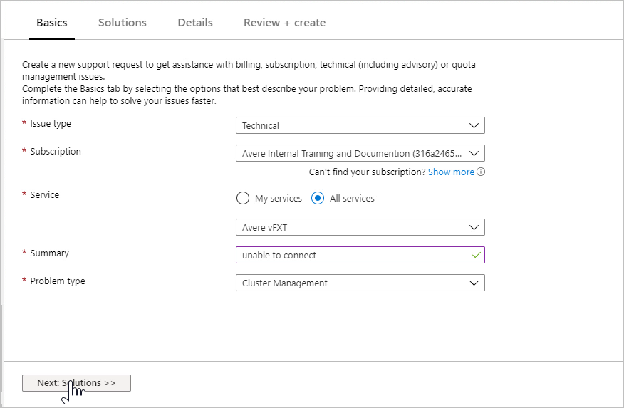
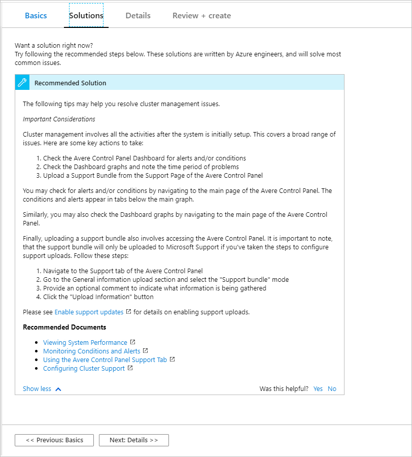
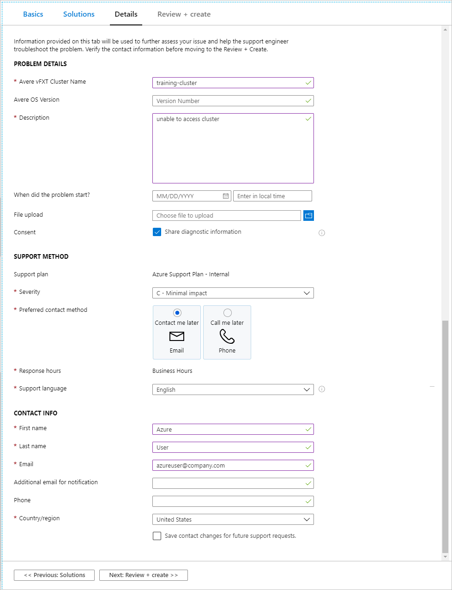

# Get help with your system

For help with your Avere vFXT for Azure system, here are the ways to get support:

* **Avere vFXT issue** - Use the Azure portal to open a support ticket for your Avere vFXT as described [below](#open-a-support-ticket-for-your-avere-vfxt).
* **Quota** - If you have a quota-related issue, [request a quota increase](#request-a-quota-increase)
* **Documentation and examples** - If you find problems with this documentation or examples, scroll to the bottom of the page with the problem and use the **Feedback** section to search for existing issues and file a new one if needed.

## Open a support ticket for your Avere vFXT

If you encounter issues while deploying or using Avere vFXT, request help through the Azure portal.

Follow these steps to make sure that your support ticket is tagged with a resource from your cluster. Tagging the ticket helps us route it to the correct support resource.

1. From [https://portal.azure.com](https://portal.azure.com), select **Resource Groups**. Browse to the resource group that contains the vFXT cluster where the issue occurred, and click on one of the Avere cluster virtual machines.

    

1. In the VM page, scroll down to the bottom of the left panel and click **New support request**.

    

1. On the first page of the support request, choose the issue type and make sure the correct subscription is selected.

   Under **Service**, click **All Services** and look under **Storage** to choose **Avere vFXT**.

   Add a short summary, and select the problem type.

    

   Click **Next** to continue.

1. The second page of the support form contains suggestions for fixing the problem based on your summary description. Click the **Next** button at the bottom if you still need to create a support ticket.

   

1. In the third page, provide details - this includes information about your cluster, the time the problem occurred, the severity, and how to contact you. Fill in the information and click the **Next** button at the bottom.

   

1. Review the information on the final page and click **Create**. A confirmation and ticket number will be sent to your email address, and a support staff member will contact you.

## Request a quota increase

Read [Quota for the vFXT cluster](avere-vfxt-prereqs.md#quota-for-the-vfxt-cluster) to learn what components are needed to deploy the Avere vFXT for Azure. You can [request a quota increase](../azure-portal/supportability/regional-quota-requests.md) from the Azure portal.