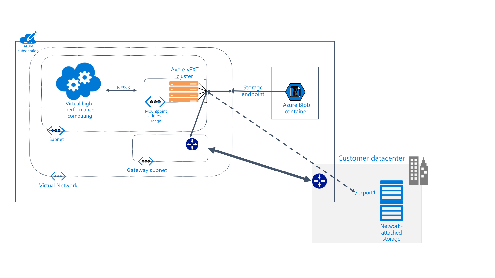

# What is Avere vFXT for Azure?

> [!NOTE]
> **Action Required:** Avere vFXT for Azure is retiring. Microsoft announced on 14 March 2024 that Avere vFXT for Azure will be closing down. The retirement date is 30 September 2025. Please remove all Avere vFXT for Azure resources by 30 September 2025. Visit https://aka.ms/vfxtretirement for more information about the retirement.

Avere vFXT for Azure is a filesystem caching solution for data-intensive high-performance computing (HPC) tasks. It lets you take advantage of cloud computing's scalability to make your data accessible when and where it’s needed - even for data that’s stored in your own on-premises hardware.

Avere vFXT supports these common computing scenarios:

* Hybrid cloud architecture - Avere vFXT for Azure can work with a hardware storage system, which provides the benefit of cloud computing without having to move files.

* Cloud bursting - Avere vFXT for Azure can help you move your data to the cloud for a single project, or "lift and shift" the entire workflow permanently.

Avere vFXT for Azure is best suited for these situations:

* Read-heavy operations for HPC workloads
* Applications using the common NFS protocol
* Compute farms of 1000 to 40,000 CPU cores
* Integration with on-premises hardware NAS, Azure Blob storage, or both

For more information, see [Avere vFXT for Azure](https://azure.microsoft.com/services/storage/avere-vfxt/).

## Who uses Avere vFXT for Azure?

Avere vFXT can help with all sorts of read-intensive computing tasks:

### Visual effects rendering

In media and entertainment, the Avere vFXT cluster can speed up data access for time-critical rendering projects. Because you can add more cache space as well as more compute nodes in Azure, you have the flexibility to handle large projects efficiently.

### Life sciences

Avere vFXT lets researchers run secondary analysis workflows in Azure Compute, and access genomic data no matter their location.

In pharmaceutical research, Avere vFXT clusters can expedite drug discovery by helping researchers predict drug-target interactions and analyze research data.

### Financial services analytics

An Avere vFXT cluster can help speed up quantitative analysis calculations, which gives financial services companies better insight to make strategic decisions.

## Features and specifications

The Avere vFXT system is made up of three or more virtual edge filer nodes, configured in a cluster. It can be situated near the client machines, which mount the cluster instead of mounting the storage directly.

The Avere vFXT cluster caches files as they are requested. Repeated requests can be served from the cache more than 80% of the time.

### Compatibility

* Compatible with hardware NAS systems from NetApp or Dell EMC Isilon
* Compatible with Azure Blob
* Uses NFSv3 or SMB2 protocol

Avere vFXT for Azure uses the following Azure resources:

|Azure component| Resource |
|----------|-----------|
|Virtual machines|3 or more E32s_v3|
|Premium SSD storage|200 GB OS space plus 1 TB to 4 TB cache space per node |
|Storage account (optional) |v2|
|Data back-end storage (optional) | One empty LRS Blob container |

## Next steps

Read these articles to plan and create your own Avere vFXT for Azure deployment.

* [Plan your system](avere-vfxt-deploy-plan.md)
* [Deployment overview](avere-vfxt-deploy-overview.md)
* [Create the vFXT](avere-vfxt-deploy.md)
