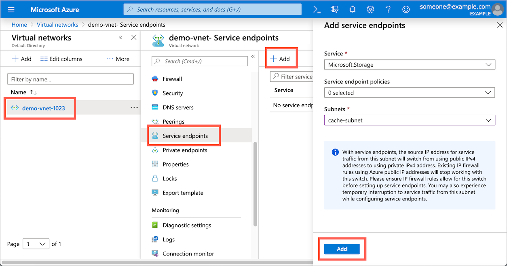

# Prepare to create the Avere vFXT

This article explains prerequisite tasks for creating an Avere vFXT cluster.

## Create a new subscription

Start by creating a new Azure subscription. Use a separate subscription for each Avere vFXT project to simplify expense tracking and cleanup, and to make sure other projects aren't affected by quotas or resource throttling when provisioning the cluster workflow.

To create a new Azure subscription in the Azure portal:

1. Navigate to the [Subscriptions blade](https://ms.portal.azure.com/#blade/Microsoft_Azure_Billing/SubscriptionsBlade)
1. Click the **+ Add** button at the top
1. Sign in if prompted
1. Select an offer and walk through the steps to create a new subscription

## Configure subscription owner permissions

A user with owner permissions for the subscription should create the vFXT cluster. Cluster creation requires an owner to accept the software terms of service and to authorize changes to network and storage resources.

There are some workarounds to allow a non-owner to create an Avere vFXT for Azure cluster. These scenarios involve restricting resources and assigning additional role-based access control (RBAC) roles to the creator. In all of these cases, a subscription owner also must [accept the Avere vFXT software terms](#accept-software-terms) ahead of time.

| Scenario | Restrictions | Access roles required to create the Avere vFXT cluster |
|----------|--------|-------|
| Resource group administrator creates the vFXT | The virtual network, cluster controller, and cluster nodes must be created within the resource group. | [User Access Administrator](../role-based-access-control/built-in-roles.md#user-access-administrator) and [Contributor](../role-based-access-control/built-in-roles.md#contributor) roles, both scoped to the target resource group. |
| Use an existing, external virtual network | The cluster controller and cluster nodes are created within the vFXT's resource group but use an existing virtual network in a different resource group. | (1) [User Access Administrator](../role-based-access-control/built-in-roles.md#user-access-administrator) and [Contributor](../role-based-access-control/built-in-roles.md#contributor) roles scoped to the vFXT resource group; and (2) [Virtual Machine Contributor](../role-based-access-control/built-in-roles.md#virtual-machine-contributor), [User Access Administrator](../role-based-access-control/built-in-roles.md#user-access-administrator), and [Avere Contributor](../role-based-access-control/built-in-roles.md#avere-contributor) roles scoped to the virtual network's resource group. |
| Custom role for cluster creators | No resource placement restrictions. This method gives non-owners significant privileges. | Subscription owner creates a custom RBAC role as explained in [this article](avere-vfxt-non-owner.md). |

## Quota for the vFXT cluster

Check that you have sufficient quota for the following Azure components. If needed, [request a quota increase](https://docs.microsoft.com/azure/azure-supportability/resource-manager-core-quotas-request).

> [!NOTE]
> The virtual machines and SSD components listed here are for the vFXT cluster itself. Remember that you also need quota for the VMs and SSDs you will use for your compute farm.
>
> Make sure the quota is enabled for the region where you intend to run the workflow.

|Azure component|Quota|
|----------|-----------|
|Virtual machines|3 or more E32s_v3 (one per cluster node) |
|Premium SSD storage|200 GB OS space plus 1 TB to 4 TB cache space per node |
|Storage account (optional) |v2|
|Data back-end storage (optional) |One new LRS Blob container |
<!-- this table also appears in the overview - update it there if updating here -->

## Accept software terms

> [!TIP]
> Skip this step if a subscription owner will create the Avere vFXT cluster.

During cluster creation, you must accept the terms of service for the Avere vFXT software. If you are not a subscription owner, have a subscription owner accept the terms ahead of time.

This step only needs to be done once per subscription.

To accept the software terms in advance:

1. Open a cloud shell in the Azure portal or by browsing to <https://shell.azure.com>. Sign in with your subscription ID.

   ```azurecli
    az login​
    az account set --subscription <subscription ID>
   ```

1. Issue this command to accept service terms and enable programmatic access for the Avere vFXT for Azure software image:

   ```azurecli
   az vm image accept-terms --urn microsoft-avere:vfxt:avere-vfxt-controller:latest
   ```

## Create a storage service endpoint in your virtual network (if needed)

A [service endpoint](../virtual-network/virtual-network-service-endpoints-overview.md) keeps Azure Blob traffic local instead of routing it outside the virtual network. It is recommended for any Avere vFXT for Azure cluster that uses Azure Blob for back-end data storage.

If you create a new virtual network while creating the cluster, an endpoint is created automatically. If you provide an existing virtual network, it must have a Microsoft storage service endpoint if you want to create a new Blob storage container during cluster creation.<!-- if there is no endpoint in that situation, the cluster creation will fail -->

> [!TIP]
>
>* Skip this step if you are creating a new virtual network as part of cluster creation.
>* An endpoint is optional if you are not creating Blob storage during cluster creation. In that case, you can create the service endpoint later if you decide to use Azure Blob.

Create the storage service endpoint from the Azure portal.

1. In the portal, open your list of virtual networks.
1. Select the virtual network for your cluster.
1. Click **Service endpoints** from the left menu.
1. Click **Add** at the top.
1. Choose the service ``Microsoft.Storage``.
1. Select the cluster's subnet.
1. At the bottom, click **Add**.

   

## Next steps

After completing these prerequisites, you can create the cluster. Read [Deploy the vFXT cluster](avere-vfxt-deploy.md) for instructions.
