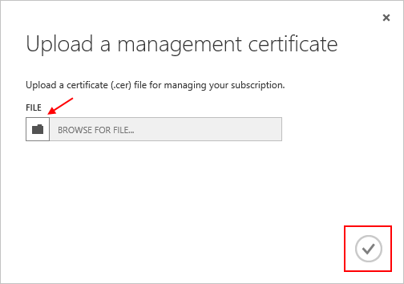

<properties 
	pageTitle="Upload an Azure Management API Certificate | Azure Microsoft" 
	description="Learn how to upload athe Management API certficate for the Azure Classic Portal." 
	services="cloud-services" 
	documentationCenter=".net" 
	authors="Thraka" 
	manager="timlt" 
	editor=""/>

<tags 
	ms.service="na" 
	ms.workload="tbd" 
	ms.tgt_pltfrm="na" 
	ms.devlang="na" 
	ms.topic="article" 
	ms.date="04/18/2016"
	ms.author="adegeo"/>

# Upload an Azure Management API Management Certificate

Management certificates allow you to authenticate with the Service Management API provided by Azure. Many programs and tools (such as Visual Studio or the Azure SDK) will use these certficates to automate configuration and deployment of various Azure services. **This only applies to the Azure classic portal**. 

>[AZURE.WARNING] Be careful! These types of certificates allow anyone who authenticates with them to manage the subscription they are associated with. 

More information about Azure certificates (including creating a self-signed certificate) is [available](cloud-services/cloud-services-certs-create.md#what-are-management-certificates) to you if you need it.

You can also use [Azure Active Directory](/services/active-directory/) to authenticate client-code for automation purposes.

## Upload a management certificate

Once you have a management certficate created, (.cer file with only the public key) you can upload it into the portal. When the certificate is available in the portal, anyone with a matching certficiate (private key) can connect through the Management API and access the resources for the associated subscription.

1. Log into the [Azure classic portal](http://manage.windowsazure.com).

2. Make sure to select the correct subscription that you want to associate a certificate with. Press the **Subscriptions** text at the top-right of the portal.

	

3. After you have the correct subscription selected, press **Settings** on the left side of the portal (you may need to scroll down). 
    
    

4. Press the **Management Certificates** tab.

    
    
5. Press the **Upload** button.

    
    
6. Fill out the dialog information and press the done **Checkmark**.

    

## Next steps

Now that you have a management certficate associated with a subscription, you can (after you have installed the matching certificate locally) programatically connect to the [Service Management REST API](https://msdn.microsoft.com/library/azure/mt420159.aspx) and automate the various Azure resources that are also associated with that subscription. 