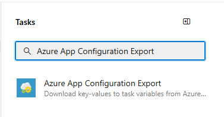
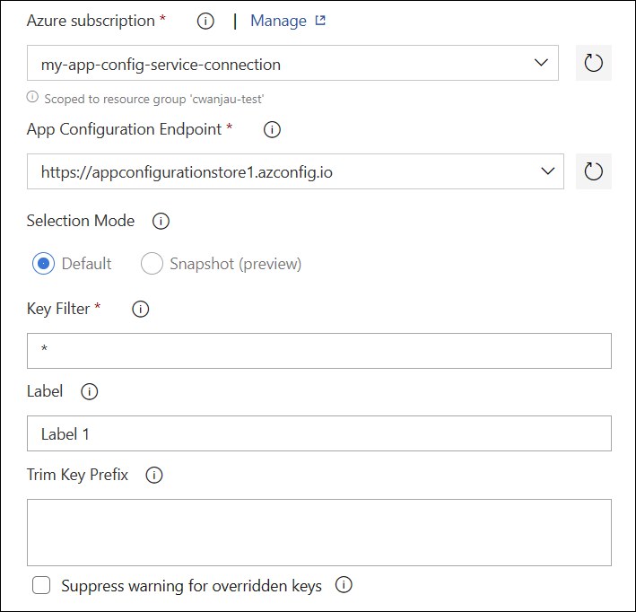

# Export settings from App Configuration with Azure Pipelines

The Azure App Configuration Export task exports key-values from your App Configuration store and sets them as Azure pipeline variables, which subsequent tasks can consume. This task complements the Azure App Configuration Import task that imports key-values from a configuration file into your App Configuration store. For more information, see [Import settings to App Configuration with Azure Pipelines](azure-pipeline-import-task.md).

## Prerequisites

- Azure subscription - [create one for free](https://azure.microsoft.com/free/)
- App Configuration store - [create one for free](./quickstart-azure-app-configuration-create.md#create-an-app-configuration-store)
- Azure DevOps project - [create one for free](https://go.microsoft.com/fwlink/?LinkId=2014881)
- [Azure Pipelines agent version 2.144.0](https://github.com/microsoft/azure-pipelines-agent/releases/tag/v2.144.0) or later and [Node version 16](https://nodejs.org/en/blog/release/v16.16.0/) or later for running the task on self-hosted agents.

## Create a service connection

[!INCLUDE [azure-app-configuration-service-connection](../../includes/azure-app-configuration-service-connection.md)]

## Add role assignment

Assign the proper App Configuration role assignments to the credentials being used within the task so that the task can access the App Configuration store.

1. Go to your target App Configuration store. 
1. In the left menu, select **Access control (IAM)**.
1. In the right pane, select **Add role assignments**.

      :::image type="content"  border="true" source="./media/azure-app-configuration-role-assignment/add-role-assignment-button.png" alt-text="Screenshot shows the Add role assignments button.":::
1. For **Role**, select **App Configuration Data Reader**. This role allows the task to read from the App Configuration store. 
1. Select the service principal associated with the service connection that you created in the previous section.

      :::image type="content"  border="true" source="./media/azure-app-configuration-role-assignment/add-role-assignment-data-reader.png" alt-text="Screenshot shows the Add role assignment dialog.":::
1. Select **Review + assign**.
1. If the store contains Key Vault references, go to relevant Key Vault and assign **Key Vault Secret User** role to the service principal created in the previous step. From the Key Vault menu, select **Access policies** and ensure [Azure role-based access control](/azure/key-vault/general/rbac-guide) is selected as the permission model.

## Use in builds

This section covers how to use the Azure App Configuration Export task in an Azure DevOps build pipeline.

1. Navigate to the build pipeline page by clicking **Pipelines** > **Pipelines**. For build pipeline documentation, see  [Create your first pipeline](/azure/devops/pipelines/create-first-pipeline?tabs=net%2Ctfs-2018-2%2Cbrowser).
      - If you're creating a new build pipeline, on the last step of the process, on the **Review** tab, select **Show assistant** on the right side of the pipeline.
      > [!div class="mx-imgBorder"]
      > 
      - If you're using an existing build pipeline, click the **Edit** button at the top-right.
      > [!div class="mx-imgBorder"]
      > 
1. Search for the **Azure App Configuration Export** Task.
      > [!div class="mx-imgBorder"]
      > 
1. To export the key-values from the App Configuration store, configure the necessary parameters for the task. Descriptions of the parameters are available in the **Parameters** section  and in tooltips next to each parameter.
      - Set the **Azure subscription** parameter to the name of the service connection you created in a previous step.
      - Set the **App Configuration Endpoint** to the endpoint of your App Configuration store.
      - Leave the default values for the remaining parameters.
        > [!div class="mx-imgBorder"]
        > 
1. Save and queue a build. The build log displays any failures that occurred during the execution of the task.

## Use in releases

This section covers how to use the Azure App Configuration Export task in an Azure DevOps release pipeline.

1. Navigate to release pipeline page by selecting **Pipelines** > **Releases**. For release pipeline documentation, see [Release pipelines](/azure/devops/pipelines/release).
1. Choose an existing release pipeline. If you don’t have one, click **New pipeline** to create a new one.
1. Select the **Edit** button in the top-right corner to edit the release pipeline.
1. From the **Tasks** dropdown, choose the **Stage** to which you want to add the task. More information about stages can be found in [Add stages, dependencies, & conditions](/azure/devops/pipelines/release/environments).
      > [!div class="mx-imgBorder"]
      > 
1. Click **+** next to the Job to which you want to add a new task.
      > [!div class="mx-imgBorder"]
      > 
1. Search for the **Azure App Configuration Export** Task.
      > [!div class="mx-imgBorder"]
      > 
1. To export your key-values from your App Configuration store, configure the necessary parameters within the task. Descriptions of the parameters are available in the **Parameters** section and in tooltips next to each parameter.
      - Set the **Azure subscription** parameter to the name of the service connection you created in a previous step.
      - Set the **App Configuration Endpoint** to the endpoint of your App Configuration store.
      - Leave the default values for the remaining parameters.
1. Save and queue a release. The release log displays any failures encountered during the execution of the task.

## Parameters

The following parameters are used by the Azure App Configuration Export task:

- **Azure subscription**: A drop-down containing your available Azure service connections. To update and refresh your list of available Azure service connections, press the **Refresh Azure subscription** button to the right of the textbox.
- **App Configuration Endpoint**: A drop-down that loads your available configuration stores endpoints under the selected subscription. To update and refresh your list of available configuration stores endpoints, press the **Refresh App Configuration Endpoint** button to the right of the textbox.
- **Selection Mode**: Specifies how the key-values read from a configuration store are selected. The 'Default' selection mode allows the use of key and label filters. The 'Snapshot' selection mode allows key-values to be selected from a snapshot. Default value is **Default**.
- **Key Filter**: The filter can be used to select what key-values are requested from Azure App Configuration. A value of * selects all key-values. For more information on, see [Query key-values](concept-key-value.md#query-key-values).
- **Label**: Specifies which label should be used when selecting key-values from the App Configuration store. If no label is provided, then key-values with the no label are retrieved. The following characters aren't allowed: , *.
- **Snapshot Name**: Specifies snapshot from which key-values should be retrieved in Azure App Configuration.
- **Trim Key Prefix**: Specifies one or more prefixes that should be trimmed from App Configuration keys before setting them as variables. A new-line character can be used to separate multiple prefixes.
- **Suppress Warning For Overridden Keys**: Default value is unchecked. Specifies whether to show warnings when existing keys are overridden. Enable this option when it's expected that the key-values downloaded from App Configuration have overlapping keys with what exists in pipeline variables.

## Use key-values in subsequent tasks

The key-values that are fetched from App Configuration are set as pipeline variables, which are accessible as environment variables. The key of the environment variable is the key of the key-value that is retrieved from App Configuration after trimming the prefix, if specified.

For example, if a subsequent task runs a PowerShell script, it could consume a key-value with the key 'myBuildSetting' like this:
```powershell
echo "$env:myBuildSetting"
```
And the value is printed to the console.

> [!NOTE]
> Azure Key Vault references within App Configuration will be resolved and set as [secret variables](/azure/devops/pipelines/process/variables#secret-variables). In Azure pipelines, secret variables are masked out from log. They aren't passed into tasks as environment variables and must instead be passed as inputs. 

## Troubleshooting

If an unexpected error occurs, debug logs can be enabled by setting the pipeline variable `system.debug` to `true`.

## FAQ

**How do I compose my configuration from multiple keys and labels?**

There are times when configuration may need to be composed from multiple labels, for example, default and dev. Multiple App Configuration tasks may be used in one pipeline to implement this scenario. The key-values fetched by a task in a later step supersedes any values from previous steps. In the aforementioned example, a task can be used to select key-values with the default label while a second task can select key-values with the dev label. The keys with the dev label override the same keys with the default label.

## Next step

For a complete reference of the parameters or to use this pipeline task in YAML pipelines, refer to the following document.

> [!div class="nextstepaction"]
> [Azure App Configuration Export Task reference](/azure/devops/pipelines/tasks/reference/azure-app-configuration-export-v10)

To learn how to import key-values from a configuration file into your App Configuration store, continue to the following document.

> [!div class="nextstepaction"]
> [Import settings to App Configuration with Azure pipelines](./azure-pipeline-import-task.md)

To learn how to create snapshot in an App Configuration store, continue to the following document.

> [!div class="nextstepaction"]
> [Create snapshots in App Configuration with Azure Pipelines](./azure-pipeline-snapshot-task.md)

