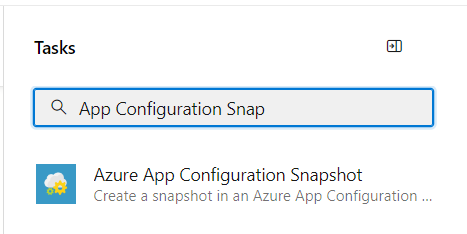

# Create snapshots in App Configuration with Azure Pipelines

The Azure App Configuration snapshot task is designed to create snapshots in Azure App Configuration.

## Prerequisites

- Azure subscription - [create one for free](https://azure.microsoft.com/free/)
- App Configuration store - [create one for free](./quickstart-azure-app-configuration-create.md#create-an-app-configuration-store)
- Azure DevOps project - [create one for free](https://go.microsoft.com/fwlink/?LinkId=2014881)
- [Azure Pipelines agent version 2.144.0](https://github.com/microsoft/azure-pipelines-agent/releases/tag/v2.144.0) or later and [Node version 16](https://nodejs.org/en/blog/release/v16.16.0/) or later for running the task on self-hosted agents.

## Create a service connection

[!INCLUDE [azure-app-configuration-service-connection](../../includes/azure-app-configuration-service-connection.md)]

## Add role assignment

Assign the proper App Configuration role assignment to the credentials being used within the task so that the task can access the App Configuration store.

1. Go to your target App Configuration store.
1. In the left menu, select **Access control (IAM)**.
1. In the right pane, select **Add role assignment**.

    :::image type="content"  border="true" source="./media/azure-app-configuration-role-assignment/add-role-assignment-button.png" alt-text="Screenshot shows the Add role assignments button.":::
1. For the **Role**, select **App Configuration Data Owner**. This role allows the task to read from and write to the App Configuration store.
1. Select the service principal associated with the service connection that you created in the previous section.

    :::image type="content"  border="true" source="./media/azure-app-configuration-role-assignment/add-role-assignment-data-owner.png" alt-text="Screenshot shows the Add role assignment dialog.":::
1. Select **Review + assign**.

## Use in builds

In this section, learn how to use the Azure App Configuration snapshot task in an Azure DevOps build pipeline.

1. Navigate to the build pipeline page by clicking **Pipelines** > **Pipelines**. For more information about build pipelines got to [Create your first pipeline](/azure/devops/pipelines/create-first-pipeline?tabs=tfs-2018-2).
      - If you're creating a new build pipeline, on the last step of the process, on the **Review** tab, select **Show assistant** on the right side of the pipeline.
        > [!div class="mx-imgBorder"]
        > 
      - If you're using an existing build pipeline, click the **Edit** button at the top-right.
        > [!div class="mx-imgBorder"]
        > 
1. Search for the **Azure App Configuration snapshot** Task.
    > [!div class="mx-imgBorder"]
    > 
1. Configure the necessary parameters for the task to create a snapshot in an App Configuration store. Explanations of the parameters are available in the **Parameters** section below and in tooltips next to each parameter.
    > [!div class="mx-imgBorder"]
    > 
1. Save and queue a build. The build log displays any failures that occurred during the execution of the task.

## Use in releases

In this section, learn how to use the Azure App Configuration snapshot task in an Azure DevOps release pipeline.

1. Navigate to the release pipeline page by selecting, **Pipelines** > **Releases**. For more information about release pipelines, go to [Create your first pipeline](/azure/devops/pipelines/release).
1. Choose an existing release pipeline. If you don’t have one, select **+ New** to create a new one.
1. Select the **Edit** button in the top-right corner to edit the release pipeline.
1. From the **Tasks** dropdown, choose the **Stage** to which you want to add the task. More information about stages can be found in [Add stages, dependencies, & conditions](/azure/devops/pipelines/release/environments).
    > [!div class="mx-imgBorder"]
    > 
1. Click **+** next to the job to which you want to add a new task.
    > [!div class="mx-imgBorder"]
    > 
1. In the **Add tasks** dialog, type **Azure App Configuration snapshot** into the search box and select it.
1. Configure the necessary parameters within the task to create a snapshot within your App Configuration store. Explanations of the parameters are available in the **Parameters** section below, and in tooltips next to each parameter.
1. Save and queue a release. The release log displays any failures encountered during the execution of the task.

## Parameters

The following parameters are used by the App Configuration snapshot task:

- **Azure subscription**: A drop-down containing your available Azure service connections. To update and refresh your list of available Azure service connections, press the **Refresh Azure subscription** button to the right of the textbox.

- **App Configuration Endpoint**: A drop-down that loads your available configuration store endpoints under the selected subscription. To update and refresh your list of available configuration store endpoints, press the **Refresh App Configuration Endpoint** button to the right of the textbox. 

- **Snapshot Name**: Specify the name for the snapshot.

- **Composition Type**: The default value is **Key**.
    - **Key**: The filters are applied in order for this composition type. Each key-value in the snapshot is uniquely identified by the key only. If there are multiple key-values with the same key and multiple labels, only one key-value will be retained based on the last applicable filter.

    - **Key-Label**: Filters will be applied and every key-value in the resulting snapshot will be uniquely identified by the key and label together.

- **Filters**: Represents key and label filter used to build an App Configuration snapshot. Filters should be of a valid JSON format. Example `[{"key":"abc*", "label":"1.0.0"}]`. At least one filter should be specified and a max of three filters can be specified.

- **Retention period**: The default value is 30 days. Refers to the number of days the snapshot will be retained after it's archived. Archived snapshots can be recovered during the retention period.

- **Tags**: A JSON object in the format of `{"tag1":"val1", "tag2":"val2"}`, which defines tags that are added to each snapshot created in your App Configuration store.

## Troubleshooting

If an unexpected error occurs, debug logs can be enabled by setting the pipeline variable `system.debug` to `true`.

## Next step

For a complete reference of the parameters or to use this pipeline task in YAML pipelines, please refer to the following document.

> [!div class="nextstepaction"]
> [Azure App Configuration Snapshot Task reference](/azure/devops/pipelines/tasks/reference/azure-app-configuration-snapshot-v1)

To learn how to export key-values from your App Configuration store and set them as Azure pipeline variables, continue to the following document.

> [!div class="nextstepaction"]
> [Export settings from App Configuration with Azure pipelines](./azure-pipeline-export-task.md)

To learn how to import key-values from a configuration file into your App Configuration store, continue to the following document.

> [!div class="nextstepaction"]
> [Import settings to App Configuration with Azure pipelines](./azure-pipeline-import-task.md)