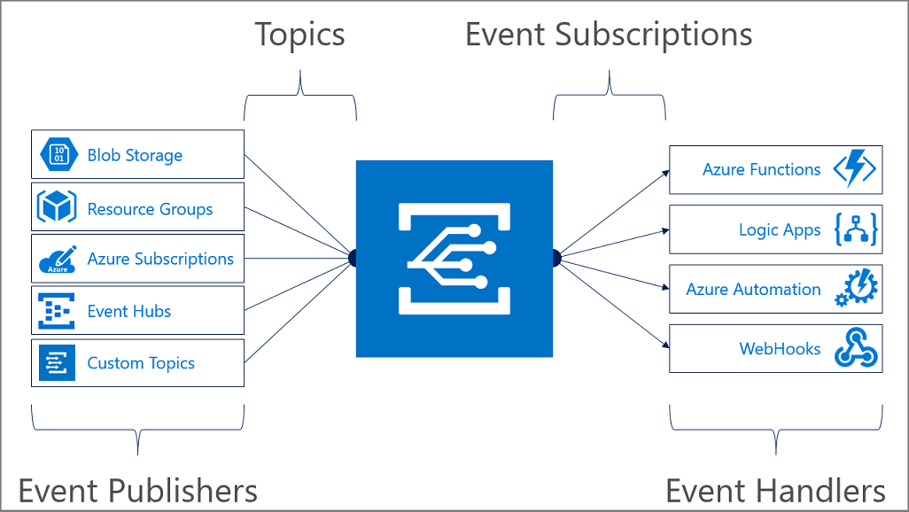

# Reacting to Azure App Configuration events

Azure App Configuration events enable applications to react to changes in key-values. This is done without the need for complicated code or expensive and inefficient polling services. Instead, events are pushed through [Azure Event Grid](https://azure.microsoft.com/services/event-grid/) to subscribers such as [Azure Functions](https://azure.microsoft.com/services/functions/), [Azure Logic Apps](https://azure.microsoft.com/services/logic-apps/), or even to your own custom http listener. Critically, you only pay for what you use.

Azure App Configuration events are sent to the Azure Event Grid which provides reliable delivery services to your applications through rich retry policies and dead-letter delivery. To learn more, see [Event Grid message delivery and retry](https://docs.microsoft.com/azure/event-grid/delivery-and-retry).

Common App Configuration event scenarios include refreshing application configuration, triggering deployments, or any configuration-oriented workflow. When changes are infrequent, but your scenario requires immediate responsiveness, event-based architecture can be especially efficient.

Take a look at [Route Azure App Configuration events to a custom web endpoint - CLI](./howto-app-configuration-event.md) for a quick example. 



## Available Azure App Configuration events
Event grid uses [event subscriptions](../event-grid/concepts.md#event-subscriptions) to route event messages to subscribers. Azure App Configuration event subscriptions can include two types of events:  

> |Event Name|Description|
> |----------|-----------|
> |`Microsoft.AppConfiguration.KeyValueModified`|Fired when a key-value is created or replaced|
> |`Microsoft.AppConfiguration.KeyValueDeleted`|Fired when a key-value is deleted|

## Event schema
Azure App Configuration events contain all the information you need to respond to changes in your data. You can identify an App Configuration event because the eventType property starts with "Microsoft.AppConfiguration". Additional information about the usage of Event Grid event properties is documented in [Event Grid event schema](../event-grid/event-schema.md).  

> |Property|Type|Description|
> |-------------------|------------------------|-----------------------------------------------------------------------|
> |topic|string|Full Azure Resource Manager id of the App Configuration that emits the event.|
> |subject|string|The URI of the key-value that is the subject of the event.|
> |eventTime|string|The date/time that the event was generated, in ISO 8601 format.|
> |eventType|string|"Microsoft.AppConfiguration.KeyValueModified" or "Microsoft.AppConfiguration.KeyValueDeleted".|
> |Id|string|A unique identifier of this event.|
> |dataVersion|string|The schema version of the data object.|
> |metadataVersion|string|The schema version of top-level properties.|
> |data|object|Collection of Azure App Configuration specific event data|
> |data.key|string|The key of the key-value that was modified or deleted.|
> |data.label|string|The label, if any, of the key-value that was modified or deleted.|
> |data.etag|string|For `KeyValueModified` the etag of the new key-value. For `KeyValueDeleted` the etag of the key-value that was deleted.|

Here is an example of a KeyValueModified event:
```json
[{
  "id": "84e17ea4-66db-4b54-8050-df8f7763f87b",
  "topic": "/subscriptions/00000000-0000-0000-0000-000000000000/resourceGroups/testrg/providers/microsoft.appconfiguration/configurationstores/contoso",
  "subject": "https://contoso.azconfig.io/kv/Foo?label=FizzBuzz",
  "data": {
    "key": "Foo",
    "label": "FizzBuzz",
    "etag": "FnUExLaj2moIi4tJX9AXn9sakm0"
  },
  "eventType": "Microsoft.AppConfiguration.KeyValueModified",
  "eventTime": "2019-05-31T20:05:03Z",
  "dataVersion": "1",
  "metadataVersion": "1"
}]

```

For more information, see [Azure App Configuration events schema](../event-grid/event-schema-app-configuration.md).

## Practices for consuming events
Applications that handle App Configuration events should follow these recommended practices:
> [!div class="checklist"]
> * Multiple subscriptions can be configured to route events to the same event handler, so do not assume events are from a particular source. Instead, check the topic of the message to ensure the App Configuration instance sending the event.
> * Check the eventType and do not assume that all events you receive will be the types you expect.
> * Use the etag fields to understand if your information about objects is still up-to-date.  
> * Use the sequencer fields to understand the order of events on any particular object.
> * Use the subject field to access the key-value that was modified.


## Next steps

Learn more about Event Grid and give Azure App Configuration events a try:

- [About Event Grid](../event-grid/overview.md)
- [Route Azure App Configuration events to a custom web endpoint](./howto-app-configuration-event.md)