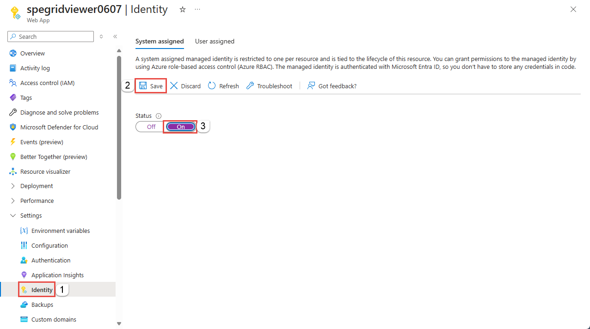

## Authenticate a managed identity with Azure Active Directory to access Azure App Configuration
Azure App Configuration supports Azure Active Directory (Azure AD) authentication with [managed identities for Azure resources](../active-directory/managed-identities-azure-resources/overview.md). Managed identities for Azure resources can authorize access to App Configuration instances using Azure AD credentials from applications running in Azure Virtual Machines (VMs), Function apps, Virtual Machine Scale Sets, and other services. By using managed identities for Azure resources together with Azure AD authentication, you can avoid storing credentials with your applications that run in the cloud.

This article shows how to authorize access to an App Configuration instance by using a managed identity from an Azure VM.

## Enable managed identities on a VM
Before you can use managed identities for Azure Resources to authorize access to App Configuration resources from your VM, you must first enable managed identities for Azure Resources on the VM. To learn how to enable managed identities for Azure Resources, see one of these articles:

- [Azure portal](../active-directory/managed-service-identity/qs-configure-portal-windows-vm.md)
- [Azure PowerShell](../active-directory/managed-identities-azure-resources/qs-configure-powershell-windows-vm.md)
- [Azure CLI](../active-directory/managed-identities-azure-resources/qs-configure-cli-windows-vm.md)
- [Azure Resource Manager template](../active-directory/managed-identities-azure-resources/qs-configure-template-windows-vm.md)
- [Azure Resource Manager client libraries](../active-directory/managed-identities-azure-resources/qs-configure-sdk-windows-vm.md)

## Grant permissions to a managed identity in Azure AD
To authorize a request to an App Configuration instance from a managed identity in your application, first configure role-based access control (RBAC) settings for that managed identity. Azure App Configuration defines RBAC roles that encompass permissions for reading and for both reading (`Azure App Configuration Data Reader`) and writing (`Azure App Configuration Data Owner`) to App Configuration instances. When the RBAC role is assigned to a managed identity, the managed identity is granted access to the App Configuration data plane at the appropriate scope.  In addition, Azure App Configuration has a third role, `Contributor`, that allows admin access for the service but does not allow access to the data plane.

For more information about assigning RBAC roles, see [Authorize access to Azure App Configuration using Azure Active Directory](concept-enable-rbac.md).

## Use Azure App Configuration with managed identities
To use App Configuration with managed identities, you need to assign the identity the role and the appropriate scope. The procedure in this section uses a simple application that runs under a managed identity.

Here we're using a sample web application hosted in [Azure App Service](https://azure.microsoft.com/services/app-service/). For step-by-step instructions for creating a web application, see [Create an ASP.NET Core web app in Azure](../app-service/app-service-web-get-started-dotnet.md)

Once the application is created, follow these steps: 

1. Go to **Settings** and select **Identity**. 
1. Select the **Status** to be **On**. 
1. Select **Save** to save the setting. 

    

Once you've enabled this setting, a new service identity is created in your Azure Active Directory (Azure AD) and configured into the App Service host.

Now, assign this service identity to a role in the required scope in your App Configuration resources.

### To Assign RBAC roles using the Azure portal
To assign a role to access App Configuration resources, navigate to that resource in the Azure portal. Display the Access Control (IAM) settings for the resource, and follow these instructions to manage role assignments:

> [!NOTE]
> The following steps assigns a service identity role to your App Configuration namespaces. You can follow the same steps to assign a role scoped to any App Configuration resource. 

1. In the Azure portal, navigate to your App Configuration namespace and display the **Overview** for the namespace. 
1. Select **Access Control (IAM)** on the left menu to display access control settings for the instance.
1.  Select the **Role assignments** tab to see the list of role assignments.
1.	Select **Add** to add a new role.
1.	On the **Add role assignment** page, select the App Configuration roles that you want to assign. Search to locate the service identity you had registered to assign the role.
    
    > [!div class="mx-imgBorder"]
    > 

1.	Select **Save**. The identity to whom you assigned the role appears listed under that role. For example, the following image shows that service identity has App Configuration Data owner.

    > [!div class="mx-imgBorder"]
    > 

Once you've assigned the role, the web application will have access to the App Configuration resources under the defined scope. 
## Next steps
- See the following article to learn about managed identities for Azure resources: [What is managed identities for Azure resources?](../active-directory/managed-identities-azure-resources/overview.md)
