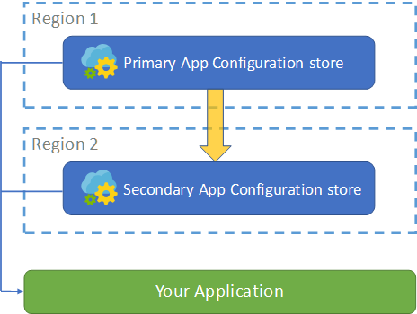

# Resiliency and disaster recovery

> [!IMPORTANT]
> Azure App Configuration supports [geo-replication](./concept-geo-replication.md). You can enable replicas of your data across multiple locations for enhanced resiliency to regional outages. You can also leverage App Configuration provider libraries in your applications for [automatic failover](./howto-geo-replication.md#use-replicas). Utilizing geo-replication is the recommended solution for high availability.

Currently, Azure App Configuration is a regional service. Each configuration store is created in a particular Azure region. A region-wide outage affects all stores in that region. App Configuration doesn't offer automatic failover to another region. This article provides general guidance on how you can use multiple configuration stores across Azure regions to increase the geo-resiliency of your application.

## High-availability architecture

To realize cross-region redundancy, you need to create multiple App Configuration stores in different regions. With this setup, your application has at least one additional configuration store to fall back on if the primary store becomes inaccessible. The following diagram illustrates the topology between your application and its primary and secondary configuration stores:



Your application loads its configuration from both the primary and secondary stores in parallel. Doing this increases the chance of successfully getting the configuration data. You're responsible for keeping the data in both stores in sync. The following sections explain how you can build geo-resiliency into your application.

## Failover between configuration stores

Technically, your application isn't executing a failover. It's attempting to retrieve the same set of configuration data from two App Configuration stores simultaneously. Arrange your code so that it loads from the secondary store first and then the primary store. This approach ensures that the configuration data in the primary store takes precedence whenever it's available. The following code snippet shows how you can implement this arrangement in .NET Core:

#### [.NET Core 2.x](#tab/core2x)

```csharp
public static IWebHostBuilder CreateWebHostBuilder(string[] args) =>
    WebHost.CreateDefaultBuilder(args)
        .ConfigureAppConfiguration((hostingContext, config) =>
        {
            var settings = config.Build();
            config.AddAzureAppConfiguration(settings["ConnectionString_SecondaryStore"], optional: true)
                  .AddAzureAppConfiguration(settings["ConnectionString_PrimaryStore"], optional: true);
        })
        .UseStartup<Startup>();
    
```

#### [.NET Core 3.x](#tab/core3x)

```csharp
public static IHostBuilder CreateHostBuilder(string[] args) =>
    Host.CreateDefaultBuilder(args)
        .ConfigureWebHostDefaults(webBuilder =>
            webBuilder.ConfigureAppConfiguration((hostingContext, config) =>
            {
                var settings = config.Build();
                config.AddAzureAppConfiguration(settings["ConnectionString_SecondaryStore"], optional: true)
                    .AddAzureAppConfiguration(settings["ConnectionString_PrimaryStore"], optional: true);
            })
            .UseStartup<Startup>());
```
---

Notice the `optional` parameter passed into the `AddAzureAppConfiguration` function. When set to `true`, this parameter prevents the application from failing to continue if the function can't load configuration data.

## Synchronization between configuration stores

It's important that your geo-redundant configuration stores all have the same set of data. There are two ways to achieve this:

### Backup manually using the Export function

You can use the **Export** function in App Configuration to copy data from the primary store to the secondary on demand. This function is available through both the Azure portal and the CLI.

From the Azure portal, you can push a change to another configuration store by following these steps.

1. Go to the **Import/Export** tab, and select **Export** > **App Configuration** > **Target** > **Select a resource**.

1. In the new blade that opens, specify the subscription, resource group, and resource name of your secondary store, then select **Apply**.

1. The UI is updated so that you can choose what configuration data you want to export to your secondary store. You can leave the default time value as is and set both **From label** and **Label** to the same value. Select **Apply**. Repeat this for all the labels in your primary store.

1. Repeat the previous steps whenever your configuration changes.

The export process can also be achieved using the Azure CLI. The following command shows how to export all configurations from the primary store to the secondary:

```azurecli
    az appconfig kv export --destination appconfig --name {PrimaryStore} --dest-name {SecondaryStore} --label * --preserve-labels -y
```

### Backup automatically using Azure Functions

The backup process can be automated by using Azure Functions. It leverages the integration with Azure Event Grid in App Configuration. Once set up, App Configuration will publish events to Event Grid for any changes made to key-values in a configuration store. Thus, an Azure Functions app can listen to these events and backup data accordingly. For details, see the tutorial on [how to backup App Configuration stores automatically](./howto-backup-config-store.md).

## Next steps

In this article, you learned how to augment your application to achieve geo-resiliency during runtime for App Configuration. You also can embed configuration data from App Configuration at build or deployment time. For more information, see [Integrate with a CI/CD pipeline](./integrate-ci-cd-pipeline.md).
