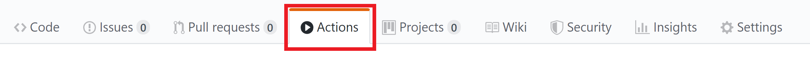
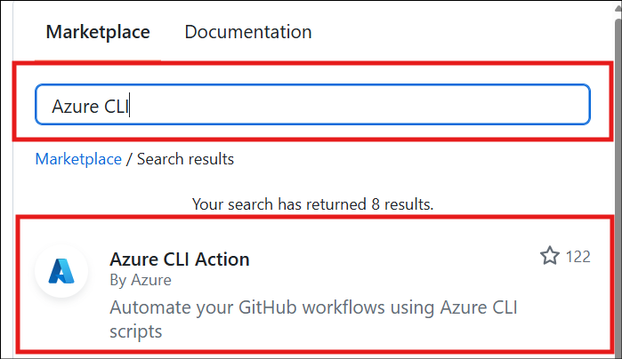

# Sync your App Configuration instance using GitHub Actions
Azure App Configuration uses GitHub Actions to update an App Configuration instance when triggered by an action performed on a GitHub repository. You can leverage GitHub workflows to update app configuration, enabling the integration of app configuration updates into the same workflow used to update app code.

A GitHub Actions [workflow](https://help.github.com/articles/about-github-actions#workflow) is an automated process defined in your GitHub repository. This process tells GitHub how to build and deploy your GitHub project. Azure App Configuration provides the *Azure App Configuration Sync* Action to enable updates to an App Configuration instance when changes are made to the source repository. 

A workflow is defined by a YAML (.yml) file found in the `/.github/workflows/` path of your repository. This definition contains the various steps and parameters that define the workflow.

GitHub events, such as a push to a repository, can trigger a GitHub Action workflow.  Azure provides the *Azure App Configuration Sync* action to enable you to trigger an update of an App Configuration instance when a specified GitHub action occurs. This allows teams to leverage GitHub's core features when pushing, reviewing, or branching app configuration files just as they do with app code.

The GitHub [documentation](https://help.github.com/actions/automating-your-workflow-with-github-actions/configuring-a-workflow) provides in-depth view of GitHub workflows and actions. 

## Enable GitHub Actions in your repository
To start using this GitHub action, go to your repository and select the **Actions** tab. Find and select the GitHub action in the marketplace by searching for "Azure App Configuration Sync". 

> [!div class="mx-imgBorder"]
> 

> [!div class="mx-imgBorder"]
> 

## Sync configuration files after a push
This action syncs Azure App Configuration files when a change is pushed to `appsettings.json`. When a developer makes and pushes a change to `appsettings.json`, the App Configuration Sync action updates the App Configuration instance with the new values.

The first section of this workflow specifies that the action triggers *on* a *push* containing `appsettings.json` to the *master* branch. The second section lists the jobs run once the action is triggered. The action checks out the relevant files and updates the App Configuration instance using the connection string stored as a secret in the repository.  For more information about using secrets in Github, see [this article](https://help.github.com/actions/automating-your-workflow-with-github-actions/creating-and-using-encrypted-secrets) about creating and using encrypted secrets.

```json
on: 
  push: 
    branches: 
      - 'master' 
    paths: 
      - 'appsettings.json' 
 
jobs: 
  syncconfig: 
    runs-on: ubuntu-latest 
    steps: 
      # checkout done so that files in the repo can be read by the sync 
      - uses: actions/checkout@v1 
      - uses: azure/appconfiguration-sync@v1 
        with: 
          configurationFile: 'appsettings.json' 
          format: 'json' 
          # Replace <ConnectionString> with the name of the secret in your                        
          # repository 
          connectionString: ${{ secrets.<ConnectionString> }} 
          separator: ':' 
```

## Use a dynamic label on sync
The previous action simply updated the App Configuration instance whenever `appsettings.json` is updated. This action inserts a dynamic label on each sync, ensuring that each sync can be uniquely identified.  This allows code changes to quickly be mapped to config changes.

The first section of this workflow specifies that the action triggers *on* a *push* containing `appsettings.json` to the *master* branch. The second section runs a job which creates a unique label for the config update based on the commit hash. The job then updates the App Configuration instance with the new values and the unique label for this update.

```json
on: 
  push: 
    branches: 
      - 'master' 
    paths: 
      - 'appsettings.json' 
 
jobs: 
  syncconfig: 
    runs-on: ubuntu-latest 
    steps: 
      # Creates a label based on the branch name and the first 8 characters          
      # of the commit hash 
      - id: determine_label 
        run: echo ::set-output name=LABEL::"${GITHUB_REF#refs/*/}/${GITHUB_SHA:0:8}" 
      # checkout done so that files in the repo can be read by the sync 
      - uses: actions/checkout@v1 
      - uses: azure/appconfiguration-sync@v1 
        with: 
          configurationFile: 'appsettings.json' 
          format: 'json' 
          # Replace <ConnectionString> with the name of the secret in your 
          # repository 
          connectionString: ${{ secrets.<ConnectionString> }}  
          separator: ':' 
          label: ${{ steps.determine_label.outputs.LABEL }} 
```

## Use strict sync
When strict mode is enabled, the sync ensures that the App Configuration instance matches the configuration file for the given prefix and label exactly. Key-value pairs with the same prefix and label that are not in the configuration file are deleted. 
 
If strict mode is not enabled, the sync will only set key-values from the configuration file. No key-value pairs will be deleted. 

```json
on: 
  push: 
    branches: 
      - 'master' 
    paths: 
      - 'appsettings.json' 
 
jobs: 
  syncconfig: 
    runs-on: ubuntu-latest 
    steps: 
      # checkout done so that files in the repo can be read by the sync 
      - uses: actions/checkout@v1 
      - uses: azure/appconfiguration-sync@v1 
        with: 
          configurationFile: 'appsettings.json' 
          format: 'json' 
          # Replace <ConnectionString> with the name of the secret in your 
          # repository 
          connectionString: ${{ secrets.<ConnectionString> }}  
          separator: ':' 
          label: 'Label' 
          prefix: 'Prefix:' 
          strict: true 
```

## Use max depth to limit GitHub Action
The default behavior for nested JSON attributes is to flatten the entire object.  The JSON below defines this key-value pair:

| Key | Value |
| --- | --- |
| Object:Inner:InnerKey | InnerValue |

```json
{ "Object": 
    { "Inner":
        {
        "InnerKey": "InnerValue"
        }
    }
}
```
If the nested object is intended to be the value pushed to the Configuration instance, you can use the *depth* value to stop the flattening at the appropriate depth. 

```json
on: 
  push: 
    branches: 
      - 'master' 
    paths: 
      - 'appsettings.json' 
 
jobs: 
  syncconfig: 
    runs-on: ubuntu-latest 
    steps: 
      # checkout done so that files in the repo can be read by the sync 
      - uses: actions/checkout@v1 
      - uses: azure/appconfiguration-sync@v1 
        with: 
          configurationFile: 'appsettings.json' 
          format: 'json' 
          # Replace <ConnectionString> with the name of the secret in your 
          # repository 
          connectionString: ${{ secrets.<ConnectionString> }}  
          separator: ':' 
          depth: 2 
```

Given a depth of 2, the example above now returns the following key:value pair:

| Key | Value |
| --- | --- |
| Object:Inner | {"InnerKey":"InnerValue"} |

## Understand action inputs
Input parameters specify data used by the action during runtime.  The following table contains input parameters accepted by App Configuration Sync and the expected values for each.  For more information about action inputs for GitHub Actions, see  GitHub's [documentation](https://help.github.com/actions/automating-your-workflow-with-github-actions/metadata-syntax-for-github-actions#inputs).

> [!Note]
> Input IDs are case insensitive.


| Input name | Required? | Value |
|----|----|----|
| configurationFile | Yes | Path to the configuration file in the repository, relative to the root of the repository.  Glob patterns are supported and can include multiple files. |
| format | Yes | File format of the configuration file.  Valid formats are: JSON, YAML, properties. |
| connectionString | Yes | Connection string for the App Configuration instance. The connection string should be stored as a secret in the GitHub repository, and only the secret name should be used in the workflow. |
| separator | Yes | Separator used when flattening the configuration file to key-value pairs.  Valid values are: . , ; : - _ __ / |
| prefix | No | Prefix to be added to the start of keys. |
| label | No | Label used when setting key-value pairs. If unspecified, a null label is used. |
| strict | No | A boolean value that determines whether strict mode is enabled. The default value is false. |
| depth | No | Max depth for flattening the configuration file.  Depth must be a positive number.  The default will have no max depth. |
| tags | No | Specifies the tag set on key-value pairs.  The expected format is a stringified form of a JSON object of the following shape:  { [propertyName: string]: string; } Each property name-value becomes a tag. |

## Next steps

In this article, you learned about the App Configuration Sync GitHub Action and how it can be used to automate updates to your App Configuration instance. To learn how Azure App Configuration reacts to changes in key-value pairs, continue to the next [article](./concept-app-configuration-event.md).
