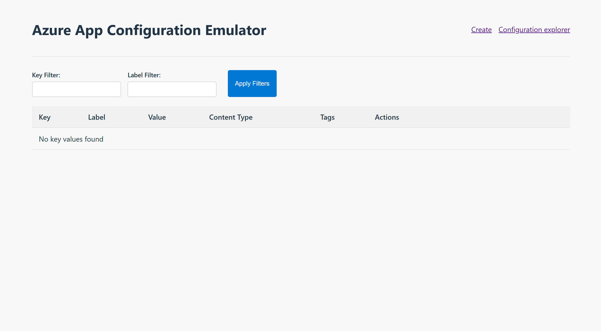
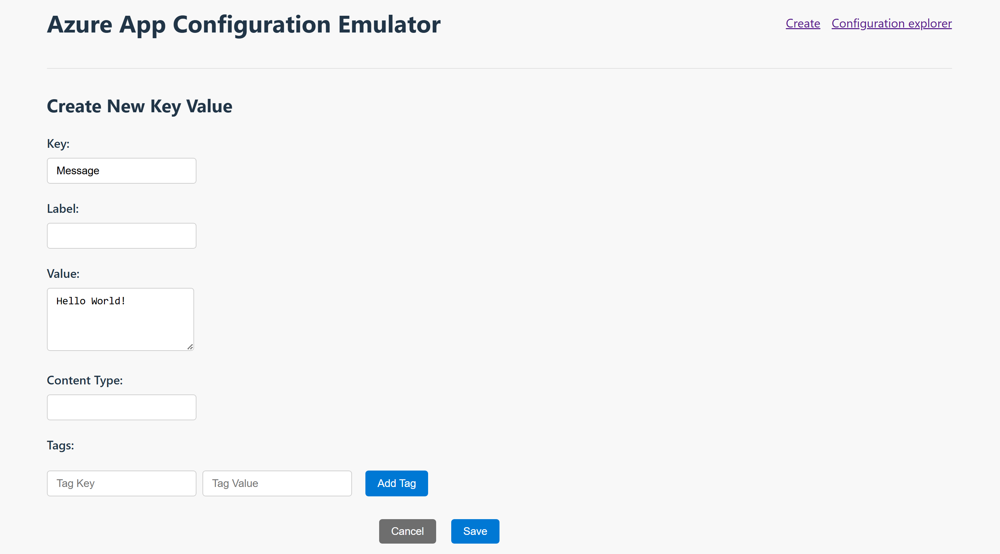
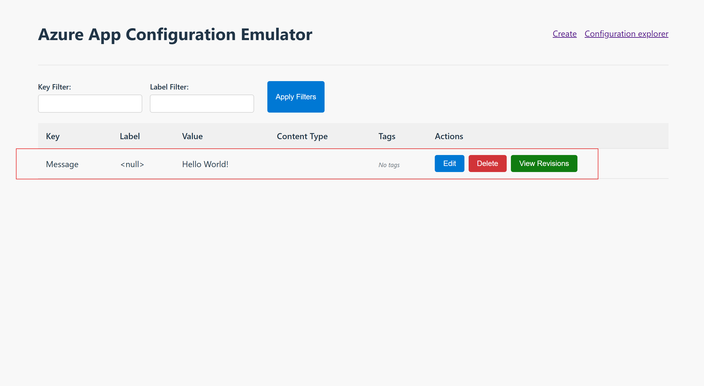

# Azure App Configuration emulator overview

The Azure App Configuration emulator is a local development tool that provides a lightweight implementation of the Azure App Configuration service. This emulator allows developers to test and develop applications locally without requiring an active Azure subscription or connection to the cloud service.

The Azure App Configuration emulator is open source. For more information, visit the [GitHub repository](https://github.com/Azure/AppConfiguration-Emulator).

## Feature overview

The following table lists the features supported by the latest Azure App Configuration emulator.

| Feature                                                          | Status    |
| ---------------------------------------------------------------- | --------- |
| Web UI                                                           | Available |
| Anonymous Authentication                                         | Available |
| [HMAC Authentication](./rest-api-authentication-hmac.md)         | Available |
| [Entra Id Authentication](./rest-api-authentication-azure-ad.md) | WIP       |
| .NET Aspire Integration                                          | WIP       |

| API                                                              | Status    |
| ---------------------------------------------------------------- | --------- |
| [`/keys`](./rest-api-keys.md)                                    | Available |
| [`/kv`](./rest-api-key-value.md)                                 | Available |
| [`/labels`](./rest-api-labels.md)                                | Available |
| [`/locks`](./rest-api-locks.md)                                  | Available |
| [`/revisions`](./rest-api-revisions.md)                          | Available |
| [`/snapshots`](./rest-api-snapshot.md)                           | WIP       |

## Install the emulator

### [Docker](#tab/docker)

Use [Docker](https://hub.docker.com/) to pull the latest [App Configuration emulator image](https://mcr.microsoft.com/artifact/mar/azure-app-configuration/app-configuration-emulator/about) by using the following console command:

```console
docker pull mcr.microsoft.com/azure-app-configuration/app-configuration-emulator:1.0.0-preview
```

### [GitHub](#tab/github)

This installation method requires that you have installed:
* [Git](https://git-scm.com/)
* [.NET 8.0 SDK](https://dotnet.microsoft.com/download/dotnet/8.0)
* [Node.js](https://nodejs.org)

1. Clone the [GitHub repository](https://github.com/Azure/AppConfiguration-Emulator) for the emulator project.

    ```console
    git clone https://github.com/Azure/AppConfiguration-Emulator.git
    ```

1. Build the entire solution including the UI components.

    ```console
    cd AppConfiguration-Emulator
    dotnet restore
    dotnet build
    ```

---

## Run the emulator

### [Docker](#tab/docker)

The following command runs the App Configuration emulator Docker image. The `-p 8483:8483` parameter redirects requests from host machine's port 8483 to the Docker instance. The `-e Tenant:AnonymousAuthEnabled=true` and `-e Authentication:Anonymous:AnonymousUserRole=Owner` parameters configure the anonymous authentication for the emulator.

```console
docker run -d -p 8483:8483 \
    -e Tenant:AnonymousAuthEnabled=true \
    -e Authentication:Anonymous:AnonymousUserRole=Owner \
    mcr.microsoft.com/azure-app-configuration/app-configuration-emulator:1.0.0-preview
```

If you want to have persisted data for the emulator, you can use a [bind mount](https://docs.docker.com/engine/storage/bind-mounts).

```console
docker run -d -p 8483:8483 \
    -v "C:\aace:/app/.aace" \
    -e Tenant:AnonymousAuthEnabled=true \
    -e Authentication:Anonymous:AnonymousUserRole=Owner \
    mcr.microsoft.com/azure-app-configuration/app-configuration-emulator:1.0.0-preview
```

### [GitHub](#tab/github)

```console
dotnet run --project src/Azure.AppConfiguration.Emulator.Host/Azure.AppConfiguration.Emulator.Host.csproj
```

---

## Emulator in action

Once started, the emulator is available at: `http://localhost:8483`

1. Open your browser and navigate to `http://localhost:8483`.

    > [!div class="mx-imgBorder"]
    > 

1. Click the `Create` button and add a new key `Message`.

    > [!div class="mx-imgBorder"]
    > 

1. Click the `Save` button and you see the key value in the configuration explorer.

    > [!div class="mx-imgBorder"]
    > 

1. Get `http://localhost:8483/kv` and you get the following response.

    ```json
    {"items":[{"etag":"EzV9zWW8k5JpcIXL00T5Kg","key":"Message","label":null,"content_type":null,"value":"Hello World!","tags":{},"locked":false,"last_modified":"2025-08-12T16:56:25.384738+00:00"}]}
    ```

## Next steps

For examples about how to use the emulator in your applications, go to the [GitHub repository](https://github.com/Azure/AppConfiguration-Emulator/tree/main/examples).
