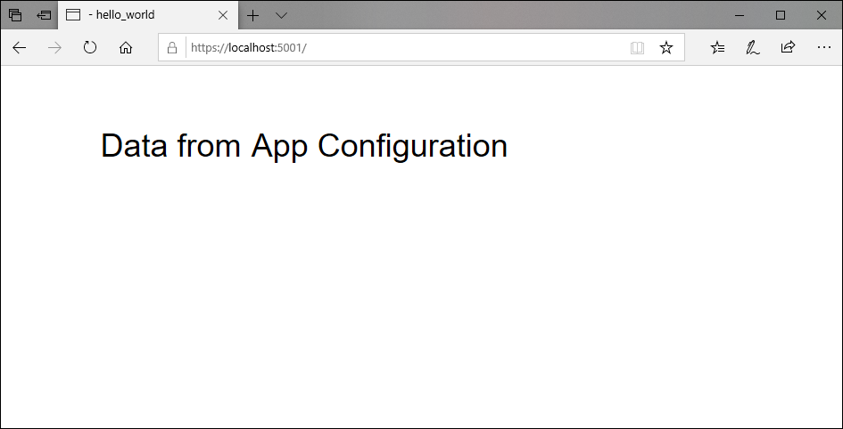
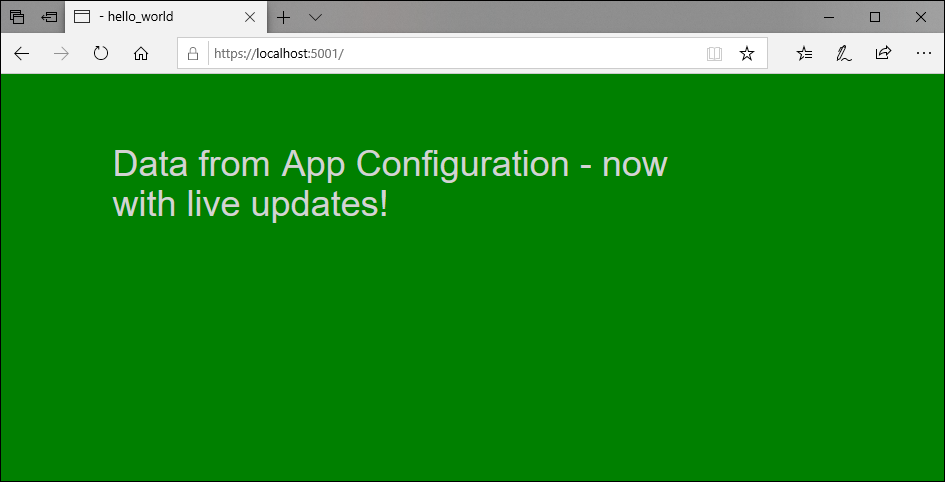

# Tutorial: Use dynamic configuration in an ASP.NET Core app

ASP.NET Core has a pluggable configuration system that can read configuration data from a variety of sources. It can handle changes on the fly without causing an application to restart. ASP.NET Core supports the binding of configuration settings to strongly typed .NET classes. It injects them into your code by using the various `IOptions<T>` patterns. One of these patterns, specifically `IOptionsSnapshot<T>`, automatically reloads the application's configuration when the underlying data changes. You can inject `IOptionsSnapshot<T>` into controllers in your application to access the most recent configuration stored in Azure App Configuration.

You also can set up the App Configuration ASP.NET Core client library to refresh a set of configuration settings dynamically using a middleware. As long as the web app continues to receive requests, the configuration settings continue to get updated with the configuration store.

In order to keep the settings updated and avoid too many calls to the configuration store, a cache is used for each setting. Until the cached value of a setting has expired, the refresh operation does not update the value, even when the value has changed in the configuration store. The default expiration time for each request is 30 seconds, but it can be overridden if required.

This tutorial shows how you can implement dynamic configuration updates in your code. It builds on the web app introduced in the quickstarts. Before you continue, finish [Create an ASP.NET Core app with App Configuration](./quickstart-aspnet-core-app.md) first.

You can use any code editor to do the steps in this tutorial. [Visual Studio Code](https://code.visualstudio.com/) is an excellent option that's available on the Windows, macOS, and Linux platforms.

In this tutorial, you learn how to:

> [!div class="checklist"]
> * Set up your application to update its configuration in response to changes in an App Configuration store.
> * Inject the latest configuration in your application's controllers.

## Prerequisites

To do this tutorial, install the [.NET Core SDK](https://dotnet.microsoft.com/download).

[!INCLUDE [quickstarts-free-trial-note](../../includes/quickstarts-free-trial-note.md)]

Before you continue, finish [Create an ASP.NET Core app with App Configuration](./quickstart-aspnet-core-app.md) first.

## Reload data from App Configuration

1. Add a reference to the `Microsoft.Azure.AppConfiguration.AspNetCore` NuGet package by running the following command:

    ```CLI
    dotnet add package Microsoft.Azure.AppConfiguration.AspNetCore --version 3.0.0-preview-011100002-1192
    ```

1. Open *Program.cs*, and update the `CreateWebHostBuilder` method to add the `config.AddAzureAppConfiguration()` method.

    #### [.NET Core 2.x](#tab/core2x)

    ```csharp
    public static IWebHostBuilder CreateWebHostBuilder(string[] args) =>
        WebHost.CreateDefaultBuilder(args)
            .ConfigureAppConfiguration((hostingContext, config) =>
            {
                var settings = config.Build();

                config.AddAzureAppConfiguration(options =>
                {
                    options.Connect(settings["ConnectionStrings:AppConfig"])
                           .ConfigureRefresh(refresh =>
                           {
                               refresh.Register("TestApp:Settings:BackgroundColor")
                                      .Register("TestApp:Settings:FontColor")
                                      .Register("TestApp:Settings:Message");
                           });
                });
            })
            .UseStartup<Startup>();
    ```

    #### [.NET Core 3.x](#tab/core3x)

    ```csharp
    public static IHostBuilder CreateHostBuilder(string[] args) =>
        Host.CreateDefaultBuilder(args)
            .ConfigureWebHostDefaults(webBuilder =>
                webBuilder.ConfigureAppConfiguration((hostingContext, config) =>
                {
                    var settings = config.Build();
                    config.AddAzureAppConfiguration(options =>
                    {   
                        options.Connect(settings["ConnectionStrings:AppConfig"])
                            .ConfigureRefresh(refresh =>
                                {
                                    refresh.Register("TestApp:Settings:BackgroundColor")
                                            .Register("TestApp:Settings:FontColor")
                                            .Register("TestApp:Settings:Message");
                                });
                    });
                })
            .UseStartup<Startup>());
    ```
    ---

    The `ConfigureRefresh` method is used to specify the settings used to update the configuration data with the App Configuration store when a refresh operation is triggered. In order to actually trigger a refresh operation, a refresh middleware needs to be configured for the application to refresh the configuration data when any change occurs.

2. Add a *Settings.cs* file that defines and implements a new `Settings` class.

    ```csharp
    namespace TestAppConfig
    {
        public class Settings
        {
            public string BackgroundColor { get; set; }
            public long FontSize { get; set; }
            public string FontColor { get; set; }
            public string Message { get; set; }
        }
    }
    ```

3. Open *Startup.cs*, and use `IServiceCollection.Configure<T>` in the `ConfigureServices` method to bind configuration data to the `Settings` class.

    #### [.NET Core 2.x](#tab/core2x)

    ```csharp
    public void ConfigureServices(IServiceCollection services)
    {
        services.Configure<Settings>(Configuration.GetSection("TestApp:Settings"));
        services.AddMvc().SetCompatibilityVersion(CompatibilityVersion.Version_2_1);
    }
    ```

    #### [.NET Core 3.x](#tab/core3x)

    ```csharp
    public void ConfigureServices(IServiceCollection services)
    {
        services.Configure<Settings>(Configuration.GetSection("TestApp:Settings"));
        services.AddControllersWithViews();
    }
    ```
    ---

4. Update the `Configure` method, adding the `UseAzureAppConfiguration` middleware to allow the configuration settings registered for refresh to be updated while the ASP.NET Core web app continues to receive requests.


    #### [.NET Core 2.x](#tab/core2x)

    ```csharp
    public void Configure(IApplicationBuilder app, IHostingEnvironment env)
    {
        app.UseAzureAppConfiguration();

        services.Configure<CookiePolicyOptions>(options =>
        {
            options.CheckConsentNeeded = context => true;
            options.MinimumSameSitePolicy = SameSiteMode.None;
        });

        app.UseMvc();
    }
    ```

    #### [.NET Core 3.x](#tab/core3x)

    ```csharp
    public void Configure(IApplicationBuilder app, IWebHostEnvironment env)
    {
            if (env.IsDevelopment())
            {
                app.UseDeveloperExceptionPage();
            }
            else
            {
                app.UseExceptionHandler("/Home/Error");
                // The default HSTS value is 30 days. You may want to change this for production scenarios, see https://aka.ms/aspnetcore-hsts.
                app.UseHsts();
            }

            // Add the following line:
            app.UseAzureAppConfiguration();

            app.UseHttpsRedirection();
            
            app.UseStaticFiles();

            app.UseRouting();

            app.UseAuthorization();

            app.UseEndpoints(endpoints =>
            {
                endpoints.MapControllerRoute(
                    name: "default",
                    pattern: "{controller=Home}/{action=Index}/{id?}");
            });
    }
    ```
    ---
    
    The middleware uses the refresh configuration specified in the `AddAzureAppConfiguration` method in `Program.cs` to trigger a refresh for each request received by the ASP.NET Core web app. For each request, a refresh operation is triggered and the client library checks if the cached value for the registered configuration settings have expired. For the cached values that have expired, the values for the settings are updated with the App Configuration store, and the remaining values remain unchanged.
    
    > [!NOTE]
    > The default cache expiration time for a configuration setting is 30 seconds, but can be overridden by calling the `SetCacheExpiration` method on the options initializer passed as an argument to the `ConfigureRefresh` method.

## Use the latest configuration data

1. Open *HomeController.cs* in the Controllers directory, and add a reference to the `Microsoft.Extensions.Options` package.

    ```csharp
    using Microsoft.Extensions.Options;
    ```

2. Update the `HomeController` class to receive `Settings` through dependency injection, and make use of its values.

    #### [.NET Core 2.x](#tab/core2x)

    ```csharp
    public class HomeController : Controller
    {
        private readonly Settings _settings;
        public HomeController(IOptionsSnapshot<Settings> settings)
        {
            _settings = settings.Value;
        }

        public IActionResult Index()
        {
            ViewData["BackgroundColor"] = _settings.BackgroundColor;
            ViewData["FontSize"] = _settings.FontSize;
            ViewData["FontColor"] = _settings.FontColor;
            ViewData["Message"] = _settings.Message;

            return View();
        }
    }
    ```

    #### [.NET Core 3.x](#tab/core3x)

    ```csharp
    public class HomeController : Controller
    {
        private readonly Settings _settings;
        private readonly ILogger<HomeController> _logger;

        public HomeController(ILogger<HomeController> logger, IOptionsSnapshot<Settings> settings)
        {
            _logger = logger;
            _settings = settings.Value;
        }

        public IActionResult Index()
        {
            ViewData["BackgroundColor"] = _settings.BackgroundColor;
            ViewData["FontSize"] = _settings.FontSize;
            ViewData["FontColor"] = _settings.FontColor;
            ViewData["Message"] = _settings.Message;

            return View();
        }

        // ...
    }
    ```
    ---


3. Open *Index.cshtml* in the Views > Home directory, and replace its content with the following script:

    ```html
    <!DOCTYPE html>
    <html lang="en">
    <style>
        body {
            background-color: @ViewData["BackgroundColor"]
        }
        h1 {
            color: @ViewData["FontColor"];
            font-size: @ViewData["FontSize"];
        }
    </style>
    <head>
        <title>Index View</title>
    </head>
    <body>
        <h1>@ViewData["Message"]</h1>
    </body>
    </html>
    ```

## Build and run the app locally

1. To build the app by using the .NET Core CLI, run the following command in the command shell:

        dotnet build

2. After the build successfully completes, run the following command to run the web app locally:

        dotnet run

3. Open a browser window, and go to `http://localhost:5000`, which is the default URL for the web app hosted locally.

    

4. Sign in to the [Azure portal](https://portal.azure.com). Select **All resources**, and select the App Configuration store instance that you created in the quickstart.

5. Select **Configuration Explorer**, and update the values of the following keys:

    | Key | Value |
    |---|---|
    | TestApp:Settings:BackgroundColor | green |
    | TestApp:Settings:FontColor | lightGray |
    | TestApp:Settings:Message | Data from Azure App Configuration - now with live updates! |

6. Refresh the browser page to see the new configuration settings. More than one refresh of the browser page may be required for the changes to be reflected.

    
    
    > [!NOTE]
    > Since the configuration settings are cached with a default expiration time of 30 seconds, any changes made to the settings in the App Configuration store would only be reflected in the web app when the cache has expired.

## Clean up resources

[!INCLUDE [azure-app-configuration-cleanup](../../includes/azure-app-configuration-cleanup.md)]

## Next steps

In this tutorial, you enabled your ASP.NET Core web app to dynamically refresh configuration settings from App Configuration. To learn how to use an Azure managed identity to streamline the access to App Configuration, continue to the next tutorial.

> [!div class="nextstepaction"]
> [Managed identity integration](./howto-integrate-azure-managed-service-identity.md)
