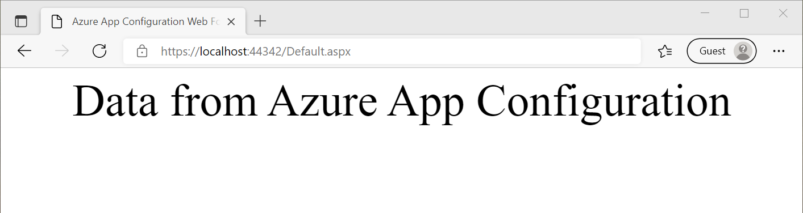
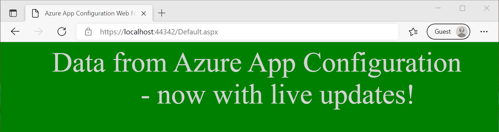

# Tutorial: Use dynamic configuration in an ASP.NET web application (.NET Framework)

Data from App Configuration can be loaded as App Settings in a .NET Framework application. For more information, see the [quickstart](./quickstart-dotnet-app.md). However, as is designed by the .NET Framework, the App Settings can only refresh upon application restart. The App Configuration .NET provider is a .NET Standard library. It supports caching and refreshing configuration dynamically without application restart. This tutorial shows how you can implement dynamic configuration updates in an ASP.NET Web Forms application. The same technique applies to .NET Framework MVC applications.

In this tutorial, you learn how to:

> [!div class="checklist"]
> * Set up your ASP.NET web application to update its configuration in response to changes in an App Configuration store.
> * Inject the latest configuration in requests to your application.

## Prerequisites

- An Azure account with an active subscription. [Create one for free](https://azure.microsoft.com/free/).
- An App Configuration store. [Create a store](./quickstart-azure-app-configuration-create.md#create-an-app-configuration-store).
- [Visual Studio](https://visualstudio.microsoft.com/vs)
- [.NET Framework 4.7.2 or later](https://dotnet.microsoft.com/download/dotnet-framework)

## Add key-values

Add the following key-values to the App Configuration store and leave **Label** and **Content Type** with their default values. For more information about how to add key-values to a store using the Azure portal or the CLI, go to [Create a key-value](./quickstart-azure-app-configuration-create.md#create-a-key-value).

| Key                                | Value                               |
|------------------------------------|-------------------------------------|
| *TestApp:Settings:BackgroundColor* | *White*                             |
| *TestApp:Settings:FontColor*       | *Black*                             |
| *TestApp:Settings:FontSize*        | *40*                                |
| *TestApp:Settings:Message*         | *Data from Azure App Configuration* |
| *TestApp:Settings:Sentinel*        | *v1*                                |

## Create an ASP.NET Web Application

1. Start Visual Studio and select **Create a new project**.

1. Select **ASP.NET Web Application (.NET Framework)** with C# from the project template list and press **Next**.

1. In **Configure your new project**, enter a project name. Under **Framework**, select **.NET Framework 4.7.2** or higher. Press **Create**.

1. In **Create a new ASP.NET Web Application**, select **Web Forms**. Press **Create**.

## Reload data from App Configuration

1. Right-click your project and select **Manage NuGet Packages**. On the **Browse** tab, search and add the latest version of the following NuGet package to your project.

   *Microsoft.Extensions.Configuration.AzureAppConfiguration*

1. Open *Global.asax.cs* file and add following namespaces.
    ```csharp
    using Microsoft.Extensions.Configuration;
    using Microsoft.Extensions.Configuration.AzureAppConfiguration;
    ```

1. Add the following static member variables to the `Global` class.
    ```csharp
    public static IConfiguration Configuration;
    private static IConfigurationRefresher _configurationRefresher;
    ```

1. Add an `Application_Start` method to the `Global` class. If the method already exists, add the following code to it.
    ```csharp
    protected void Application_Start(object sender, EventArgs e)
    {
        ConfigurationBuilder builder = new ConfigurationBuilder();
        builder.AddAzureAppConfiguration(options =>
        {
            options.Connect(Environment.GetEnvironmentVariable("ConnectionString"))
                    // Load all keys that start with `TestApp:` and have no label.
                    .Select("TestApp:*")
                    // Configure to reload configuration if the registered key 'TestApp:Settings:Sentinel' is modified.
                    .ConfigureRefresh(refresh => 
                    {
                        refresh.Register("TestApp:Settings:Sentinel", refreshAll:true)
                               .SetCacheExpiration(new TimeSpan(0, 5, 0));
                    });
            _configurationRefresher = options.GetRefresher();
        });

        Configuration = builder.Build();
    }
    ```
    The `Application_Start` method is called upon the first request to your web application. It is called only once during the application's life cycle. As such it is a good place to initialize your `IConfiguration` object and load data from App Configuration.

    In the `ConfigureRefresh` method, a key within your App Configuration store is registered for change monitoring. The `refreshAll` parameter to the `Register` method indicates that all configuration values should be refreshed if the registered key changes. In this example, the key *TestApp:Settings:Sentinel* is a *sentinel key* that you update after you complete the change of all other keys. When a change is detected, your application refreshes all configuration values. This approach helps to ensure the consistency of configuration in your application compared to monitoring all keys for changes.
    
    The `SetCacheExpiration` method specifies the minimum time that must elapse before a new request is made to App Configuration to check for any configuration changes. In this example, you override the default expiration time of 30 seconds, specifying a time of 5 minutes instead. It reduces the potential number of requests made to your App Configuration store.


1. Add an `Application_BeginRequest` method to the `Global` class. If the method already exists, add the following code to it.
    ```csharp
    protected void Application_BeginRequest(object sender, EventArgs e)
    {
        _ = _configurationRefresher.TryRefreshAsync();
    }
    ```
    Calling the `ConfigureRefresh` method alone won't cause the configuration to refresh automatically. You call the `TryRefreshAsync` method at the beginning of every request to signal a refresh. This design ensures your application only sends requests to App Configuration when it is actively receiving requests. 
    
    Calling `TryRefreshAsync` is a no-op before the configured cache expiration time elapses, so its performance impact is minimal. When a request is made to App Configuration, as you don't wait on the task, the configuration is refreshed asynchronously without blocking the execution of the current request. The current request may not get the updated configuration values, but subsequent requests will do.

    If the call `TryRefreshAsync` fails for any reason, your application will continue to use the cached configuration. Another attempt will be made when the configured cache expiration time has passed again, and the `TryRefreshAsync` call is triggered by a new request to your application.

## Use the latest configuration data

1. Open *Default.aspx* and replace its content with the following markup. Make sure the *Inherits* attribute matches the namespace and the class name of your application.
    ```xml
    <%@ Page Language="C#" AutoEventWireup="true" CodeBehind="Default.aspx.cs" Inherits="WebFormApp.Default" %>

    <!DOCTYPE html>

    <html xmlns="http://www.w3.org/1999/xhtml">
    <head runat="server">
        <title>Azure App Configuration Web Forms Demo</title>
    </head>
    <body id="body" runat="server">
        <form id="form1" runat="server">
            <div style="text-align: center">
                <asp:Label ID="message" runat="server" />
            </div>
        </form>
    </body>
    </html>
    ```

1. Open *Default.aspx.cs* and update it with the following code.
    ```cs
    using System;
    using System.Web.UI.WebControls;

    namespace WebFormApp
    {
        public partial class Default : System.Web.UI.Page
        {
            protected void Page_Load(object sender, EventArgs e)
            {
                // Read configuration from the IConfiguration object loaded from Azure App Configuration
                string messageText = Global.Configuration["TestApp:Settings:Message"] ?? "Please add the key \"TestApp:Settings:Message\" in your Azure App Configuration store.";
                string messageFontSize = Global.Configuration["TestApp:Settings:FontSize"] ?? "20";
                string messageFontColor = Global.Configuration["TestApp:Settings:FontColor"] ?? "Black";
                string backgroundColor = Global.Configuration["TestApp:Settings:BackgroundColor"] ?? "White";

                message.Text = messageText;
                message.Font.Size = FontUnit.Point(int.Parse(messageFontSize));
                message.ForeColor = System.Drawing.Color.FromName(messageFontColor);
                body.Attributes["bgcolor"] = backgroundColor;
            }
        }
    }
    ```

## Build and run the application

1. Set an environment variable named **ConnectionString** to the read-only key connection string obtained during your App Configuration store creation.

    If you use the Windows command prompt, run the following command:
    ```console
    setx ConnectionString "connection-string-of-your-app-configuration-store"
    ```

    If you use Windows PowerShell, run the following command:
    ```powershell
    $Env:ConnectionString = "connection-string-of-your-app-configuration-store"
    ```

1. Restart Visual Studio to allow the change to take effect. 

1. Press Ctrl + F5 to build and run the web application.

    

1. In the Azure portal, navigate to the **Configuration explorer** of your App Configuration store, and update the value of the following keys. Remember to update the sentinel key *TestApp:Settings:Sentinel* at last.

    | Key                                | Value                                                        |
    |------------------------------------|--------------------------------------------------------------|
    | *TestApp:Settings:BackgroundColor* | *Green*                                                      |
    | *TestApp:Settings:FontColor*       | *LightGray*                                                  |
    | *TestApp:Settings:Message*         | *Data from Azure App Configuration - now with live updates!* |
    | *TestApp:Settings:Sentinel*        | *v2*                                                         |

1. Refresh the browser page to see the new configuration settings. You may need to refresh more than once for the changes to be reflected or change your cache expiration time to less than 5 minutes. 

    

> [!NOTE]
> You can download the example code used in this tutorial from the [Azure App Configuration GitHub repo](https://github.com/Azure/AppConfiguration/tree/main/examples/DotNetFramework/WebFormApp).

## Clean up resources

[!INCLUDE [azure-app-configuration-cleanup](../../includes/azure-app-configuration-cleanup.md)]

## Next steps

In this tutorial, you enabled your ASP.NET Web Forms application to dynamically refresh configuration settings from App Configuration. To learn how to enable dynamic configuration in a .NET Framework app, continue to the next tutorial:

> [!div class="nextstepaction"]
> [Enable dynamic configuration in .NET Framework apps](./enable-dynamic-configuration-dotnet.md)

To learn how to use an Azure managed identity to streamline the access to App Configuration, continue to the next tutorial:

> [!div class="nextstepaction"]
> [Managed identity integration](./howto-integrate-azure-managed-service-identity.md)
