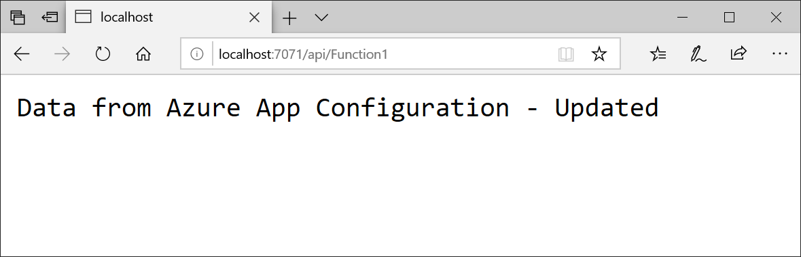

# Tutorial: Use dynamic configuration in an Azure Functions app

The App Configuration .NET Standard configuration provider supports caching and refreshing configuration dynamically driven by application activity. This tutorial shows how you can implement dynamic configuration updates in your code. It builds on the Azure Functions app introduced in the quickstarts. Before you continue, finish [Create an Azure functions app with Azure App Configuration](./quickstart-azure-functions-csharp.md) first.

In this tutorial, you learn how to:

> [!div class="checklist"]
> * Set up your Azure Functions app to update its configuration in response to changes in an App Configuration store.
> * Inject the latest configuration to your Azure Functions calls.

## Prerequisites

- Azure subscription - [create one for free](https://azure.microsoft.com/free/)
- [Visual Studio 2019](https://visualstudio.microsoft.com/vs) with the **Azure development** workload
- [Azure Functions tools](../azure-functions/functions-develop-vs.md#check-your-tools-version)
- Finish quickstart [Create an Azure functions app with Azure App Configuration](./quickstart-azure-functions-csharp.md)

## Reload data from App Configuration

1. Open *Function1.cs*. In addition to the `static` property `Configuration`, add a new `static` property `ConfigurationRefresher` to keep a singleton instance of `IConfigurationRefresher` that will be used to signal configuration updates during Functions calls later.

    ```csharp
    private static IConfiguration Configuration { set; get; }
    private static IConfigurationRefresher ConfigurationRefresher { set; get; }
    ```

2. Update the constructor and use the `ConfigureRefresh` method to specify the setting to be refreshed from the App Configuration store. An instance of `IConfigurationRefresher` is retrieved using `GetRefresher` method. Optionally, we also change the configuration cache expiration time window to 1 minute from the default 30 seconds.

    ```csharp
    static Function1()
    {
        var builder = new ConfigurationBuilder();
        builder.AddAzureAppConfiguration(options =>
        {
            options.Connect(Environment.GetEnvironmentVariable("ConnectionString"))
                   .ConfigureRefresh(refreshOptions =>
                        refreshOptions.Register("TestApp:Settings:Message")
                                      .SetCacheExpiration(TimeSpan.FromSeconds(60))
            );
            ConfigurationRefresher = options.GetRefresher();
        });
        Configuration = builder.Build();
    }
    ```

3. Update the `Run` method and signal to refresh the configuration using the `TryRefreshAsync` method at the beginning of the Functions call. This will be no-op if the cache expiration time window isn't reached. Remove the `await` operator if you prefer the configuration to be refreshed without blocking.

    ```csharp
    public static async Task<IActionResult> Run(
        [HttpTrigger(AuthorizationLevel.Anonymous, "get", "post", Route = null)] HttpRequest req, ILogger log)
    {
        log.LogInformation("C# HTTP trigger function processed a request.");

        await ConfigurationRefresher.TryRefreshAsync(); 

        string keyName = "TestApp:Settings:Message";
        string message = Configuration[keyName];
            
        return message != null
            ? (ActionResult)new OkObjectResult(message)
            : new BadRequestObjectResult($"Please create a key-value with the key '{keyName}' in App Configuration.");
    }
    ```

## Test the function locally

1. Set an environment variable named **ConnectionString**, and set it to the access key to your app configuration store. If you use the Windows command prompt, run the following command and restart the command prompt to allow the change to take effect:

        setx ConnectionString "connection-string-of-your-app-configuration-store"

    If you use Windows PowerShell, run the following command:

        $Env:ConnectionString = "connection-string-of-your-app-configuration-store"

    If you use macOS or Linux, run the following command:

        export ConnectionString='connection-string-of-your-app-configuration-store'

2. To test your function, press F5. If prompted, accept the request from Visual Studio to download and install **Azure Functions Core (CLI)** tools. You might also need to enable a firewall exception so that the tools can handle HTTP requests.

3. Copy the URL of your function from the Azure Functions runtime output.

    

4. Paste the URL for the HTTP request into your browser's address bar. The following image shows the response in the browser to the local GET request returned by the function.

    

5. Sign in to the [Azure portal](https://portal.azure.com). Select **All resources**, and select the App Configuration store instance that you created in the quickstart.

6. Select **Configuration Explorer**, and update the values of the following key:

    | Key | Value |
    |---|---|
    | TestApp:Settings:Message | Data from Azure App Configuration - Updated |

7. Refresh the browser a few times. When the cached setting expires after a minute, the page shows the response of the Functions call with updated value.

    

The example code used in this tutorial can be downloaded from [App Configuration GitHub repo](https://github.com/Azure/AppConfiguration/tree/master/examples/DotNetCore/AzureFunction)

## Clean up resources

[!INCLUDE [azure-app-configuration-cleanup](../../includes/azure-app-configuration-cleanup.md)]

## Next steps

In this tutorial, you enabled your Azure Functions app to dynamically refresh configuration settings from App Configuration. To learn how to use an Azure managed identity to streamline the access to App Configuration, continue to the next tutorial.

> [!div class="nextstepaction"]
> [Managed identity integration](./howto-integrate-azure-managed-service-identity.md)
