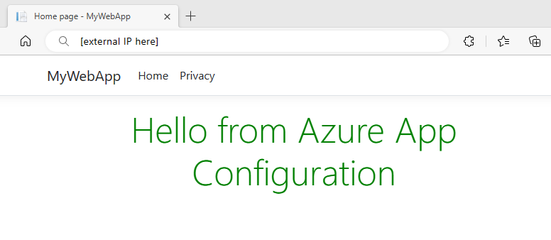

# Tutorial: Use dynamic configuration in Azure Kubernetes Service

If you use Azure Kubernetes Service (AKS), this tutorial will show you how to enable dynamic configuration for your workloads in AKS by leveraging Azure App Configuration and its Kubernetes Provider. The tutorial assumes that you have already worked through the quickstart and have an App Configuration Kubernetes Provider set up, so before proceeding, make sure you have completed the [Use Azure App Configuration in Azure Kubernetes Service](./quickstart-azure-kubernetes-service.md) quickstart.


## Prerequisites

Finish the quickstart: [Use Azure App Configuration in Azure Kubernetes Service](./quickstart-azure-kubernetes-service.md).

> [!TIP]
> The Azure Cloud Shell is a free, interactive shell that you can use to run the command line instructions in this article. It has common Azure tools preinstalled, including the .NET Core SDK. If you're logged in to your Azure subscription, launch your [Azure Cloud Shell](https://shell.azure.com) from shell.azure.com. You can learn more about Azure Cloud Shell by [reading our documentation](../cloud-shell/overview.md).
>
## Add a sentinel key

A *sentinel key* is a key that you update after you complete the change of all other keys. Your app monitors the sentinel key. When a change is detected, your app refreshes all configuration values. This approach helps to ensure the consistency of configuration in your app and reduces the overall number of requests made to your App Configuration store, compared to monitoring all keys for changes.

Add the following key-value to your App Configuration store. For more information about how to add key-values to a store using the Azure portal or the CLI, go to [Create a key-value](./quickstart-azure-app-configuration-create.md#create-a-key-value).

| Key | Value |
|---|---|
| Settings:Sentinel | 1 |

## Reload data from App Configuration

1. Open the *appConfigurationProvider.yaml* file located in the *Deployment* directory. Then, add the `refresh` section under the `configuration` property as shown below. It enables configuration refresh by monitoring the sentinel key.

    ```yaml
    apiVersion: azconfig.io/v1
    kind: AzureAppConfigurationProvider
    metadata:
      name: appconfigurationprovider-sample
    spec:
      endpoint: <your-app-configuration-store-endpoint>
      target:
        configMapName: configmap-created-by-appconfig-provider
        configMapData: 
          type: json
          key: mysettings.json
      auth:
        workloadIdentity:
          managedIdentityClientId: <your-managed-identity-client-id>
      configuration:
        refresh:
          enabled: true
          monitoring:
            keyValues:
            - key: Settings:Sentinel
    ```

    > [!TIP]
    > By default, the Kubernetes provider polls the monitoring key-values every 30 seconds for change detection. However, you can change this behavior by setting the `interval` property of the `refresh`. If you want to reduce the number of requests to your App Configuration store, you can adjust it to a higher value.

1. Open the *deployment.yaml* file in the *Deployment* directory and add the following content to the `spec.containers` section. Your application will load configuration from a volume-mounted file the App Configuration Kubernetes provider generates. By setting this environment variable, your application can [ use polling to monitor changes in mounted files](/dotnet/api/microsoft.extensions.fileproviders.physicalfileprovider.usepollingfilewatcher).

    ```yaml
    env:
    - name: DOTNET_USE_POLLING_FILE_WATCHER
      value: "true"
    ```

1. Run the following command to deploy the change. Replace the namespace if you are using your existing AKS application.
   
   ```console
   kubectl apply -f ./Deployment -n appconfig-demo
   ```

1. Open a browser window, and navigate to the IP address obtained in the [previous step](./quickstart-azure-kubernetes-service.md#deploy-the-application). The web page looks like this:

    


1. Update the following key-values in your App Configuration store, ensuring to update the sentinel key last.

    | Key | Value |
    |---|---|
    | Settings:Message | Hello from Azure App Configuration - now with live updates! |
    | Settings:Sentinel | 2 |

1. After refreshing the browser a few times, you will see the updated content once the ConfigMap is updated in 30 seconds.

    

## Reload ConfigMap and Secret

App Configuration Kubernetes provider generates ConfigMaps or Secrets that can be used as environment variables or volume-mounted files. This tutorial demonstrated how to load configuration from a JSON file using the [.NET JSON configuration provider](/dotnet/core/extensions/configuration-providers#json-configuration-provider), which automatically reloads the configuration whenever a change is detected in the mounted file. As a result, your application gets the updated configuration automatically whenever the App Configuration Kubernetes provider updates the ConfigMap.

If your application is dependent on environment variables for configuration, it may require a restart to pick up any updated values. In Kubernetes, the application restart can be orchestrated using rolling updates on the corresponding pods or containers. To automate configuration updates, you may leverage third-party tools like [stakater/Reloader](https://github.com/stakater/Reloader), which can automatically trigger rolling updates upon any changes made to ConfigMaps or Secrets.

## Next steps

To learn more about the Azure App Configuration Kubernetes Provider, see [Azure App Configuration Kubernetes Provider reference](./reference-kubernetes-provider.md).