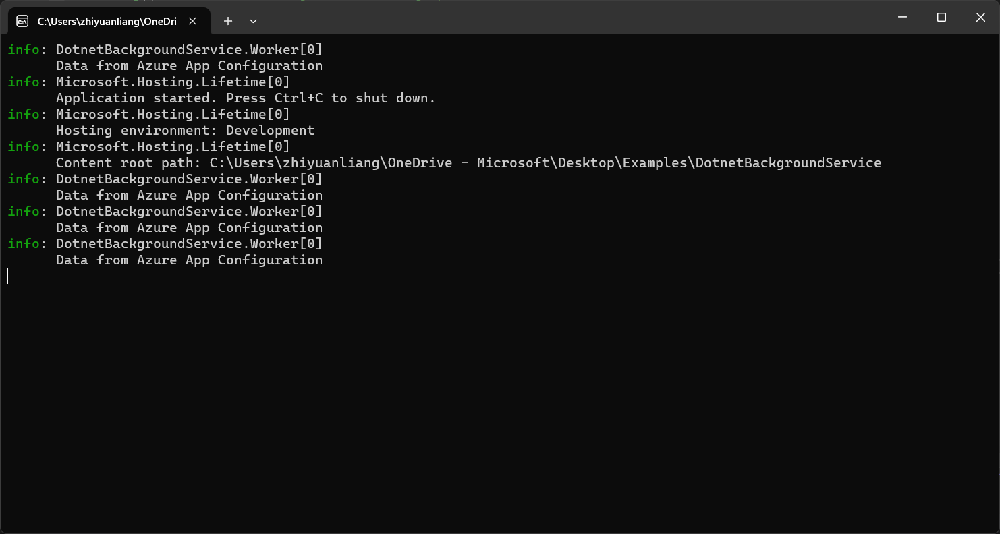
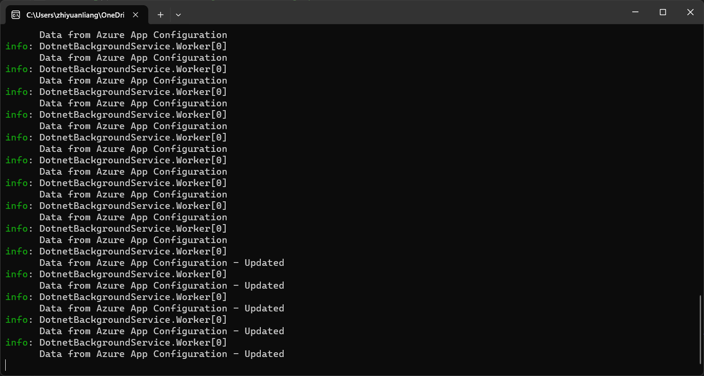

# Tutorial: Use dynamic configuration in a .NET background service

Data from App Configuration can be loaded as App Settings in a .NET application. For more information, see the [quickstart](./quickstart-dotnet-core-app.md). However, as is designed by the .NET, the App Settings can only refresh upon application restart. The App Configuration .NET provider is a .NET Standard library. It supports caching and refreshing configuration dynamically without application restart. This tutorial shows how you can implement dynamic configuration updates in a .NET background service.

In this tutorial, you learn how to:

> [!div class="checklist"]
> * Set up your .NET background service to update its configuration in response to changes in an App Configuration store.
> * Consume the latest configuration in your background service.

## Prerequisites

- An Azure account with an active subscription. [Create one for free](https://azure.microsoft.com/free/).
- An App Configuration store. [Create a store](./quickstart-azure-app-configuration-create.md#create-an-app-configuration-store).
- [.NET SDK 6.0 or later](https://dotnet.microsoft.com/download) - also available in the [Azure Cloud Shell](https://shell.azure.com).

## Add a key-value

Add the following key-value to the App Configuration store and leave **Label** and **Content Type** with their default values. For more information about how to add key-values to a store using the Azure portal or the CLI, go to [Create a key-value](./quickstart-azure-app-configuration-create.md#create-a-key-value).

| Key                        | Value                               |
|----------------------------|-------------------------------------|
| *TestApp:Settings:Message* | *Data from Azure App Configuration* |

## Create a .NET background service

You use the [.NET command-line interface (CLI)](/dotnet/core/tools/) to create a new .NET app project. The advantage of using the .NET CLI over Visual Studio is that it's available across the Windows, macOS, and Linux platforms.  Alternatively, use the preinstalled tools available in the [Azure Cloud Shell](https://shell.azure.com).

1. Create a new folder for your project.

1. In the new folder, run the following command to create a new .NET background service project:

    ```dotnetcli
    dotnet new worker
    ```

## Reload data from App Configuration

1. Add references to the `Microsoft.Extensions.Configuration.AzureAppConfiguration` NuGet package by running the following command:

    ```dotnetcli
    dotnet add package Microsoft.Extensions.Configuration.AzureAppConfiguration
    ```

1. Run the following command to restore packages for your project:

    ```dotnetcli
    dotnet restore
    ```

1. Open *Program.cs* and add the following statements:

    ```csharp
    using Microsoft.Extensions.Configuration;
    using Microsoft.Extensions.Configuration.AzureAppConfiguration;
    ```

1. Connect to App Configuration.

    ```csharp
    // Existing code in Program.cs
    // ... ...

    var builder = Host.CreateApplicationBuilder(args);

    builder.Configuration.AddAzureAppConfiguration(options =>
    {
        options.Connect(Environment.GetEnvironmentVariable("ConnectionString"))
            // Load all keys that start with `TestApp:`.
            .Select("TestApp:*")
            // Configure to reload the key 'TestApp:Settings:Message' if it is modified.
            .ConfigureRefresh(refreshOptions =>
            {
                refreshOptions.Register("TestApp:Settings:Message");
            });

        // Register the refresher so that the Worker service can consume it through DI
        builder.Services.AddSingleton(options.GetRefresher());
    });

    // The rest of existing code in Program.cs
    // ... ...
    ```

    In the `ConfigureRefresh` method, a key within your App Configuration store is registered for change monitoring. The `Register` method has an optional boolean parameter `refreshAll` that can be used to indicate whether all configuration values should be refreshed if the registered key changes. In this example, only the key *TestApp:Settings:Message* will be refreshed. All settings registered for refresh have a default cache expiration of 30 seconds before a new refresh is attempted. It can be updated by calling the `AzureAppConfigurationRefreshOptions.SetCacheExpiration` method.

1. Open *Worker.cs*. Inject `IConfiguration` and `IConfigurationRefresher` to the `Worker` service and log the configuration data from App Configuration.

    ```csharp
    public class Worker : BackgroundService
    {
        private readonly ILogger<Worker> _logger;
        private readonly IConfiguration _configuration;
        private readonly IConfigurationRefresher _refresher;

        public Worker(ILogger<Worker> logger, IConfiguration configuration, IConfigurationRefresher refresher)
        {
            _logger = logger ?? throw new ArgumentNullException(nameof(logger));
            _configuration = configuration ?? throw new ArgumentNullException(nameof(configuration));
            _refresher = refresher ?? throw new ArgumentNullException(nameof(refresher));
        }

        protected override async Task ExecuteAsync(CancellationToken stoppingToken)
        {
            while (!stoppingToken.IsCancellationRequested)
            {
                // Intentionally not await TryRefreshAsync to avoid blocking the execution.
                _refresher.TryRefreshAsync(stoppingToken);

                if (_logger.IsEnabled(LogLevel.Information))
                {
                    _logger.LogInformation(_configuration["TestApp:Settings:Message"] ?? "No data.");
                }

                await Task.Delay(TimeSpan.FromSeconds(30), stoppingToken);
            }
        }
    }
    ```

    Calling the `ConfigureRefresh` method alone won't cause the configuration to refresh automatically. You call the `TryRefreshAsync` method from the interface `IConfigurationRefresher` to trigger a refresh. This design is to avoid requests sent to App Configuration even when your application is idle. You can include the `TryRefreshAsync` call where you consider your application active. For example, it can be when you process an incoming message, an order, or an iteration of a complex task. It can also be in a timer if your application is active all the time. In this example, you call `TryRefreshAsync` every time the background service is executed. Note that, even if the call `TryRefreshAsync` fails for any reason, your application will continue to use the cached configuration. Another attempt will be made when the configured cache expiration time has passed and the `TryRefreshAsync` call is triggered by your application activity again. Calling `TryRefreshAsync` is a no-op before the configured cache expiration time elapses, so its performance impact is minimal, even if it's called frequently.

## Build and run the app locally

1. Set an environment variable named **ConnectionString**, and set it to the access key to your App Configuration store. At the command line, run the following command.

    ### [Windows command prompt](#tab/windowscommandprompt)

    To build and run the app locally using the Windows command prompt, run the following command.

    ```console
    setx ConnectionString "connection-string-of-your-app-configuration-store"
    ```

    Restart the command prompt to allow the change to take effect. Print the value of the environment variable to validate that it's set properly.

    ### [PowerShell](#tab/powershell)

    If you use Windows PowerShell, run the following command.

    ```azurepowershell
    $Env:ConnectionString = "connection-string-of-your-app-configuration-store"
    ```

    ### [macOS](#tab/unix)

    If you use macOS, run the following command.

    ```console
    export ConnectionString='connection-string-of-your-app-configuration-store'
    ```

    ### [Linux](#tab/linux)

    If you use Linux, run the following command.

    ```console
    export ConnectionString='connection-string-of-your-app-configuration-store'
    ```

    ---

1. Run the following command to build the app.

    ```dotnetcli
    dotnet build
    ```

1. After the build successfully completes, run the following command to run the app locally.

    ```dotnetcli
    dotnet run
    ```

1. You should see the following outputs in the console.

    

1. In the Azure portal, navigate to the **Configuration explorer** of your App Configuration store, and update the value of the following key.

    | Key                        | Value                                         |
    |----------------------------|-----------------------------------------------|
    | *TestApp:Settings:Message* | *Data from Azure App Configuration - Updated* |

1. Wait a few moments for the refresh interval time window to pass. You will see the console outputs changed.

    

## Clean up resources

[!INCLUDE [azure-app-configuration-cleanup](../../includes/azure-app-configuration-cleanup.md)]

## Next steps

In this tutorial, you enabled your .NET background service to dynamically refresh configuration settings from App Configuration. To learn how to enable dynamic configuration in an ASP.NET Web Application, continue to the next tutorial:

> [!div class="nextstepaction"]
> [Enable dynamic configuration in ASP.NET Web Applications](./enable-dynamic-configuration-aspnet-core.md)

To learn how to use an Azure managed identity to streamline the access to App Configuration, continue to the next tutorial:

> [!div class="nextstepaction"]
> [Managed identity integration](./howto-integrate-azure-managed-service-identity.md)