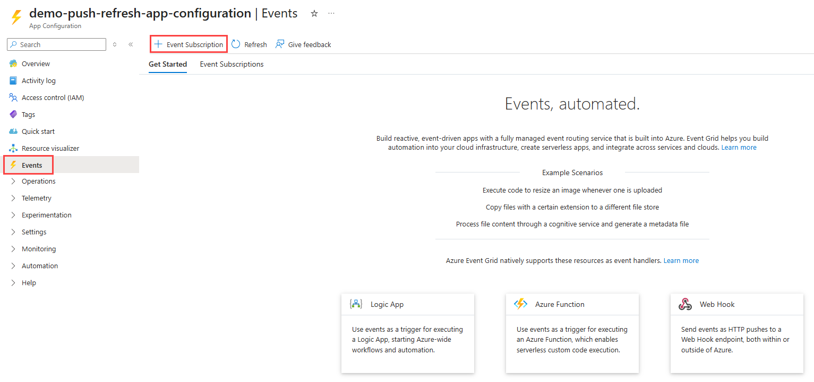
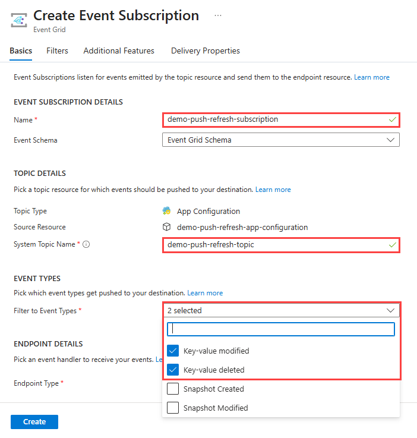
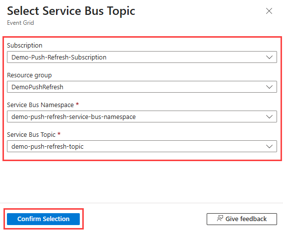
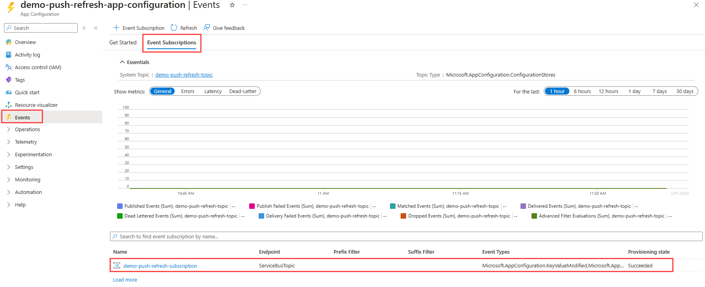
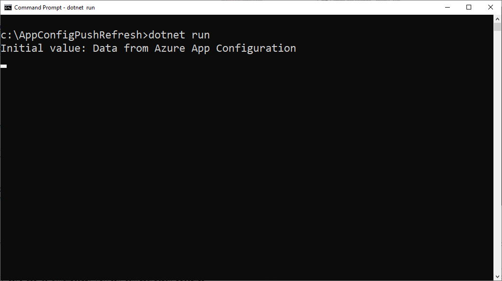
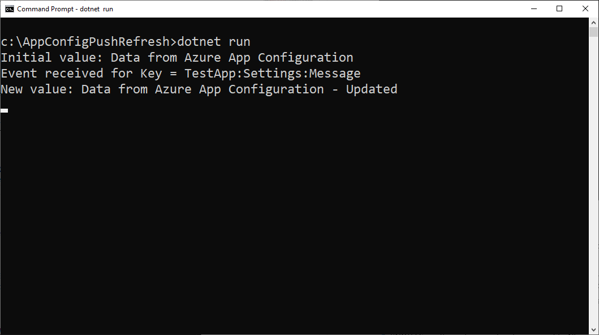

# Tutorial: Use dynamic configuration using push refresh in a .NET Core app

The App Configuration .NET Core client library supports updating configuration on demand without causing an application to restart. An application can be configured to detect changes in App Configuration using one or both of the following two approaches.

1. Poll Model: This is the default behavior that uses polling to detect changes in configuration. Once the cached value of a setting expires, the next call to `TryRefreshAsync` or `RefreshAsync` sends a request to the server to check if the configuration has changed, and pulls the updated configuration if needed.

1. Push Model: This uses [App Configuration events](./concept-app-configuration-event.md) to detect changes in configuration. Once App Configuration is set up to send key value change events to Azure Event Grid, the application can use these events to optimize the total number of requests needed to keep the configuration updated. Applications can choose to subscribe to these either directly from Event Grid, or through one of the [supported event handlers](../event-grid/event-handlers.md) such as a webhook, an Azure function, or a Service Bus topic.

This tutorial shows how you can implement dynamic configuration updates in your code using push refresh. It builds on the app introduced in the tutorial. Before you continue, finish Tutorial: [Use dynamic configuration in a .NET Core app](./enable-dynamic-configuration-dotnet-core.md) first.

You can use any code editor to do the steps in this tutorial. [Visual Studio Code](https://code.visualstudio.com/) is an excellent option that's available on the Windows, macOS, and Linux platforms.

In this tutorial, you learn how to:
> [!div class="checklist"]
>
> * Set up a subscription to send configuration change events from App Configuration to a Service Bus topic
> * Set up your .NET Core app to update its configuration in response to changes in App Configuration.
> * Consume the latest configuration in your application.

## Prerequisites

* Tutorial: [Use dynamic configuration in a .NET Core app](./enable-dynamic-configuration-dotnet-core.md)
* NuGet package `Microsoft.Extensions.Configuration.AzureAppConfiguration` version 5.0.0 or later

## Set up Azure Service Bus topic and subscription

This tutorial uses the Service Bus integration for Event Grid to simplify the detection of configuration changes for applications that don't wish to poll App Configuration for changes continuously. The Azure Service Bus SDK provides an API to register a message handler that can be used to update configuration when changes are detected in App Configuration. Follow steps in the [Quickstart: Use the Azure portal to create a Service Bus topic and subscription](../service-bus-messaging/service-bus-quickstart-topics-subscriptions-portal.md) to create a service bus namespace, topic, and subscription.

Once the resources are created, add the following environment variables. These will be used to register an event handler for configuration changes in the application code.

| Key | Value |
|---|---|
| ServiceBusConnectionString | Connection string for the service bus namespace |
| ServiceBusTopic | Name of the Service Bus topic |
| ServiceBusSubscription | Name of the service bus subscription |

## Set up Event subscription

1. Open the App Configuration resource in the Azure portal, then click on `+ Event Subscription` in the `Events` pane.

    

1. Enter a name for the `Event Subscription` and the `System Topic`.

    

1. Select the `Endpoint Type` as `Service Bus Topic`, elect the Service Bus topic, then click on `Confirm Selection`.

    

1. Click on `Create` to create the event subscription.

1. Click on `Event Subscriptions` in the `Events` pane to validate that the subscription was created successfully.

    

> [!NOTE]
> When subscribing for configuration changes, one or more filters can be used to reduce the number of events sent to your application. These can be configured either as [Event Grid subscription filters](../event-grid/event-filtering.md) or [Service Bus subscription filters](../service-bus-messaging/topic-filters.md). For example, a subscription filter can be used to only subscribe to events for changes in a key that starts with a specific string.

## Register event handler to reload data from App Configuration

Open *Program.cs* and update the file with the following code.

```csharp
using Azure.Messaging.EventGrid;
using Azure.Messaging.ServiceBus;
using Microsoft.Extensions.Configuration;
using Microsoft.Extensions.Configuration.AzureAppConfiguration;
using Microsoft.Extensions.Configuration.AzureAppConfiguration.Extensions;
using System;
using System.Threading.Tasks;

namespace TestConsole
{
    class Program
    {
        private const string AppConfigurationConnectionStringEnvVarName = "AppConfigurationConnectionString";
        // e.g. Endpoint=https://{store_name}.azconfig.io;Id={id};Secret={secret}
        
        private const string ServiceBusConnectionStringEnvVarName = "ServiceBusConnectionString";
        // e.g. Endpoint=sb://{service_bus_name}.servicebus.windows.net/;SharedAccessKeyName={key_name};SharedAccessKey={key}
        
        private const string ServiceBusTopicEnvVarName = "ServiceBusTopic";
        private const string ServiceBusSubscriptionEnvVarName = "ServiceBusSubscription";

        private static IConfigurationRefresher _refresher = null;

        static async Task Main(string[] args)
        {
            string appConfigurationConnectionString = Environment.GetEnvironmentVariable(AppConfigurationConnectionStringEnvVarName);

            IConfiguration configuration = new ConfigurationBuilder()
                .AddAzureAppConfiguration(options =>
                {
                    options.Connect(appConfigurationConnectionString);
                    options.ConfigureRefresh(refresh =>
                        refresh
                            .Register("TestApp:Settings:Message")
                            .SetCacheExpiration(TimeSpan.FromDays(1))  // Important: Reduce poll frequency
                    );

                    _refresher = options.GetRefresher();
                }).Build();

            RegisterRefreshEventHandler();
            var message = configuration["TestApp:Settings:Message"];
            Console.WriteLine($"Initial value: {configuration["TestApp:Settings:Message"]}");

            while (true)
            {
                await _refresher.TryRefreshAsync();

                if (configuration["TestApp:Settings:Message"] != message)
                {
                    Console.WriteLine($"New value: {configuration["TestApp:Settings:Message"]}");
                    message = configuration["TestApp:Settings:Message"];
                }

                await Task.Delay(TimeSpan.FromSeconds(1));
            }
        }

        private static void RegisterRefreshEventHandler()
        {
            string serviceBusConnectionString = Environment.GetEnvironmentVariable(ServiceBusConnectionStringEnvVarName);
            string serviceBusTopic = Environment.GetEnvironmentVariable(ServiceBusTopicEnvVarName);
            string serviceBusSubscription = Environment.GetEnvironmentVariable(ServiceBusSubscriptionEnvVarName);
            ServiceBusClient serviceBusClient = new ServiceBusClient(serviceBusConnectionString);
            ServiceBusProcessor serviceBusProcessor = serviceBusClient.CreateProcessor(serviceBusTopic, serviceBusSubscription);

            serviceBusProcessor.ProcessMessageAsync += (processMessageEventArgs) =>
                {
                    // Build EventGridEvent from notification message
                    EventGridEvent eventGridEvent = EventGridEvent.Parse(BinaryData.FromBytes(processMessageEventArgs.Message.Body));

                    // Create PushNotification from eventGridEvent
                    eventGridEvent.TryCreatePushNotification(out PushNotification pushNotification);

                    // Prompt Configuration Refresh based on the PushNotification
                    _refresher.ProcessPushNotification(pushNotification);

                    return Task.CompletedTask;
                };

            serviceBusProcessor.ProcessErrorAsync += (exceptionargs) =>
                {
                    Console.WriteLine($"{exceptionargs.Exception}");
                    return Task.CompletedTask;
                };
        }
    }
}
```

The `ProcessPushNotification` method resets the cache expiration to a short random delay. This causes future calls to `RefreshAsync` or `TryRefreshAsync` to re-validate the cached values against App Configuration and update them as necessary. In this example you register to monitor changes to the key: *TestApp:Settings:Message* with a cache expiration of one day. This means no request to App Configuration will be made before a day has passed since the last check. By calling  `ProcessPushNotification` your application will send requests to App Configuration in the next few seconds. Your application will load the new configuration values shortly after changes occur in the `App Configuration` store without the need to constantly poll for updates. In case your application misses the change notification for any reason, it will still check for configuration changes once a day.

The short random delay for cache expiration is helpful if you have many instances of your application or microservices connecting to the same App Configuration store with the push model. Without this delay, all instances of your application could send requests to your App Configuration store simultaneously as soon as they receive a change notification. This can cause the App Configuration Service to throttle your store. Cache expiration delay is set to a random number between 0 and a maximum of 30 seconds by default, but you can change the maximum value through the optional parameter `maxDelay` to the `ProcessPushNotification` method.

The `ProcessPushNotification` method takes in a `PushNotification` object containing information about which change in App Configuration triggered the push notfication. This helps ensure all configuration changes up to the triggering event are loaded in the following configuration refresh. The `SetDirty` method does not gurarantee the change that triggers the push notification to be loaded in an immediate configuration refresh. If you are using the `SetDirty` method for the push model, we recommend using the `ProcessPushNotification` method instead.

## Build and run the app locally

1. Set an environment variable named **AppConfigurationConnectionString**, and set it to the access key to your App Configuration store.

    ### [Windows command prompt](#tab/windowscommandprompt)

    To build and run the app locally using the Windows command prompt, run the following command and restart the command prompt to allow the change to take effect:

    ```console
    setx AppConfigurationConnectionString "connection-string-of-your-app-configuration-store"
    ```

    ### [PowerShell](#tab/powershell)

    If you use Windows PowerShell, run the following command:

    ```powershell
    $Env:AppConfigurationConnectionString = "connection-string-of-your-app-configuration-store"
    ```

    ### [macOS](#tab/unix)

    If you use macOS, run the following command:

    ```console
    export AppConfigurationConnectionString='connection-string-of-your-app-configuration-store'
    ```

    ### [Linux](#tab/linux)

    If you use Linux, run the following command:

    ```console
    export AppConfigurationConnectionString='connection-string-of-your-app-configuration-store'
    ```

    ---

1. Run the following command to build the console app:

    ```console
    dotnet build
    ```

1. After the build successfully completes, run the following command to run the app locally:

    ```console
    dotnet run
    ```

    

1. Sign in to the [Azure portal](https://portal.azure.com). Select **All resources**, and select the App Configuration store instance that you created in the quickstart.

1. Select **Configuration Explorer**, and update the values of the following keys:

    | Key | Value |
    |---|---|
    | TestApp:Settings:Message | Data from Azure App Configuration - Updated |

1. Wait for 30 seconds to allow the event to be processed and configuration to be updated.

    

## Clean up resources

[!INCLUDE [azure-app-configuration-cleanup](../../includes/azure-app-configuration-cleanup.md)]

## Next steps

In this tutorial, you enabled your .NET Core app to dynamically refresh configuration settings from App Configuration. To learn how to use an Azure managed identity to streamline the access to App Configuration, continue to the next tutorial.

> [!div class="nextstepaction"]
> [Managed identity integration](./howto-integrate-azure-managed-service-identity.md)
