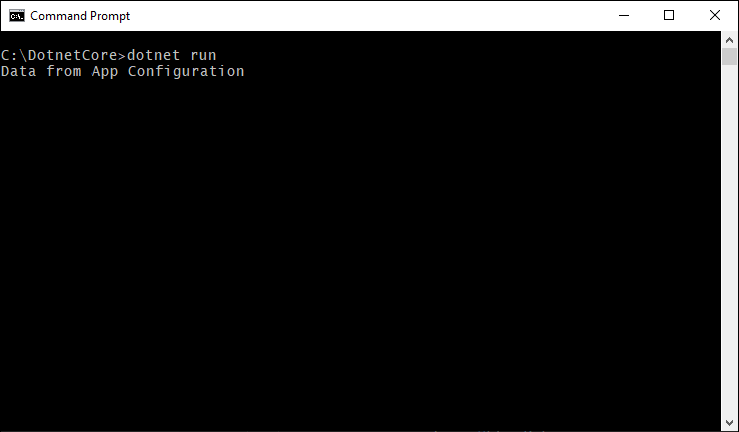

# Tutorial: Use dynamic configuration in a .NET Core app

The App Configuration .NET Core client library supports updating a set of configuration settings on demand without causing an application to restart. This can be implemented by first getting an instance of `IConfigurationRefresher` from the options for the configuration provider and then calling `Refresh` on that instance anywhere in your code.

In order to keep the settings updated and avoid too many calls to the configuration store, a cache is used for each setting. Until the cached value of a setting has expired, the refresh operation does not update the value, even when the value has changed in the configuration store. The default expiration time for each request is 30 seconds, but it can be overridden if required.

This tutorial shows how you can implement dynamic configuration updates in your code. It builds on the app introduced in the quickstarts. Before you continue, finish [Create a .NET Core app with App Configuration](./quickstart-dotnet-core-app.md) first.

You can use any code editor to do the steps in this tutorial. [Visual Studio Code](https://code.visualstudio.com/) is an excellent option that's available on the Windows, macOS, and Linux platforms.

In this tutorial, you learn how to:

> [!div class="checklist"]
> * Set up your .NET Core app to update its configuration in response to changes in an App Configuration store.
> * Consume the latest configuration in your application.

## Prerequisites

To do this tutorial, install the [.NET Core SDK](https://dotnet.microsoft.com/download).

[!INCLUDE [quickstarts-free-trial-note](../../includes/quickstarts-free-trial-note.md)]

## Reload data from App Configuration

Open *Program.cs* and update the file to add a reference to the `System.Threading.Tasks` namespace, to specify refresh configuration in the `AddAzureAppConfiguration` method, and to trigger manual refresh using the `Refresh` method.

```csharp
using System;
using System.Threading.Tasks;

namespace TestConsole
{
class Program
{
    private static IConfiguration _configuration = null;
    private static IConfigurationRefresher _refresher = null;

    static void Main(string[] args)
    {
        var builder = new ConfigurationBuilder();
        builder.AddAzureAppConfiguration(options =>
        {
            options.Connect(Environment.GetEnvironmentVariable("ConnectionString"))
                    .ConfigureRefresh(refresh =>
                    {
                        refresh.Register("TestApp:Settings:Message")
                               .SetCacheExpiration(TimeSpan.FromSeconds(10));
                    });
                    
                    _refresher = options.GetRefresher();
        });

        _configuration = builder.Build();
        PrintMessage().Wait();
    }

    private static async Task PrintMessage()
    {
        Console.WriteLine(_configuration["TestApp:Settings:Message"] ?? "Hello world!");

        // Wait for the user to press Enter
        Console.ReadLine();

        await _refresher.Refresh();
        Console.WriteLine(_configuration["TestApp:Settings:Message"] ?? "Hello world!");
    }
}
}
```

The `ConfigureRefresh` method is used to specify the settings used to update the configuration data with the App Configuration store when a refresh operation is triggered. An instance of `IConfigurationRefresher` can be retrieved by calling `GetRefresher` method on the options provided to `AddAzureAppConfiguration` method, and the `Refresh` method on this instance could be used to trigger a refresh operation anywhere in your code.
    
> [!NOTE]
> The default cache expiration time for a configuration setting is 30 seconds, but can be overridden by calling the `SetCacheExpiration` method on the options initializer passed as an argument to the `ConfigureRefresh` method.

## Build and run the app locally

1. Set an environment variable named **ConnectionString**, and set it to the access key to your App Configuration store. If you use the Windows command prompt, run the following command and restart the command prompt to allow the change to take effect:

        setx ConnectionString "connection-string-of-your-app-configuration-store"

    If you use Windows PowerShell, run the following command:

        $Env:ConnectionString = "connection-string-of-your-app-configuration-store"

    If you use macOS or Linux, run the following command:

        export ConnectionString='connection-string-of-your-app-configuration-store'

1. Run the following command to build the console app:

        dotnet build

1. After the build successfully completes, run the following command to run the app locally:

        dotnet run

    

1. Sign in to the [Azure portal](https://portal.azure.com). Select **All resources**, and select the App Configuration store instance that you created in the quickstart.

1. Select **Configuration Explorer**, and update the values of the following keys:

    | Key | Value |
    |---|---|
    | TestApp:Settings:Message | Data from Azure App Configuration - Updated |

1. Press the Enter key to trigger a refresh and print the updated value in the Command Prompt or PowerShell window.

    
    
    > [!NOTE]
    > Since the cache expiration time was set to 10 seconds using the `SetCacheExpiration` method while specifying the configuration for the refresh operation, the value for the configuration setting will only be updated if at least 10 seconds have elapsed since the last refresh for that setting.

## Clean up resources

[!INCLUDE [azure-app-configuration-cleanup](../../includes/azure-app-configuration-cleanup.md)]

## Next steps

In this tutorial, you enabled your .NET Core app to dynamically refresh configuration settings from App Configuration. To learn how to use an Azure managed identity to streamline the access to App Configuration, continue to the next tutorial.

> [!div class="nextstepaction"]
> [Managed identity integration](./howto-integrate-azure-managed-service-identity.md)
