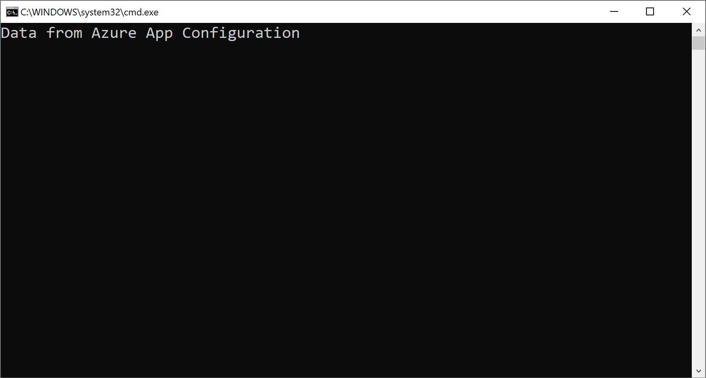
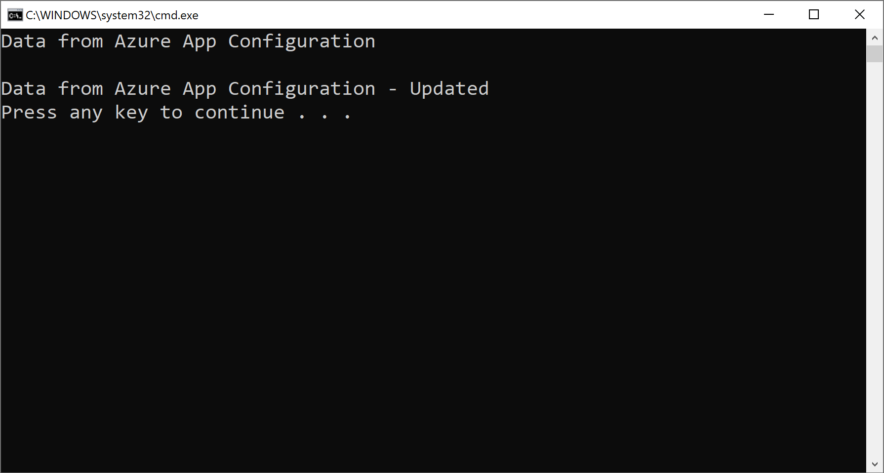

# Tutorial: Use dynamic configuration in a .NET Framework app

Data from App Configuration can be loaded as App Settings in a .NET Framework app. For more information, see the [quickstart](./quickstart-dotnet-app.md). However, as is designed by the .NET Framework, the App Settings can only refresh upon app restart. The App Configuration .NET provider is a .NET Standard library. It supports caching and refreshing configuration dynamically without app restart. This tutorial shows how you can implement dynamic configuration updates in a .NET Framework console app.

In this tutorial, you learn how to:

> [!div class="checklist"]
> * Set up your .NET Framework app to update its configuration in response to changes in an App Configuration store.
> * Inject the latest configuration in your application.

## Prerequisites

- An Azure account with an active subscription. [Create one for free](https://azure.microsoft.com/free/).
- An App Configuration store. [Create a store](./quickstart-azure-app-configuration-create.md#create-an-app-configuration-store).
- [Visual Studio](https://visualstudio.microsoft.com/vs)
- [.NET Framework 4.7.2 or later](https://dotnet.microsoft.com/download/dotnet-framework)

## Add a key-value

Add the following key-value to the App Configuration store and leave **Label** and **Content Type** with their default values. For more information about how to add key-values to a store using the Azure portal or the CLI, go to [Create a key-value](./quickstart-azure-app-configuration-create.md#create-a-key-value).

| Key                        | Value                               |
|----------------------------|-------------------------------------|
| *TestApp:Settings:Message* | *Data from Azure App Configuration* |

## Create a .NET Framework console app

1. Start Visual Studio and select **Create a new project**.

1. In **Create a new project**, filter on the **Console** project type and select **Console App (.NET Framework)** with C# from the project template list. Press **Next**.

1. In **Configure your new project**, enter a project name. Under **Framework**, select **.NET Framework 4.7.2** or higher. Press **Create**.

## Reload data from App Configuration
1. Right-click your project, and select **Manage NuGet Packages**. On the **Browse** tab, search and add the latest version of the following NuGet package to your project.

   *Microsoft.Extensions.Configuration.AzureAppConfiguration*

1. Open *Program.cs* and add following namespaces.

    ```csharp
    using Microsoft.Extensions.Configuration;
    using Microsoft.Extensions.Configuration.AzureAppConfiguration;
    ```

1. Add two variables to store configuration-related objects.

    ```csharp
    private static IConfiguration _configuration;
    private static IConfigurationRefresher _refresher;
    ```

1. Update the `Main` method to connect to App Configuration with the specified refresh options.

    ```csharp
    static void Main(string[] args)
    {
        var builder = new ConfigurationBuilder();
        builder.AddAzureAppConfiguration(options =>
        {
            options.Connect(Environment.GetEnvironmentVariable("ConnectionString"))
                    // Load all keys that start with `TestApp:`.
                    .Select("TestApp:*")
                    // Configure to reload the key 'TestApp:Settings:Message' if it is modified.
                    .ConfigureRefresh(refresh =>
                    {
                        refresh.Register("TestApp:Settings:Message")
                               .SetCacheExpiration(TimeSpan.FromSeconds(10));
                    });

            _refresher = options.GetRefresher();
        });

        _configuration = builder.Build();
        PrintMessage().Wait();
    }
    ```

    In the `ConfigureRefresh` method, a key within your App Configuration store is registered for change monitoring. The `Register` method has an optional boolean parameter `refreshAll` that can be used to indicate whether all configuration values should be refreshed if the registered key changes. In this example, only the key *TestApp:Settings:Message* will be refreshed. The `SetCacheExpiration` method specifies the minimum time that must elapse before a new request is made to App Configuration to check for any configuration changes. In this example, you override the default expiration time of 30 seconds, specifying a time of 10 seconds instead for demonstration purposes.

1. Add a method called `PrintMessage()` that triggers a refresh of configuration data from App Configuration.

    ```csharp
    private static async Task PrintMessage()
    {
        Console.WriteLine(_configuration["TestApp:Settings:Message"] ?? "Hello world!");

        // Wait for the user to press Enter
        Console.ReadLine();

        await _refresher.TryRefreshAsync();
        Console.WriteLine(_configuration["TestApp:Settings:Message"] ?? "Hello world!");
    }
    ```

    Calling the `ConfigureRefresh` method alone won't cause the configuration to refresh automatically. You call the `TryRefreshAsync` method from the interface `IConfigurationRefresher` to trigger a refresh. This design is to avoid phantom requests sent to App Configuration even when your application is idle. You can include the `TryRefreshAsync` call where you consider your application active. For example, it can be when you process an incoming message, an order, or an iteration of a complex task. It can also be in a timer if your application is active all the time. In this example, you call `TryRefreshAsync` when you press the Enter key. Note that, even if the call `TryRefreshAsync` fails for any reason, your application will continue to use the cached configuration. Another attempt will be made when the configured cache expiration time has passed and the `TryRefreshAsync` call is triggered by your application activity again. Calling `TryRefreshAsync` is a no-op before the configured cache expiration time elapses, so its performance impact is minimal, even if it's called frequently.

## Build and run the app locally

1. Set an environment variable named **ConnectionString** to the read-only key connection string obtained during your App Configuration store creation. 

    If you use the Windows command prompt, run the following command:
    ```console
    setx ConnectionString "connection-string-of-your-app-configuration-store"
    ```

    If you use Windows PowerShell, run the following command:
    ```powershell
    $Env:ConnectionString = "connection-string-of-your-app-configuration-store"
    ```

1. Restart Visual Studio to allow the change to take effect. 

1. Press Ctrl + F5 to build and run the console app.

    

1. In the Azure portal, navigate to the **Configuration explorer** of your App Configuration store, and update the value of the following key.

    | Key                        | Value                                         |
    |----------------------------|-----------------------------------------------|
    | *TestApp:Settings:Message* | *Data from Azure App Configuration - Updated* |

1. Back in the running application, press the Enter key to trigger a refresh and print the updated value in the Command Prompt or PowerShell window.

    
    
    > [!NOTE]
    > Since the cache expiration time was set to 10 seconds using the `SetCacheExpiration` method while specifying the configuration for the refresh operation, the value for the configuration setting will only be updated if at least 10 seconds have elapsed since the last refresh for that setting.

## Clean up resources

[!INCLUDE [azure-app-configuration-cleanup](../../includes/azure-app-configuration-cleanup.md)]

## Next steps

In this tutorial, you enabled your .NET Framework app to dynamically refresh configuration settings from App Configuration. To learn how to enable dynamic configuration in an ASP.NET Web Application (.NET Framework), continue to the next tutorial:

> [!div class="nextstepaction"]
> [Enable dynamic configuration in ASP.NET Web Applications](./enable-dynamic-configuration-aspnet-netfx.md)

To learn how to use an Azure managed identity to streamline the access to App Configuration, continue to the next tutorial:

> [!div class="nextstepaction"]
> [Managed identity integration](./howto-integrate-azure-managed-service-identity.md)
