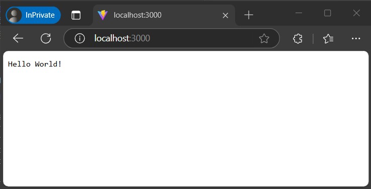
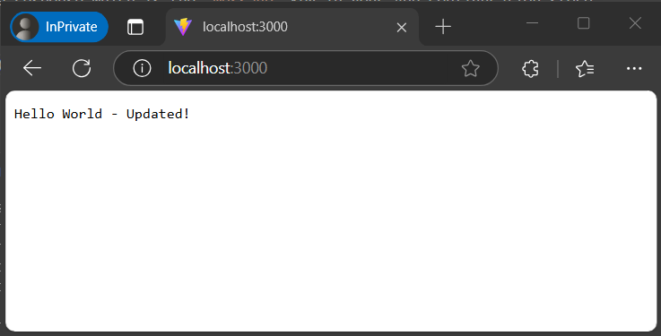

# Tutorial: Use dynamic configuration in JavaScript

In this tutorial, you learn how to enable dynamic configuration in your JavaScript applications.
The example in this tutorial builds on the sample application introduced in the JavaScript quickstart.
Before you continue, finish [Create a JavaScript app with Azure App Configuration](./quickstart-javascript-provider.md).

## Prerequisites

- Finish the quickstart [Create a JavaScript app with Azure App Configuration](./quickstart-javascript-provider.md).
- Update the [`@azure/app-configuration-provider`](https://www.npmjs.com/package/@azure/app-configuration-provider) package to version **2.0.0** or later.

## Add key-values

Add the following key-value to your Azure App Configuration store. For more information about how to add key-values to a store using the Azure portal or the CLI, go to [Create a key-value](./quickstart-azure-app-configuration-create.md#create-a-key-value).

| Key            | Value             | Label       | Content type       |
|----------------|-------------------|-------------|--------------------|
| *message*      | *Hello World!*    | Leave empty | Leave empty        |

## Console applications

The following examples show how to use refreshable configuration values in console applications.
Choose the following instructions based on how your application consumes configuration data loaded from App Configuration, either as a `Map` or a configuration object.

### Load data from App Configuration

You can connect to App Configuration using either Microsoft Entra ID (recommended) or a connection string. The following code snippet demonstrates using Microsoft Entra ID. You use the DefaultAzureCredential to authenticate to your App Configuration store. While completing the quickstart listed in the prerequisites, you already [assigned your credential the App Configuration Data Reader role](./concept-enable-rbac.md#authentication-with-token-credentials).

1. Open the file *app.js* and update the `load` function. Add a `refreshOptions` parameter to enable the refresh and configure refresh options. The loaded configuration will be updated when a change is detected on the server. By default, a refresh interval of 30 seconds is used, but you can override it with the `refreshIntervalInMs` property.

    ### [Use configuration as Map](#tab/configuration-map)

    ```javascript
    // Connecting to Azure App Configuration using endpoint and token credential
    const appConfig = await load(endpoint, credential, {
        // Enabling the dynamic refresh
        refreshOptions: {
            enabled: true
        }
    });
    ```

    ### [Use configuration as object](#tab/configuration-object)

    The configuration object is constructed by calling `constructConfigurationObject` function.
    To ensure an up-to-date configuration, update the configuration object in the `onRefresh` callback triggered whenever a configuration change is detected and the configuration is updated.

    ```javascript
    // Connecting to Azure App Configuration using endpoint and token credential
    const appConfig = await load(endpoint, credential, {
        // Enabling the dynamic refresh
        refreshOptions: {
            enabled: true
        }
    });

    // Constructing configuration object
    let config = appConfig.constructConfigurationObject();

    // Setting up callback to ensure `config` object is updated once configuration is changed.
    appConfig.onRefresh(() => {
        config = appConfig.constructConfigurationObject();
    });

    ```
    
    ---

    > [!NOTE]
    > If you get the error: "Refresh is enabled but no watched settings are specified.", please update the [`@azure/app-configuration-provider`](https://www.npmjs.com/package/@azure/app-configuration-provider) package to version **2.0.0** or later.

    > [!TIP]
    > For more information about monitoring configuration changes, see [Best practices for configuration refresh](./howto-best-practices.md#configuration-refresh).

1. Setting up `refreshOptions` alone won't automatically refresh the configuration. You need to call the `refresh` method to trigger a refresh. This design prevents unnecessary requests to App Configuration when your application is idle. You should include the `refresh` call where your application activity occurs. This is known as **activity-driven configuration refresh**. For example, you can call `refresh` when processing an incoming message or an order, or inside an iteration where you perform a complex task. Alternatively, you can use a timer if your application is always active. In this example, `refresh` is called in a loop for demonstration purposes. Even if the `refresh` call fails for any reason, your application will continue to use the cached configuration. Another attempt will be made when the configured refresh interval has passed and the `refresh` call is triggered by your application activity. Calling `refresh` is a no-op before the configured refresh interval elapses, so its performance impact is minimal even if it's called frequently.

    Add the following code to poll configuration changes of watched key-values.

    ### [Use configuration as Map](#tab/configuration-map)

    ```javascript
    // Polling for configuration changes every 5 seconds
    while (true) {
        console.log(appConfig.get("message")); // Consume current value of message from a Map
        appConfig.refresh(); // Refreshing the configuration setting asynchronously
        await sleepInMs(5000); // Waiting before the next refresh
    }
    ```

    ### [Use configuration as object](#tab/configuration-object)

    ```javascript
    // Polling for configuration changes every 5 seconds
    while (true) {
        console.log(config.message); // Consume current value of message from an object
        appConfig.refresh(); // Refreshing the configuration setting asynchronously
        await sleepInMs(5000); // Waiting before the next refresh
    }
    ```

    ---

1. Now the file *app.js* should look like the following code snippet:

    ### [Use configuration as Map](#tab/configuration-map)

    ```javascript
    const sleepInMs = require("util").promisify(setTimeout);
    const { load } = require("@azure/app-configuration-provider");
    const { DefaultAzureCredential } = require("@azure/identity");
    const endpoint = process.env.AZURE_APPCONFIG_ENDPOINT;
    const credential = new DefaultAzureCredential(); // For more information, see https://learn.microsoft.com/azure/developer/javascript/sdk/credential-chains#use-defaultazurecredential-for-flexibility

    async function run() {
        // Connecting to Azure App Configuration using endpoint and token credential
        const appConfig = await load(endpoint, credential, {
            // Enabling the dynamic refresh
            refreshOptions: {
                enabled: true
            }
        });

        // Polling for configuration changes every 5 seconds
        while (true) {
            console.log(appConfig.get("message")); // Consume current value of message from a Map
            appConfig.refresh(); // Refreshing the configuration setting asynchronously
            await sleepInMs(5000); // Waiting before the next refresh
        }
    }

    run().catch(console.error);
    ```

    ### [Use configuration as object](#tab/configuration-object)

    ```javascript
    const sleepInMs = require("util").promisify(setTimeout);
    const { load } = require("@azure/app-configuration-provider");
    const { DefaultAzureCredential } = require("@azure/identity");
    const endpoint = process.env.AZURE_APPCONFIG_ENDPOINT;
    const credential = new DefaultAzureCredential(); // For more information, see https://learn.microsoft.com/azure/developer/javascript/sdk/credential-chains#use-defaultazurecredential-for-flexibility

    async function run() {
        // Connecting to Azure App Configuration using endpoint and token credential
        const appConfig = await load(endpoint, credential, {
            // Enabling the dynamic refresh
            refreshOptions: {
                enabled: true
            }
        });

        // Constructing configuration object
        let config = appConfig.constructConfigurationObject();

        // Setting up callback to ensure `config` object is updated once configuration is changed.
        appConfig.onRefresh(() => {
            config = appConfig.constructConfigurationObject();
        });

        // Polling for configuration changes every 5 seconds
        while (true) {
            console.log(config.message); // Consume current value of message from an object
            appConfig.refresh(); // Refreshing the configuration setting asynchronously
            await sleepInMs(5000); // Waiting before the next refresh
        }
    }

    run().catch(console.error);
    ```

    ---

### Run the application

1. Run your script:

    ```console
    node app.js
    ```

1. Verify Output:

    ```console
    Hello World!
    ```
    It continues to print "Hello World!" in a new line every 5 seconds.

1. Update the following key-values to the Azure App Configuration store. Update value of the key `message`.

    | Key            | Value                     | Label       | Content type       |
    |----------------|---------------------------|-------------|--------------------|
    | *message*      | *Hello World - Updated!*  | Leave empty | Leave empty        |

1. Once the values are updated, the updated value is printed after the refresh interval.

    ```console
    Hello World - Updated!
    ```

## Server application

The following example shows how to update an existing http server to use refreshable configuration values.

1. Create a new JavaScript file named `server.js` and add the following code:

    ```javascript
    const http = require('http');

    function startServer() {
        const server = http.createServer((req, res) => {
            res.statusCode = 200;
            res.setHeader('Content-Type', 'text/plain');
            res.end("Hello World!");
        });

        const hostname = "localhost";
        const port = 3000;
        server.listen(port, hostname, () => {
        console.log(`Server running at http://localhost:${port}/`);
        });
    }

    startServer();
    ```

1. Run your script:

    ```console
    node server.js
    ```
    
1. Visit `http://localhost:3000` and you will see the response:

    > [!div class="mx-imgBorder"]
    > 

### Load data from App Configuration

1. Update the `server.js` to use App Configuration and enable dynamic refresh:

    ```javascript
    const http = require("http");

    const { load } = require("@azure/app-configuration-provider");
    const { DefaultAzureCredential } = require("@azure/identity");
    const endpoint = process.env.AZURE_APPCONFIG_ENDPOINT;
    const credential = new DefaultAzureCredential(); // For more information, see https://learn.microsoft.com/azure/developer/javascript/sdk/credential-chains#use-defaultazurecredential-for-flexibility

    let appConfig;
    async function initializeConfig() {
        appConfig = await load(endpoint, credential, {
            refreshOptions: {
                enabled: true,
                refreshIntervalInMs: 15_000 // set the refresh interval
            }
        });
    }

    function startServer() {
        const server = http.createServer((req, res) => {
            // refresh the configuration asynchronously when there is any incoming request
            appConfig.refresh();
            res.statusCode = 200;
            res.setHeader('Content-Type', 'text/plain');
            res.end(appConfig.get("message"));
        });

        const hostname = "localhost";
        const port = 3000;
        server.listen(port, hostname, () => {
        console.log(`Server running at http://localhost:${port}/`);
        });
    }

    // Initialize the configuration and then start the server
    initializeConfig()
        .then(() => startServer());
    ```

### Request-driven configuration refresh

In most cases, the refresh operation of the App Configuration provider can be treated as a no-op. It will only send requests to check the value in App Configuration when the refresh interval time you set has passed.

We recommend implementing request-driven configuration refresh for your web application. The configuration refresh is triggered by the incoming requests to your web app. No refresh will occur if your app is idle, when there is no request incoming. When your app is active, you can use a middleware or similar mechanism to trigger the `appConfig.refresh()` call upon every incoming request to your application.

- If a request to App Configuration for change detection fails, your app will continue to use the cached configuration. New attempts to check for changes will be made periodically while there are new incoming requests to your app.

- The configuration refresh happens asynchronously to the processing of your app's incoming requests. It will not block or slow down the incoming request that triggered the refresh. The request that triggered the refresh may not get the updated configuration values, but later requests will get new configuration values.

### Run the application

1. Relaunch your http server:

    ```console
    node server.js
    ```

1. Visit `http://localhost:3000` and verify the response which is the `message` key in your App Configuration store.

    > [!div class="mx-imgBorder"]
    > 

1. Update the following key-values to the Azure App Configuration store. Update value of the key `message`.

    | Key            | Value                     | Label       | Content type       |
    |----------------|---------------------------|-------------|--------------------|
    | *message*      | *Hello World - Updated!*  | Leave empty | Leave empty        |

1. After about 15 seconds, refresh the page for multiple times and the message should be updated.

    > [!div class="mx-imgBorder"]
    > 

## Clean up resources

[!INCLUDE [azure-app-configuration-cleanup](../../includes/azure-app-configuration-cleanup.md)]

## Next steps

In this tutorial, you enabled your JavaScript app to dynamically refresh configuration settings from Azure App Configuration. To learn how to use an Azure managed identity to streamline the access to Azure App Configuration, continue to the next tutorial.

> [!div class="nextstepaction"]
> [Managed identity integration](./howto-integrate-azure-managed-service-identity.md)

For the full feature rundown of the JavaScript configuration provider library, continue to the following document.

> [!div class="nextstepaction"]
> [JavaScript configuration provider](./reference-javascript-provider.md)