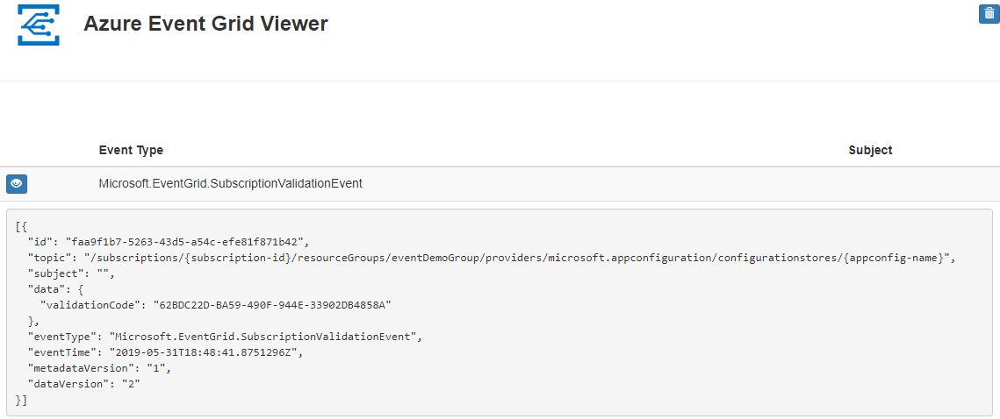

# Route Azure App Configuration events to a web endpoint with Azure CLI

In this article, you learn how to set up Azure App Configuration event subscriptions to send key-value modification events to a web endpoint. Azure App Configuration users can subscribe to events emitted whenever key-values are modified. These events can trigger web hooks, Azure Functions, Azure Storage Queues, or any other event handler that is supported by Azure Event Grid. Typically, you send events to an endpoint that processes the event data and takes actions. However, to simplify this article, you send the events to a web app that collects and displays the messages.

## Prerequisites

- Azure subscription - [create one for free](https://azure.microsoft.com/free/). You can optionally use the Azure Cloud Shell.

[!INCLUDE [cloud-shell-try-it.md](../../includes/cloud-shell-try-it.md)]

If you choose to install and use the CLI locally, this article requires that you're running the latest version of Azure CLI (2.0.70 or later). To find the version, run `az --version`. If you need to install or upgrade, see [Install Azure CLI](/cli/azure/install-azure-cli).

If you aren't using Cloud Shell, you must first sign in using `az login`.

## Create a resource group

Event Grid topics are Azure resources, and must be placed in an Azure resource group. The resource group is a logical collection into which Azure resources are deployed and managed.

Create a resource group with the [az group create](/cli/azure/group) command. 

The following example creates a resource group named `<resource_group_name>` in the *westus* location.  Replace `<resource_group_name>` with a unique name for your resource group.

```azurecli-interactive
az group create --name <resource_group_name> --location westus
```

## Create an App Configuration store

Replace `<appconfig_name>` with a unique name for your configuration store, and `<resource_group_name>` with the resource group you created earlier. The name must be unique because it is used as a DNS name.

```azurecli-interactive
az appconfig create \
  --name <appconfig_name> \
  --location westus \
  --resource-group <resource_group_name> \
  --sku free
```

## Create a message endpoint

Before subscribing to the topic, let's create the endpoint for the event message. Typically, the endpoint takes actions based on the event data. To simplify this quickstart, you deploy a [pre-built web app](https://github.com/Azure-Samples/azure-event-grid-viewer) that displays the event messages. The deployed solution includes an App Service plan, an App Service web app, and source code from GitHub.

Replace `<your-site-name>` with a unique name for your web app. The web app name must be unique because it's part of the DNS entry.

```azurecli-interactive
$sitename=<your-site-name>

az group deployment create \
  --resource-group <resource_group_name> \
  --template-uri "https://raw.githubusercontent.com/Azure-Samples/azure-event-grid-viewer/master/azuredeploy.json" \
  --parameters siteName=$sitename hostingPlanName=viewerhost
```

The deployment may take a few minutes to complete. After the deployment has succeeded, view your web app to make sure it's running. In a web browser, navigate to: `https://<your-site-name>.azurewebsites.net`

You should see the site with no messages currently displayed.

[!INCLUDE [event-grid-register-provider-cli.md](../../includes/event-grid-register-provider-cli.md)]

## Subscribe to your App Configuration store

You subscribe to a topic to tell Event Grid which events you want to track and where to send those events. The following example subscribes to the App Configuration you created, and passes the URL from your web app as the endpoint for event notification. Replace `<event_subscription_name>` with a name for your event subscription. For `<resource_group_name>` and `<appconfig_name>`, use the values you created earlier.

The endpoint for your web app must include the suffix `/api/updates/`.

```azurecli-interactive
appconfigId=$(az appconfig show --name <appconfig_name> --resource-group <resource_group_name> --query id --output tsv)
endpoint=https://$sitename.azurewebsites.net/api/updates

az eventgrid event-subscription create \
  --resource-id $appconfigId \
  --name <event_subscription_name> \
  --endpoint $endpoint
```

View your web app again, and notice that a subscription validation event has been sent to it. Select the eye icon to expand the event data. Event Grid sends the validation event so the endpoint can verify that it wants to receive event data. The web app includes code to validate the subscription.



## Trigger an App Configuration event

Now, let's trigger an event to see how Event Grid distributes the message to your endpoint. Create a key-value using the `<appconfig_name>` from earlier.

```azurecli-interactive
az appconfig kv set --name <appconfig_name> --key Foo --value Bar --yes
```

You've triggered the event, and Event Grid sent the message to the endpoint you configured when subscribing. View your web app to see the event you just sent.

```json
[{
  "id": "deb8e00d-8c64-4b6e-9cab-282259c7674f",
  "topic": "/subscriptions/{subscription-id}/resourceGroups/eventDemoGroup/providers/microsoft.appconfiguration/configurationstores/{appconfig-name}",
  "subject": "https://{appconfig-name}.azconfig.io/kv/Foo",
  "data": {
    "key": "Foo",
    "etag": "a1LIDdNEIV6wCnfv3xaip7fMXD3"
  },
  "eventType": "Microsoft.AppConfiguration.KeyValueModified",
  "eventTime": "2019-05-31T18:59:54Z",
  "dataVersion": "1",
  "metadataVersion": "1"
}]
```

## Clean up resources
If you plan to continue working with this App Configuration and event subscription, do not clean up the resources created in this article. If you do not plan to continue, use the following command to delete the resources you created in this article.

Replace `<resource_group_name>` with the resource group you created above.

```azurecli-interactive
az group delete --name <resource_group_name>
```

## Next steps

Now that you know how to create topics and event subscriptions, learn more about key-value events and what Event Grid can help you do:

- [Reacting to Key-Value Events](concept-app-configuration-event.md)
- [About Event Grid](../event-grid/overview.md)
- [Azure Event Grid handlers](../event-grid/event-handlers.md)
