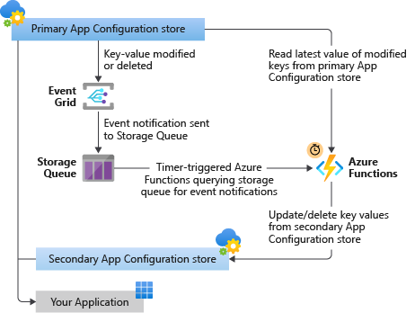

# Back up App Configuration stores automatically

> [!IMPORTANT]
> Azure App Configuration supports [geo-replication](./concept-geo-replication.md). You can enable replicas of your data across multiple locations for enhanced resiliency to regional outages. You can also leverage App Configuration provider libraries in your applications for [automatic failover](./howto-geo-replication.md#use-replicas). Utilizing geo-replication is the recommended solution for high availability.

In this article, you'll learn how to set up an automatic backup of key-values from a primary Azure App Configuration store to a secondary store. The automatic backup uses the integration of Azure Event Grid with App Configuration.

After you set up the automatic backup, App Configuration will publish events to Azure Event Grid for any changes made to key-values in a configuration store. Event Grid supports various Azure services from which users can subscribe to the events emitted whenever key-values are created, updated, or deleted.

## Overview

In this article, you'll use Azure Queue storage to receive events from Event Grid and use a timer-trigger of Azure Functions to process events in the queue in batches.

When a function is triggered, based on the events, it will fetch the latest values of the keys that have changed from the primary App Configuration store and update the secondary store accordingly. This setup helps combine multiple changes that occur in a short period in one backup operation, which avoids excessive requests made to your App Configuration stores.



## Resource provisioning

The motivation behind backing up App Configuration stores is to use multiple configuration stores across different Azure regions to increase the geo-resiliency of your application. To achieve this, your primary and secondary stores should be in different Azure regions. All other resources created in this tutorial can be provisioned in any region of your choice. This is because if primary region is down, there will be nothing new to back up until the primary region is accessible again.

In this tutorial, you'll create a secondary store in the `centralus` region and all other resources in the `westus` region.

[!INCLUDE [quickstarts-free-trial-note](../../includes/quickstarts-free-trial-note.md)].

## Prerequisites

- [Visual Studio 2019](https://visualstudio.microsoft.com/vs) with the Azure development workload.

- [.NET Core SDK](https://dotnet.microsoft.com/download).

[!INCLUDE [azure-cli-prepare-your-environment.md](~/articles/reusable-content/azure-cli/azure-cli-prepare-your-environment-no-header.md)]

- This tutorial requires version 2.3.1 or later of the Azure CLI. If using Azure Cloud Shell, the latest version is already installed.

## Create a resource group

The resource group is a logical collection into which Azure resources are deployed and managed.

Create a resource group by using the [az group create](/cli/azure/group) command.

The following example creates a resource group named `<resource_group_name>` in the `westus` location.  Replace `<resource_group_name>` with a unique name for your resource group.

```azurecli-interactive
resourceGroupName="<resource_group_name>"
az group create --name $resourceGroupName --location westus
```

## Create App Configuration stores

Create your primary and secondary App Configuration stores in different regions.
Replace `<primary_appconfig_name>` and `<secondary_appconfig_name>` with unique names for your configuration stores. Each store name must be unique because it's used as a DNS name.

```azurecli-interactive
primaryAppConfigName="<primary_appconfig_name>"
secondaryAppConfigName="<secondary_appconfig_name>"
az appconfig create \
  --name $primaryAppConfigName \
  --location westus \
  --resource-group $resourceGroupName\
  --sku standard

az appconfig create \
  --name $secondaryAppConfigName \
  --location centralus \
  --resource-group $resourceGroupName\
  --sku standard
```

## Create a queue

Create a storage account and a queue for receiving the events published by Event Grid.

```azurecli-interactive
storageName="<unique_storage_name>"
queueName="<queue_name>"
az storage account create -n $storageName -g $resourceGroupName -l westus --sku Standard_LRS
az storage queue create --name $queueName --account-name $storageName --auth-mode login
```

[!INCLUDE [register-provider-cli.md](../../articles/event-grid/includes/register-provider-cli.md)]

## Subscribe to your App Configuration store events

You subscribe to these two events from the primary App Configuration store:

- `Microsoft.AppConfiguration.KeyValueModified`
- `Microsoft.AppConfiguration.KeyValueDeleted`

The following command creates an Event Grid subscription for the two events sent to your queue. The endpoint type is set to `storagequeue`, and the endpoint is set to the queue ID. Replace `<event_subscription_name>` with the name of your choice for the event subscription.

```azurecli-interactive
storageId=$(az storage account show --name $storageName --resource-group  $resourceGroupName --query id --output tsv)
queueId="$storageId/queueservices/default/queues/$queueName"
appconfigId=$(az appconfig show --name $primaryAppConfigName --resource-group $resourceGroupName --query id --output tsv)
eventSubscriptionName="<event_subscription_name>"
az eventgrid event-subscription create \
  --source-resource-id $appconfigId \
  --name $eventSubscriptionName \
  --endpoint-type storagequeue \
  --endpoint $queueId \
  --included-event-types Microsoft.AppConfiguration.KeyValueModified Microsoft.AppConfiguration.KeyValueDeleted 
```

## Create functions for handling events from Queue storage

### Set up with ready-to-use functions

In this article, you'll work with C# functions that have the following properties:

- Runtime stack .NET Core 3.1
- Azure Functions runtime version 3.x
- Function triggered by timer every 10 minutes

To make it easier for you to start backing up your data, we've [tested and published a function](https://github.com/Azure/AppConfiguration/tree/master/examples/ConfigurationStoreBackup) that you can use without making any changes to the code. Download the project files and [publish them to your own function app from Visual Studio](../azure-functions/functions-develop-vs.md#publish-to-azure).

> [!IMPORTANT]
> Don't make any changes to the environment variables in the code you've downloaded. You'll create the required app settings in the next section.
>

### Build your own function

If the sample code provided earlier doesn't meet your requirements, you can also create your own function. Your function must be able to perform the following tasks in order to complete the backup:

- Periodically read contents of your queue to see if it contains any notifications from Event Grid. Refer to the [Storage Queue SDK](../storage/queues/storage-quickstart-queues-dotnet.md) for implementation details.
- If your queue contains [event notifications from Event Grid](./concept-app-configuration-event.md#event-schema), extract all the unique `<key, label>` information from event messages. The combination of key and label is the unique identifier for key-value changes in the primary store.
- Read all settings from the primary store. Update only those settings in the secondary store that have a corresponding event in the queue. Delete all settings from the secondary store that were present in the queue but not in the primary store. You can use the [App Configuration SDK](https://github.com/Azure/AppConfiguration#sdks) to access your configuration stores programmatically.
- Delete messages from the queue if there were no exceptions during processing.
- Implement error handling according to your needs. Refer to the preceding code sample to see some common exceptions that you might want to handle.

To learn more about creating a function, see: [Create a function in Azure that is triggered by a timer](../azure-functions/functions-create-scheduled-function.md) and [Develop Azure Functions using Visual Studio](../azure-functions/functions-develop-vs.md).

> [!IMPORTANT]
> Use your best judgement to choose the timer schedule based on how often you make changes to your primary configuration store. Running the function too often might end up throttling requests for your store.
>

## Create function app settings

If you're using a function that we've provided, you need the following app settings in your function app:

- `PrimaryStoreEndpoint`: Endpoint for the primary App Configuration store. An example is `https://{primary_appconfig_name}.azconfig.io`.
- `SecondaryStoreEndpoint`: Endpoint for the secondary App Configuration store. An example is `https://{secondary_appconfig_name}.azconfig.io`.
- `StorageQueueUri`: Queue URI. An example is `https://{unique_storage_name}.queue.core.windows.net/{queue_name}`.

The following command creates the required app settings in your function app. Replace `<function_app_name>` with the name of your function app.

```azurecli-interactive
functionAppName="<function_app_name>"
primaryStoreEndpoint="https://$primaryAppConfigName.azconfig.io"
secondaryStoreEndpoint="https://$secondaryAppConfigName.azconfig.io"
storageQueueUri="https://$storageName.queue.core.windows.net/$queueName"
az functionapp config appsettings set --name $functionAppName --resource-group $resourceGroupName --settings StorageQueueUri=$storageQueueUri PrimaryStoreEndpoint=$primaryStoreEndpoint SecondaryStoreEndpoint=$secondaryStoreEndpoint
```

## Grant access to the managed identity of the function app

Use the following command or the [Azure portal](../app-service/overview-managed-identity.md#add-a-system-assigned-identity) to add a system-assigned managed identity for your function app.

```azurecli-interactive
az functionapp identity assign --name $functionAppName --resource-group $resourceGroupName
```

> [!NOTE]
> To perform the required resource creation and role management, your account needs `Owner` permissions at the appropriate scope (your subscription or resource group). If you need assistance with role assignment, learn [how to assign Azure roles using the Azure portal](../role-based-access-control/role-assignments-portal.md).

Use the following commands or the [Azure portal](./howto-integrate-azure-managed-service-identity.md#grant-access-to-app-configuration) to grant the managed identity of your function app access to your App Configuration stores. Use these roles:

- Assign the `App Configuration Data Reader` role in the primary App Configuration store.
- Assign the `App Configuration Data Owner` role in the secondary App Configuration store.

```azurecli-interactive
functionPrincipalId=$(az functionapp identity show --name $functionAppName --resource-group  $resourceGroupName --query principalId --output tsv)
primaryAppConfigId=$(az appconfig show -n $primaryAppConfigName --query id --output tsv)
secondaryAppConfigId=$(az appconfig show -n $secondaryAppConfigName --query id --output tsv)

az role assignment create \
    --role "App Configuration Data Reader" \
    --assignee $functionPrincipalId \
    --scope $primaryAppConfigId

az role assignment create \
    --role "App Configuration Data Owner" \
    --assignee $functionPrincipalId \
    --scope $secondaryAppConfigId
```

Use the following command or the [Azure portal](../storage/blobs/assign-azure-role-data-access.md#assign-an-azure-role) to grant the managed identity of your function app access to your queue. Assign the `Storage Queue Data Contributor` role in the queue.

```azurecli-interactive
az role assignment create \
    --role "Storage Queue Data Contributor" \
    --assignee $functionPrincipalId \
    --scope $queueId
```

## Trigger an App Configuration event

To test that everything works, you can create, update, or delete a key-value from the primary store. You should automatically see this change in the secondary store a few seconds after the timer triggers Azure Functions.

```azurecli-interactive
az appconfig kv set --name $primaryAppConfigName --key Foo --value Bar --yes
```

You've triggered the event. In a few moments, Event Grid will send the event notification to your queue. *After the next scheduled run of your function*, view configuration settings in your secondary store to see if it contains the updated key-value from the primary store.

> [!NOTE]
> You can [trigger your function manually](../azure-functions/functions-manually-run-non-http.md) during the testing and troubleshooting without waiting for the scheduled timer-trigger.

After you make sure that the backup function ran successfully, you can see that the key is now present in your secondary store.

```azurecli-interactive
az appconfig kv show --name $secondaryAppConfigName --key Foo
```

```json
{
  "contentType": null,
  "etag": "eVgJugUUuopXnbCxg0dB63PDEJY",
  "key": "Foo",
  "label": null,
  "lastModified": "2020-04-27T23:25:08+00:00",
  "locked": false,
  "tags": {},
  "value": "Bar"
}
```

## Troubleshooting

If you don't see the new setting in your secondary store:

- Make sure the backup function was triggered *after* you created the setting in your primary store.
- It's possible that Event Grid couldn't send the event notification to the queue in time. Check if your queue still contains the event notification from your primary store. If it does, trigger the backup function again.
- Check [Azure Functions logs](../azure-functions/functions-create-scheduled-function.md#test-the-function) for any errors or warnings.
- Use the [Azure portal](../azure-functions/functions-how-to-use-azure-function-app-settings.md#get-started-in-the-azure-portal) to ensure that the Azure function app contains correct values for the application settings that the Azure function is trying to read.
- You can also set up monitoring and alerting for Azure Functions by using [Azure Application Insights](../azure-functions/functions-monitoring.md?tabs=cmd).

## Clean up resources

If you plan to continue working with this App Configuration and event subscription, you might want to leave these resources in place. If you don't plan to continue, use the [az group delete](/cli/azure/group#az-group-delete) command, which deletes the resource group and the resources in it.

```azurecli-interactive
az group delete --name $resourceGroupName
```

## Next steps

Now that you know how to set up automatic backup of your key-values, learn more about how you can increase the geo-resiliency of your application:

> [!div class="nextstepaction"]
> [Resiliency and disaster recovery](concept-disaster-recovery.md)
