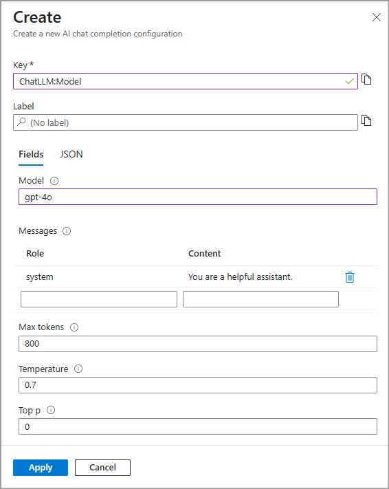

# Chat Completion configuration in Azure App Configuration

Chat completion is an AI capability that enables models to generate conversational responses based on a series of messages. Unlike simple text completion, chat completion maintains context across multiple exchanges, simulating a natural conversation. With chat completion configuration, you can define and manage how AI models respond within your application. A typical configuration includes model selection, system and user prompts, and model-specific settings such as temperature or token limits.

## Prerequisites
- An Azure account with an active subscription. [Create one for free](https://azure.microsoft.com/free)
- An App Configuration store. [Create a store](./quickstart-azure-app-configuration-create.md#create-an-app-configuration-store).

## Create a chat completion configuration

In this section, you create a chat completion configuration in Azure portal using the GPT-4o model as an example.

 1. In Azure portal, navigate to your App configuration store. From the **Operations** menu, select **Configuration explorer** > **Create**, and then select **AI configuration**.

 1. Specify the following values:
    - **Key**: Type **ChatApp:Model**.
    - **Label**: Leave this value blank.
    - **Model**: Select **gpt-4o**.
    - **Message**: Add a new message.
        - **Role**: Select **user**
        - **Content**: Type "What is the capital of France?"
    
    > [!div class="mx-imgBorder"]
    > 
    
1. Leave the rest of the values as default then select **Apply**.

## Add model connection configuration

You successfully added your chat completion configuration named **ChatApp:Model** in the previous section. In this section, you add the connection details for your model, including the endpoint and deployment name. If required by your authentication method, you can also specify an API key using a Key Vault reference.

> [!NOTE]
> This tutorial demonstrates how to use chat completion configuration with an Azure OpenAI model. However, the chat completion configuration demonstrated in the tutorial can be applied to any AI model you choose to work with in your application.
>

1. Follow the [Get started with Azure OpenAI Service](/azure/ai-services/openai/overview#get-started-with-azure-openai-service) to create and deploy an Azure OpenAI service resource with a **gpt-4o** model. Note down the deployment name for later use.

1. In your Azure OpenAI resource, from the **Resource Management** menu, select **Keys and Endpoint** and copy the Azure OpenAI resource endpoint. It should follow the format: `https://<open-ai-resource-name>.openai.azure.com`. If using the API key for authentication, copy the API key as well.

1. Navigate to your App Configuration store and add the following key-values. Leave **Label** and **Content Type** with their default values. For more information about how to add key-values to a store using the Azure portal or the CLI, go to [Create a key-value](./quickstart-azure-app-configuration-create.md#create-a-key-value).

    | **Key**                                 | **Value**                                                             |
    |-----------------------------------------|-----------------------------------------------------------------------|
    |  _ChatApp:AzureOpenAI:Endpoint_         | _Paste the resource endpoint you copied in the previous step_         |
    |  _ChatApp:AzureOpenAI:DeploymentName_   | _Paste the model deployment name you copied in the previous step_     |
 
    If you plan to use an API key for authentication, you can optionally add it as a Key Vault reference using the following key-value. For detailed instructions, see [Add a Key Vault reference to App Configuration](./use-key-vault-references-dotnet-core.md#add-a-key-vault-reference-to-app-configuration).

    | **Key**                          | **Value**                                                      |
    |----------------------------------|----------------------------------------------------------------|
    |  _ChatApp:AzureOpenAI:APIKey_  | _The Key Vault reference of your Azure OpenAI resource API key_  |

1. Continue to the following instructions to implement the chat completion configuration into your application for the language or platform you're using.

    - [.NET](./quickstart-chat-completion-dotnet.md)
