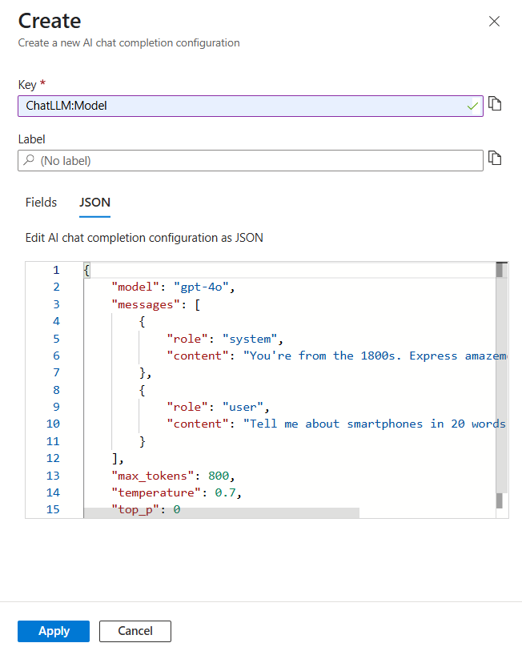
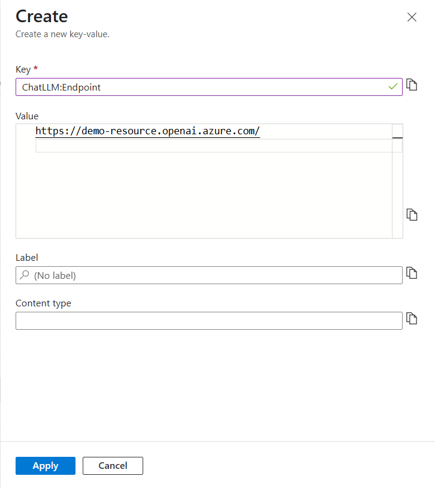

# Chat Completion Configuration in Azure App Configuration

Chat completion is an AI capability that enables models to generate conversational responses based on a series of messages. Unlike simple text completion, chat completion maintains context across multiple exchanges, simulating a natural conversation. This capability powers many AI assistants, chatbots, and interactive applications. Azure App Configuration enhances this experience by providing built in validation for chat completion models, ensuring configurations meet required specifications. Additionaly, App Configuration facilitates the discoverability of new models making it easier for developers to find and implement the latest AI models while maintaining a centralized control over model configurations across their applications.

## Chat Completion Parameters

Azure OpenAI chat models support several [parameters](/azure/ai-services/openai/reference#request-body-2) that control how responses are generated. Common parameters include:

| Parameter | Description |
|-----------|-------------|
| max_tokens | Maximum number of tokens that can be generated in the chat completion. |
| temperature | What sampling temperature to use, between 0 and 2. Higher values like 0.8 will make the output more random, while lower values like 0.2 will make it more focused and deterministic. |
| top_p | An alternative to sampling with temperature, called nucleus sampling, where the model considers the results of the tokens with top_p probability mass. So 0.1 means only the tokens comprising the top 10% probability mass are considered. |
| frequency_penalty | Number between -2.0 and 2.0. Positive values penalize new tokens based on their existing frequency in the text so far, decreasing the model's likelihood to repeat the same line verbatim. |
| presence_penalty | Number between -2.0 and 2.0. Positive values penalize new tokens based on whether they appear in the text so far, increasing the model's likelihood to talk about new topics. |
| stop | Up to four sequences where the API will stop generating further tokens |
| response_format | Specifies the format that the model must output. |

## Create a chat completion configuration

## Prerequisites
- An [Azure subscription](https://azure.microsoft.com/free/dotnet/)
- An App Configuration store. [Create a store](./quickstart-azure-app-configuration-create.md#create-an-app-configuration-store).
- [Azure OpenAI access](https://learn.microsoft.com/en-us/azure/cognitive-services/openai/overview#how-do-i-get-access-to-azure-openai)

 1. Select **Operations** > **Configuration explorer** > **Create** > **AI configuration**.

 1. Specify the following values:
    - **Key**: Select **ChatLLM**.
    - **Label**: Leave this value blank.
    - **Model**: Select **gpt-4o**.
    - **Messages**: 
        1. Select **User** from the Role dropdown
        2. In the **Content** text field, type "What is Azure App Configuration in 20 words ?"
    
    

1. To view the JSON representation of the chat completion configuration, switch to the **JSON** tab:

    

1.  Leave the rest of the values as default then select **Apply**.

## Create and deploy an Azure OpenAI service resource

1. [Create an Azure OpenAI service resource](/azure/ai-services/openai/includes/create-resource-portal#create-a-resource)

1. Sign in to [Azure AI Foundry Portal](https://ai.azure.com/)

1. Choose the subscription and the Azure OpenAI resource to work with, and select **Use resource**

1. Under **Management** select **Deployments**.

1. Select **Create new deployment** and configure the following fields:
    - **Select a model** : gpt-4o
    - **Deployment name**: gpt-4o

1. Leave the **Deployment type** and **Advanced options** set to default and select **Create**.

1. The deployments table shows a new entry that corresponds to your newly created model.
When the deployment completes, your model deployment status changes to _succeeded_.

1. Select the new model you just deployed in the deployment table, locate the **Endpoint** section and copy the model endpoint url in the format `"https://<open-ai-resource-name>.openai.azure.com"`.

1. Select **Operations** > **Configuration explorer** > **Create** > **Key-Value**

1. Specify the following values:
    - **Key**: Select **ChatLLM:Endpoint**.
    - **Label**: Leave this value blank.
    - **Value**: Paste the model endpoint we copied in the previous step.
    
    Leave the rest of the values as default then select **Apply**.

    

1. Continue to the following instructions to implement the chat completion configuration into your application for the language or platform you are using.

    - [.NET Core](./quickstart-chat-completion-dotnet.md)
    - [Node.js](./quickstart-chat-completion-javascript.md)
    - [Python](./quickstart-chat-completion-python.md)

## Clean up resources

[!INCLUDE[Azure App Configuration cleanup](../../includes/azure-app-configuration-cleanup.md)]

## Next steps
To learn how to configure your app to dynamically refresh configuration settings, continue to the following document.

> [!div class="nextstepaction"]
> [Enable dynamic configuration](./enable-dynamic-configuration-aspnet-core.md)