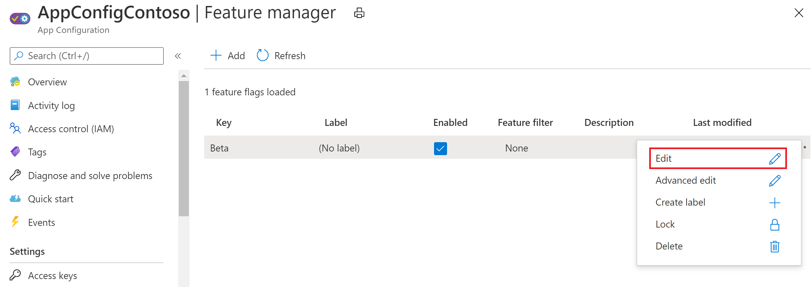
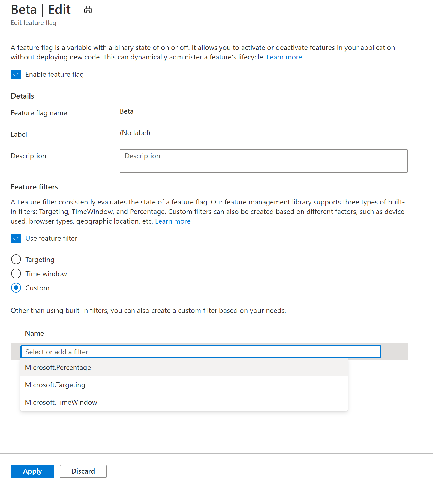
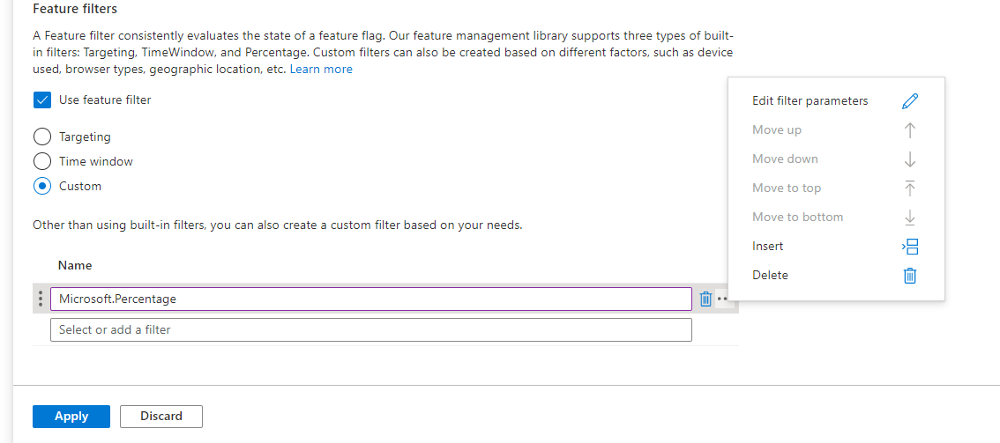
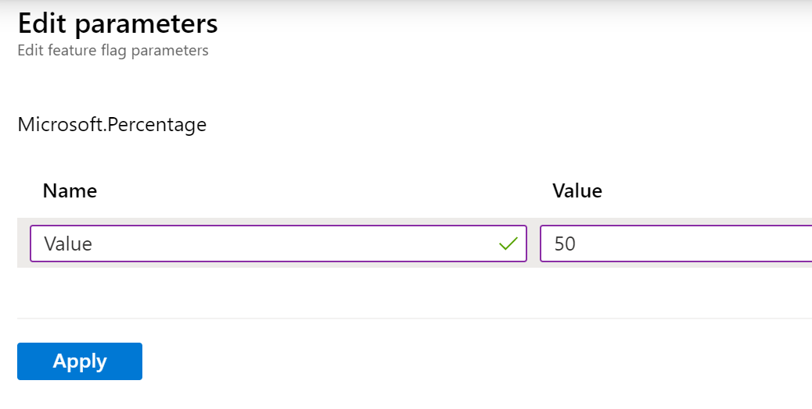
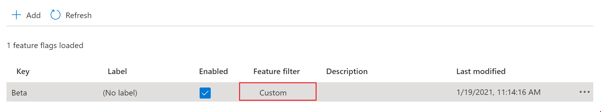

# Use feature filters to enable conditional feature flags

Feature flags allow you to activate or deactivate functionality in your application. A simple feature flag is either on or off. The application always behaves the same way. For example, you could roll out a new feature behind a feature flag. When the feature flag is enabled, all users see the new feature. Disabling the feature flag hides the new feature.

In contrast, a _conditional feature flag_ allows the feature flag to be enabled or disabled dynamically. The application may behave differently, depending on the feature flag criteria. Suppose you want to show your new feature to a small subset of users at first. A conditional feature flag allows you to enable the feature flag for some users while disabling it for others. _Feature filters_ determine the state of the feature flag each time it's evaluated.

The `Microsoft.FeatureManagement` library includes three feature filters:

- `PercentageFilter` enables the feature flag based on a percentage.
- `TimeWindowFilter` enables the feature flag during a specified window of time.
- `TargetingFilter` enables the feature flag for specified users and groups.

You can also create your own feature filter that implements the Microsoft.FeatureManagement.IFeatureFilter interface.

## Registering a feature filter

You register a feature filter by calling the `AddFeatureFilter` method, specifying the type name of the desired feature filter. For example, the following code registers `PercentageFilter`:

```csharp
public void ConfigureServices(IServiceCollection services)
{
    services.AddControllersWithViews();
    services.AddFeatureManagement().AddFeatureFilter<PercentageFilter>();
}
```

## Configuring a feature filter in Azure App Configuration

Some feature filters have additional settings. For example, `PercentageFilter` activates a feature based on a percentage. It has a setting defining the percentage to use.

You can configure these settings for feature flags defined in Azure App Configuration. For example, follow these steps to use `PercentageFilter` to enable the feature flag for 50% of requests to a web app:

1. Follow the instructions in [Quickstart: Add feature flags to an ASP.NET Core app](./quickstart-feature-flag-aspnet-core.md) to create a web app with a feature flag.

1. In the Azure portal, go to your configuration store and click **Feature manager**.

1. Click on the context menu for the *Beta* feature flag that you created in the quickstart. Click **Edit**.

    > [!div class="mx-imgBorder"]
    > 

1. In the **Edit** screen, check the **Enable feature flag** checkbox if it isn't already enabled. Then check the **Use feature filter** checkbox and select **Custom**. 

1. In the **Name** field, select *Microsoft.Percentage*.

    > [!div class="mx-imgBorder"]
    > 

1. Click the context menu next to the feature filter name. Click **Edit filter parameters**.

    > [!div class="mx-imgBorder"]
    > 

1. Enter a **Name** of *Value* and a **Value** of 50. The **Value** field indicates the percentage of requests for which to enable the feature filter.

    > [!div class="mx-imgBorder"]
    > 

1. Click **Apply** to return to the **Edit feature flag** screen. Then click **Apply** again to save the feature flag settings.

1. On the **Feature manager** page, the feature flag now has a **Feature filter** value of *Custom*. 

    > [!div class="mx-imgBorder"]
    > 

## Feature filters in action

To see the effects of this feature flag, launch the application and hit the **Refresh** button in your browser multiple times. You'll see that the *Beta* item appears on the toolbar about 50% of the time. It's hidden the rest of the time, because the `PercentageFilter` deactivates the *Beta* feature for a subset of requests. The following video shows this behavior in action.

> [!div class="mx-imgBorder"]
> 

## Next steps

> [!div class="nextstepaction"]
> [Enable staged rollout of features for targeted audiences](./howto-targetingfilter-aspnet-core.md)
