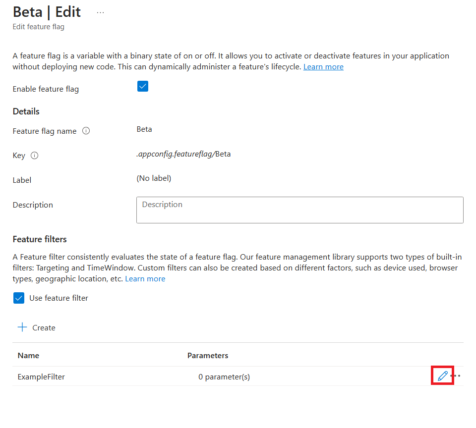
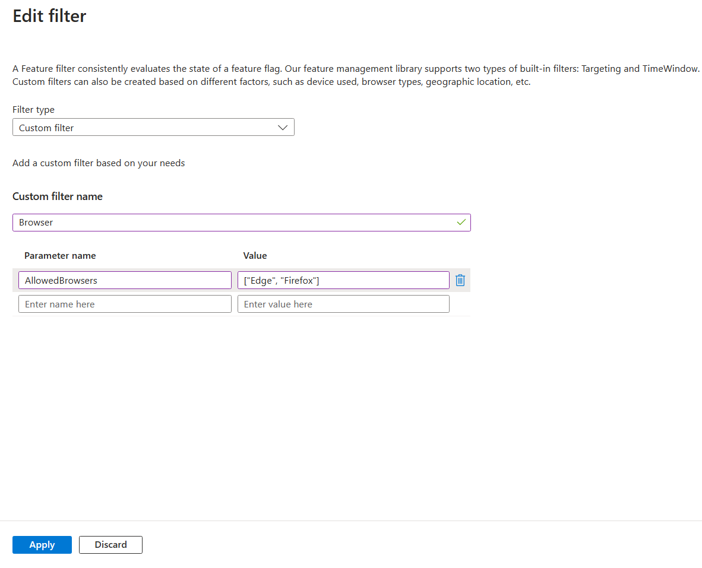

# Tutorial: Enable conditional features with a custom filter in an ASP.NET Core app

Feature flags can use feature filters to enable features conditionally. To learn more about feature filters, see [Tutorial: Enable conditional features with feature filters](./howto-feature-filters.md).

The example used in this tutorial is based on the ASP.NET Core app introduced in the feature management [quickstart](./quickstart-feature-flag-aspnet-core.md). Before proceeding further, complete the quickstart to create an ASP.NET Core app with a *Beta* feature flag. Once completed, you will add a custom feature filter to the *Beta* feature flag in your App Configuration store. In this tutorial, you will learn how to implement the custom feature filter and use the feature flag to enable features conditionally.

## Prerequisites

- Create an [ASP.NET Core app with a feature flag](./quickstart-feature-flag-aspnet-core.md).
- Add a [custom feature filter to the feature flag](./howto-feature-filters.md)

## Configure a custom feature filter

1. Open the *Edit feature flag* pane for the *Beta* feature flag you created in the quickstart.

1. You've added a custom filter for the feature flag if you finish the prerequisites. On the line with that feature filters, select the *Edit* button.

    > [!div class="mx-imgBorder"]
    > 

1. Rename the feature filter to `Browser` and add a parameter called **AllowedBrowsers** with value `["Edge", "Firefox"]`

    The feature filter screen will look like this.

    > [!div class="mx-imgBorder"]
    > 

1. Select *Apply* to save the new filter settings and return to the Edit feature flag screen.

1. Select *Apply* to save the change for the feature flag.

## Implement a custom feature filter

To implement the *Browser* filter you just added for your feature flag, you need to implement the `IFeatureFilter` interface provided by the `Microsoft.FeatureManagement` library. The `IFeatureFilter` has a single method named `EvaluateAsync`. When a feature specifies that it can be enabled for a feature filter, the `EvaluateAsync` method is called. If `EvaluateAsync` returns true it means the feature should be enabled.

```csharp
public interface IFeatureFilter : IFeatureFilterMetadata
{
    Task<bool> EvaluateAsync(FeatureFilterEvaluationContext context);
}
```

Some feature filters require parameters to decide whether a feature should be turned on or not. These parameters would be specified in the feature configuration, and in code would be accessible via the `FeatureFilterEvaluationContext` parameter of `IFeatureFilter.EvaluateAsync`.

```csharp
public class FeatureFilterEvaluationContext
{
    /// The name of the feature being evaluated.
    public string FeatureName { get; set; }

    /// The settings provided for the feature filter to use when evaluating whether the feature should be enabled.
    public IConfiguration Parameters { get; set; }
}
```

You've added a parameter called `AllowedBrowsers` for the *Browser* filter. When implementing the *Browser* filter, you can determine whether a feature should be turned on or not based on the browser names listed in the parameter.

Add `BrowserFilter.cs` file. Here is an example of how to implement a browser filter based on the `User-Agent` information retrieved from the httpcontext.

```csharp
using Microsoft.FeatureManagement;

namespace TestAppConfig
{
    [FilterAlias("Browser")]
    public class BrowserFilter : IFeatureFilter
    {
        private readonly IHttpContextAccessor _httpContextAccessor;

        public BrowserFilter(IHttpContextAccessor httpContextAccessor)
        {
            _httpContextAccessor = httpContextAccessor ?? throw new ArgumentNullException(nameof(httpContextAccessor));
        }

        public Task<bool> EvaluateAsync(FeatureFilterEvaluationContext context)
        {
            List<string> AllowedBrowsers = context.Parameters.GetSection("AllowedBrowsers").Get<List<string>>();

            string userAgent = _httpContextAccessor.HttpContext.Request.Headers["User-Agent"];

            return Task.FromResult(
                AllowedBrowsers.Any(browser => {
                    switch (browser)
                    {
                        case "Edge":
                            return userAgent.Contains("edg", StringComparison.OrdinalIgnoreCase);
                        case "Chrome":
                            return userAgent.Contains("chrome", StringComparison.OrdinalIgnoreCase) &&
                                !userAgent.Contains("edg", StringComparison.OrdinalIgnoreCase);
                        case "Firefox":
                            return userAgent.Contains("firefox", StringComparison.OrdinalIgnoreCase);
                        default:
                            return false;
                    }
            }));
        }
    }
}
```

## Register the custom feature filter

You can register the *Browser* filter by calling the `AddFeatureFilter` method. Register the `HttpContextAccessor` by calling the `AddHttpContextAccessor` method. The *Browser* filter will use it to access the httpcontext.

```csharp
// Add feature management to the container of services.
builder.Services.AddFeatureManagement()
                .AddFeatureFilter<BrowserFilter>();

// Add HttpContextAccessor to the container of services.
builder.Services.AddHttpContextAccessor();
```

## Feature filter in action

Relaunch the application you created in the [Quickstart](./quickstart-feature-flag-aspnet-core.md). If your browser is not Edge or Firefox browser, the **Beta** menu item will not appear on the toolbar. This is because the **Beta** feature flag is disabled by the browser filter.

## Next steps

> [!div class="nextstepaction"]
> [Enable features on a schedule](./howto-timewindow-filter.md)

> [!div class="nextstepaction"]
> [Roll out features to targeting audience](./howto-targetingfilter.md)
