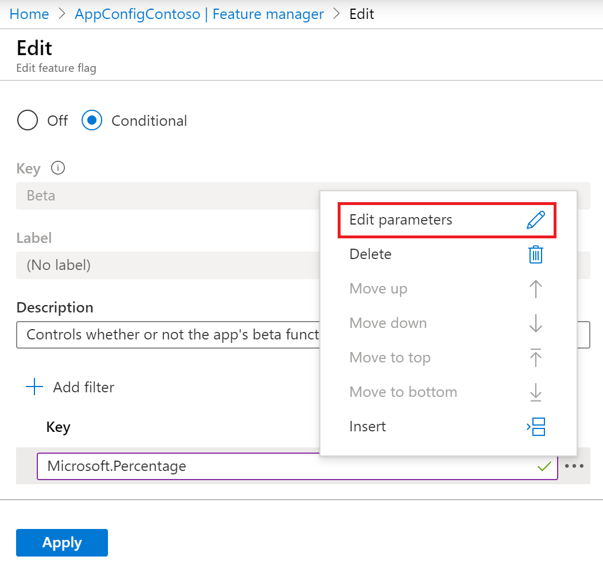

# Use feature filters to enable a feature for a subset of users

You can show or hide functionality in your application based on the value of a feature flag. Feature flags can be simply on or off, so that all requests experience the same behavior. Feature flags can also be conditional, so that different requests experience different behavior. A conditional feature flag relies on a _feature filter_ to determine the behavior in effect for a given request.

The `Microsoft.FeatureManagement` library includes two feature filters:

- `PercentageFilter` enables the feature flag for a specified percentage of requests.
- `TimeWindowFilter` enables the feature flag during a specified window of time.

You can also create your own feature filter that implements the [Microsoft.FeatureManagement.IFeatureFilter interface](/dotnet/api/microsoft.featuremanagement.ifeaturefilter).

## Registering a feature filter

You register a feature filter by calling the `AddFeatureFilter` method, specifying the name of the feature filter. For example, the following code registers `PercentageFilter`:

```csharp
public void ConfigureServices(IServiceCollection services)
{
    services.AddControllersWithViews();
    services.AddFeatureManagement().AddFeatureFilter<PercentageFilter>();
}
```

## Configuring a feature filter in Azure App Configuration

Some feature filters have additional settings. For example, `PercentageFilter` has a setting specifying the percentage of requests for which the feature is enabled.

You can configure these settings for feature flags defined in Azure App Configuration. For example, follow these steps to use `PercentageFilter` to enable the feature flag for 50% of requests:

1. Follow the instructions in [Quickstart: Add feature flags to an ASP.NET Core app](./quickstart-feature-flag-aspnet-core.md) to create a web app with a feature flag.

1. In the Azure portal, go to your configuration store and click **Feature Manager**.

1. Click on the context menu for the *Beta* feature flag that you created in the quickstart. Click **Edit**.

    > [!div class="mx-imgBorder"]
    > 

1. In the **Edit** screen, select the **On** radio button if it is not already selected. Then click the **Add Filter** button. (The **On** radio button's label will change to read **Conditional**.)

1. In the **Key** field, enter *Microsoft.Percentage*.

    > [!div class="mx-imgBorder"]
    > 

1. Click the context menu next to the feature filter key. Click **Edit Parameters**.

    > [!div class="mx-imgBorder"]
    > 

1. Hover under the **Name** header so that text boxes appear in the grid. Enter a **Name** of *Value* and a **Value** of 50. The **Value** field indicates the percentage of requests for which to enable the feature filter.

    > [!div class="mx-imgBorder"]
    > 

1. Click **Apply** to return to the **Edit feature flag** screen. Then click **Apply** again to save the feature flag settings.

1. The **State** of the feature flag now appears as *Conditional*. This indicates that the feature flag will be enabled or disabled on a per-request basis, based on the criteria enforced by the feature filter.

    > [!div class="mx-imgBorder"]
    > 

## Feature filters in action

To see the effects of this feature flag, launch the application and hit the **Refresh** button in your browser multiple times. You will see that the *Beta* item appears on the toolbar 50% of the time, and does not appear on the toolbar the other 50% of the time. This reflects the feature flag being enabled or disabled by the `PercentageFilter`. The following video shows this behavior.

> [!div class="mx-imgBorder"]
> 

## Next steps

> [!div class="nextstepaction"]
> [Feature management overview](./concept-feature-management.md)