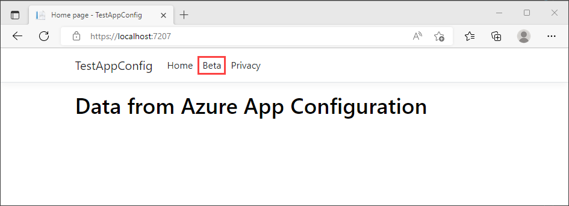

# Enable conditional features with a custom filter in an ASP.NET Core application

Feature flags can use feature filters to enable features conditionally. For more information about feature filters, see [Enable conditional features with feature filters](./howto-feature-filters.md).

This guide shows you how to implement a custom feature filter in an ASP.NET Core application and use the feature filter to enable features conditionally.

## Prerequisites

- The ASP.NET Core application with a *Beta* feature flag that you create when you complete the steps in [Quickstart: Add feature flags to an ASP.NET Core app](./quickstart-feature-flag-aspnet-core.md). This guide builds on that feature management quickstart.
- A custom feature filter called *Random*, added to the *Beta* feature flag in your Azure App Configuration store. For instructions, see [Add a custom feature filter](./howto-feature-filters.md).

## Implement a custom feature filter

In your App Configuration store, the *Beta* feature flag has a custom feature filter named `Random`. That filter has a `Percentage` parameter. To implement the feature filter, you enable the *Beta* feature flag based on the chance defined by the `Percentage` parameter.

1. Go to the folder that contains the ASP.NET Core application project that you used in the feature management quickstart listed in [Prerequisites](#prerequisites).

1. Add a *RandomFilter.cs* file that contains the following code:

    ```csharp
    using Microsoft.FeatureManagement;

    namespace TestAppConfig
    {
        [FilterAlias("Random")]
        public class RandomFilter : IFeatureFilter
        {
            private readonly Random _random;

            public RandomFilter()
            {
                _random = new Random();
            }

            public Task<bool> EvaluateAsync(FeatureFilterEvaluationContext context)
            {
                int percentage = context.Parameters.GetSection("Percentage").Get<int>();

                int randomNumber = _random.Next(100);

                return Task.FromResult(randomNumber <= percentage);
            }
        }
    }
    ```

    The `RandomFilter` class in the preceding code implements the `IFeatureFilter` interface from the `Microsoft.FeatureManagement` library. The `IFeatureFilter` interface has a single method named `EvaluateAsync`, which is called whenever a feature flag is evaluated. In `EvaluateAsync`, a feature filter enables a feature flag by returning `true`.

    In this code, the `RandomFilter` class is decorated with the attribute `FilterAliasAttribute`, which gives your filter the alias `Random`. That alias matches the filter name in the *Beta* feature flag in App Configuration.

1. Open the *Program.cs* file. Register the `RandomFilter` filter by adding a call to the `AddFeatureFilter` method, as shown in the following code: 

    ```csharp
    // The existing code in Program.cs
    // ... ...

    // Add feature management to the container of services.
    builder.Services.AddFeatureManagement()
                    .AddFeatureFilter<RandomFilter>();

    // The rest of the existing code in Program.cs
    // ... ...
    ```

## Apply the feature filter

1. Build your app by using the `dotnet build` command. Then run it by using `dotnet run`.

1. In the output of the `dotnet run` command, find a URL that the web app is listening on. Open a browser and go to that URL.

1. Refresh the browser a few times. The **Beta** menu sometimes appears on the webpage, and sometimes it doesn't. The *Beta* feature flag isn't being manually turned on and off. The variation is caused by the random percentage that's generated when the feature flag is evaluated in the `RandomFilter` implementation of `EvaluateAsync`.

> [!div class="mx-imgBorder"]
> 

> [!div class="mx-imgBorder"]
> 

## Next steps

To learn more about the built-in feature filters, continue to the following documents.

> [!div class="nextstepaction"]
> [Enable features on a schedule](./howto-timewindow-filter.md)

> [!div class="nextstepaction"]
> [Roll out features to targeted audience](./howto-targetingfilter.md)

For the full feature rundown of the .NET feature management library, continue to the following document.

> [!div class="nextstepaction"]
> [.NET Feature Management](./feature-management-dotnet-reference.md)
