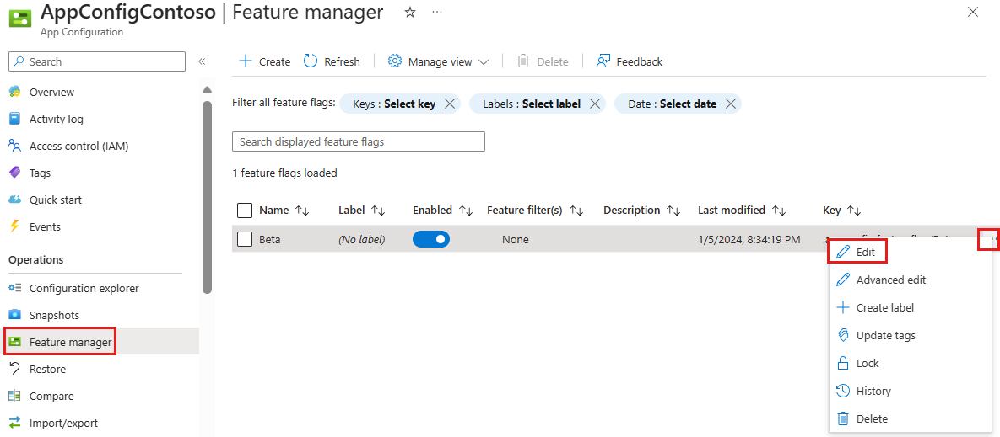
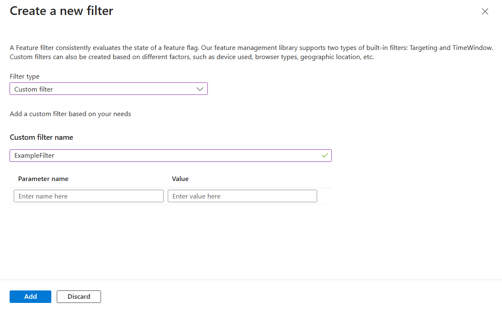
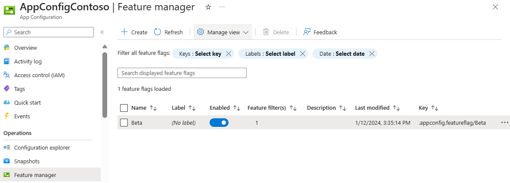

# Tutorial: Enable conditional features with feature filters

Feature flags allow you to activate or deactivate functionality in your application. A simple feature flag is either on or off. The application always behaves the same way. For example, you could roll out a new feature behind a feature flag. When the feature flag is enabled, all users see the new feature. Disabling the feature flag hides the new feature.

In contrast, a _conditional feature flag_ allows the feature flag to be enabled or disabled dynamically. The application may behave differently, depending on the feature flag criteria. Suppose you want to show your new feature to a small subset of users at first. A conditional feature flag allows you to enable the feature flag for some users while disabling it for others. _Feature filters_ are rules for determining the state of the feature flag each time it's evaluated. Potential feature filters include user groups, device or browser types, geographic locations, and time windows.

The Microsoft `FeatureManagement` libraries include the following built-in feature filters accessible from the Azure App Configuration portal.

- **Time window filter** enables the feature flag during a specified window of time.
- **Targeting filter** enables the feature flag for specified users and groups.

You can also create your own custom feature filters to enable features based on criteria that you define. The ways to implement a feature filter are different depending on the language of the `FeatureManagement` libraries you are using. For more details, please follow the tutorials in the next steps.

In this article, you will learn how to add a custom feature filter for your feature flag.

## Add a custom feature filter for the feature flag

1. If you don't have any feature flag, create a feature flag called *Beta* to the App Configuration store and leave **Label** and **Description** with their default values. For more information about how to add feature flags to a store using the Azure portal or the CLI, go to [Create a feature flag](./quickstart-azure-app-configuration-create.md#create-a-feature-flag).

1. In the Azure portal, go to your configuration store and select **Feature manager**.

    > [!div class="mx-imgBorder"]
    > 

1. On the line with the **Beta** feature flag you created in the quickstart, select the context menu and then **Edit**.

1. In the **Edit feature flag** pane that opens, check the **Enable feature flag** checkbox if it isn't already enabled. Then check the **Use feature filter** checkbox and select **Create**.

    > [!div class="mx-imgBorder"]
    > 

1. The pane **Create a new filter** opens. Under **Filter type**, select **Custom filter**.

    > [!div class="mx-imgBorder"]
    > 

1. Enter the name of your custom filter.

    > [!div class="mx-imgBorder"]
    > 

    > [!TIP]
    > Some feature filters require parameters to decide whether a feature should be turned on or not. For example, a browser feature filter may turn on a feature for a certain set of browsers. It may be desired that Edge and Firefox browsers enable a feature, while Chrome does not. To do this a feature filter can be designed to expect parameters. You can specify any number of parameters for your custom filter in the portal.
    >
    > 

1. Select **Add** to save the new feature filter and return to the **Edit feature flag** screen.

1. The feature filter you created is now listed in the feature flag details. Select **Apply** to save the new feature flag settings.

    > [!div class="mx-imgBorder"]
    > 

1. On the **Feature manager** page, the feature flag now has a **Feature filter(s)** value of **1**.

    > [!div class="mx-imgBorder"]
    > 

Now, you sucessfully added a custom filter for your feature flag. The next step is to implement the feature filter by yourself through the Microsoft `FeatureManagement` libraries. You can define any rule you want to enable the feature flag. The `FeatureManagement` libraries will recognize the feature filter configuration and apply the rule for the feature flag. For more details, please follow the tutorials about how to implement a custom feature filter in the next steps.

## Next steps

In this tutorial, you learn the basic concept of feature filter and how to add a custom filter for a feature flag.

To learn how to implement a custom feature filter, continue to the following tutorial:

> [!div class="nextstepaction"]
> [ASP.NET](./howto-feature-filters-aspnet-core.md)

To learn more about the built-in feature filters, continue to the following tutorials:

> [!div class="nextstepaction"]
> [Enable features on a schedule](./howto-timewindow-filter.md)

> [!div class="nextstepaction"]
> [Roll out features to targeting audience](./howto-targetingfilter.md)