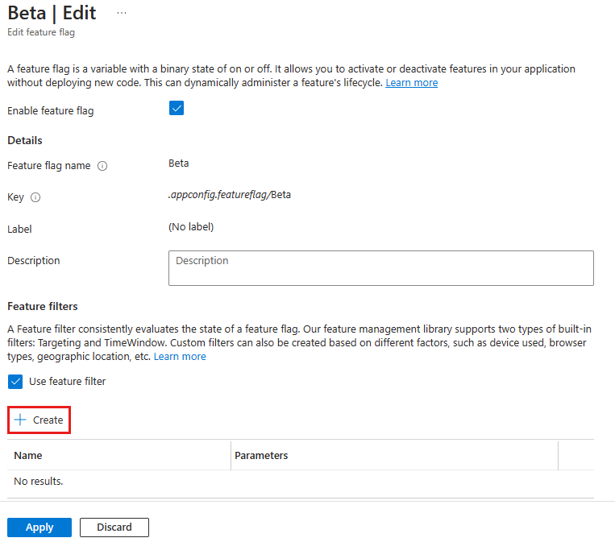
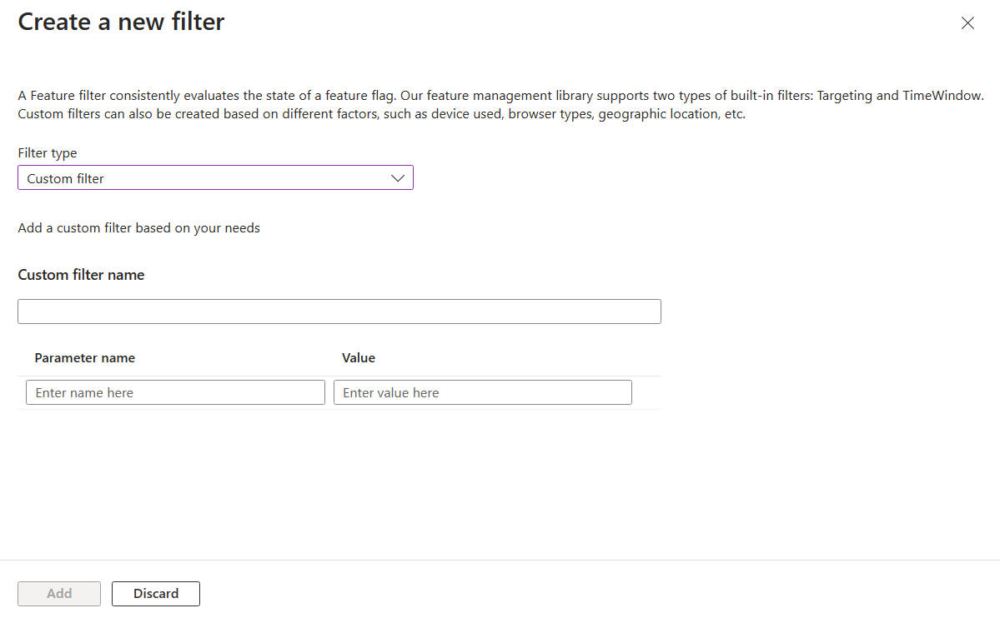
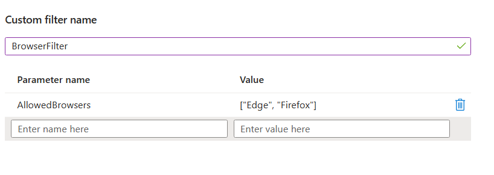
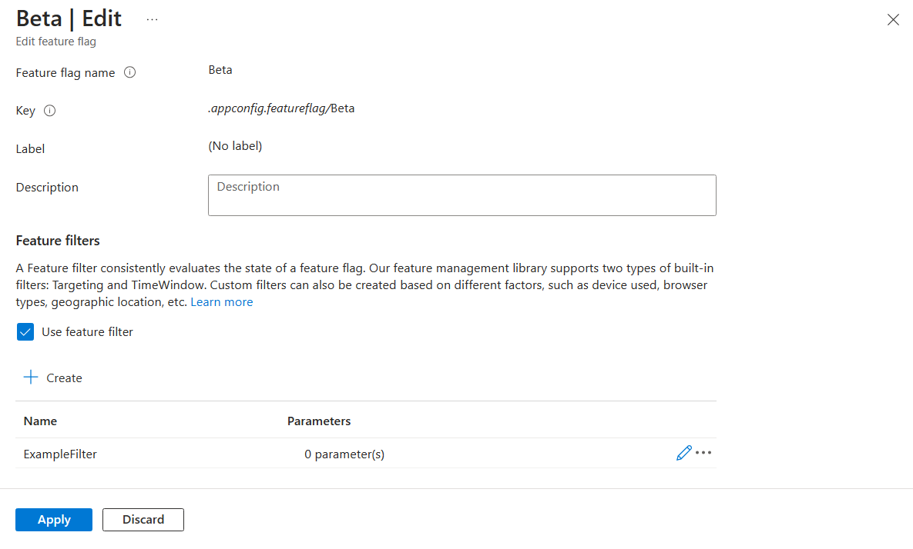

# Tutorial: Enable conditional features with feature filters

Feature flags allow you to activate or deactivate functionality in your application. A simple feature flag is either on or off. The application always behaves the same way. For example, you could roll out a new feature behind a feature flag. When the feature flag is enabled, all users see the new feature. Disabling the feature flag hides the new feature.

In contrast, a _conditional feature flag_ allows the feature flag to be enabled or disabled dynamically. The application may behave differently, depending on the feature flag criteria. Suppose you want to show your new feature to a small subset of users at first. A conditional feature flag allows you to enable the feature flag for some users while disabling it for others. 

## What is a feature filter?

_Feature filters_ are conditions for determining the state of the feature flag. Adding feature filters to a feature flag allows you to invoke custom code each time the feature flag is evaluated.

The Microsoft feature management libraries include the following built-in feature filters configurable from the Azure App Configuration portal.

- **Time window filter** enables the feature flag during a specified window of time.
- **Targeting filter** enables the feature flag for specified users and groups.

You can create custom feature filters that enable features based on your specific criteria in code. This article will guide you through adding a custom feature filter to a feature flag. Afterward, you can follow the instructions in the *Next Steps* section to implement the feature filter in your application.

## Add a custom feature filter

1. Create a feature flag named *Beta* in your App Configuration store and open to edit it. For more information about how to add and edit a feature flag, see [Manage feature flags](./manage-feature-flags.md).

1. In the **Edit feature flag** pane that opens, check the **Enable feature flag** checkbox if it isn't already enabled. Then check the **Use feature filter** checkbox and select **Create**.

    > [!div class="mx-imgBorder"]
    > 

1. The pane **Create a new filter** opens. Under **Filter type**, select **Custom filter** and enter the name *Random* for your custom filter.

    > [!div class="mx-imgBorder"]
    > 

1. Feature filters can optionally use parameters for configurable conditions. In this example, you use a **Percentage** parameter and set its value to **50**, which tells the filter to enable the feature flag with a 50% chance.

    > [!div class="mx-imgBorder"]
    > 

1. Select **Add** to save the new feature filter and return to the **Edit feature flag** screen.

1. The feature filter is now listed in the feature flag details. Select **Apply** to save the feature flag.

    > [!div class="mx-imgBorder"]
    > 

You have successfully added a custom filter to a feature flag. Follow the instructions in the [Next Steps](#next-steps) section to implement the feature filter into your application for the language or platform you are using.

## Next steps

In this tutorial, you learned the concept of feature filter and added a custom feature filter to a feature flag.

To learn how to implement a custom feature filter, continue to the following tutorial:

> [!div class="nextstepaction"]
> [ASP.NET Core](./howto-feature-filters-aspnet-core.md)

To learn more about the built-in feature filters, continue to the following tutorials:

> [!div class="nextstepaction"]
> [Enable features on a schedule](./howto-timewindow-filter.md)

> [!div class="nextstepaction"]
> [Roll out features to targeted audience](./howto-targetingfilter.md)