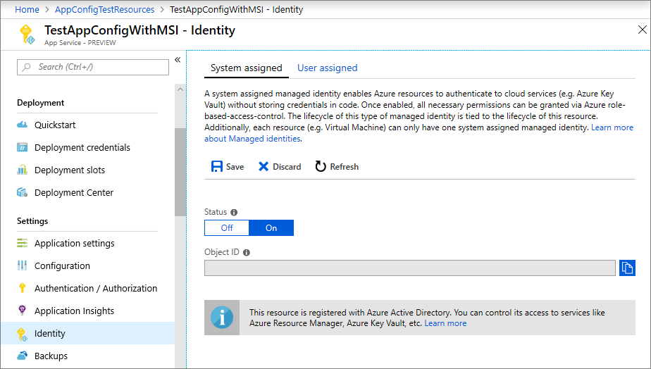
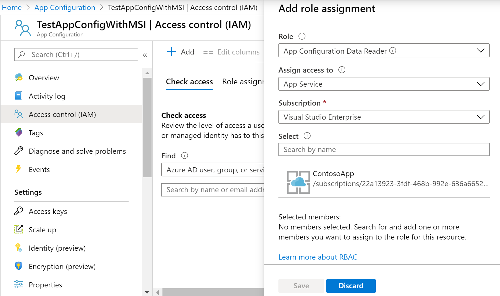

# Integrate with Azure managed identities

Azure Active Directory [managed identities](https://docs.microsoft.com/azure/active-directory/managed-identities-azure-resources/overview) help simplify secrets management for your cloud application. With a managed identity, you can set up your code to use the service principal that was created for the Azure compute service it runs on. You use a managed identity instead of a separate credential stored in Azure Key Vault or a local connection string. 

Azure App Configuration and its .NET Core, .NET, and Java Spring client libraries come with managed service identity (MSI) support built into them. Although you aren't required to use it, MSI eliminates the need for an access token that contains secrets. Your code has to know only the service endpoint for an app configuration store in order to access it. You can embed this URL in your code directly without the concern of exposing any secret.

This tutorial shows how you can take advantage of MSI to access App Configuration. It builds on the web app introduced in the quickstarts. Before you continue, finish [Create an ASP.NET Core app with App Configuration](./quickstart-aspnet-core-app.md) first.

You can use any code editor to do the steps in this tutorial. [Visual Studio Code](https://code.visualstudio.com/) is an excellent option available on the Windows, macOS, and Linux platforms.

In this tutorial, you learn how to:

> [!div class="checklist"]
> * Grant a managed identity access to App Configuration.
> * Configure your app to use a managed identity when you connect to App Configuration.

## Prerequisites

To complete this tutorial, you must have:

* [.NET Core SDK](https://www.microsoft.com/net/download/windows).
* [Azure Cloud Shell configured](https://docs.microsoft.com/azure/cloud-shell/quickstart).

[!INCLUDE [quickstarts-free-trial-note](../../includes/quickstarts-free-trial-note.md)]

## Add a managed identity

To set up a managed identity in the portal, you first create an application as normal and then enable the feature.

1. Create an app in the [Azure portal](https://portal.azure.com) as you normally do. Go to it in the portal.

2. Scroll down to the **Settings** group in the left pane, and select **Identity**.

3. On the **System assigned** tab, switch **Status** to **On** and select **Save**.

    

## Grant access to App Configuration

1. In the [Azure portal](https://portal.azure.com), select **All resources** and select the app configuration store that you created in the quickstart.

2. Select **Access control (IAM)**.

3. On the **Check access** tab, select **Add** in the **Add role assignment** card UI.

4. Under **Role**, select **Contributor**. Under **Assign access to**, select **App Service** under **System assigned managed identity**.

5. Under **Subscription**, select your Azure subscription. Select the App Service resource for your app.

6. Select **Save**.

    

## Use a managed identity

1. Open *appsettings.json*, and add the following script. Replace *\<service_endpoint>*, including the brackets, with the URL to your app configuration store:

    ```json
    "AppConfig": {
        "Endpoint": "<service_endpoint>"
    }
    ```

2. Open *Program.cs*, and update the `CreateWebHostBuilder` method by replacing the `config.AddAzureAppConfiguration()` method.

    ```csharp
    public static IWebHostBuilder CreateWebHostBuilder(string[] args) =>
        WebHost.CreateDefaultBuilder(args)
            .ConfigureAppConfiguration((hostingContext, config) =>
            {
                var settings = config.Build();
                config.AddAzureAppConfiguration(options =>
                    options.ConnectWithManagedIdentity(settings["AppConfig:Endpoint"]));
            })
            .UseStartup<Startup>();
    ```

[!INCLUDE [Prepare repository](../../includes/app-service-deploy-prepare-repo.md)]

[!INCLUDE [cloud-shell-try-it](../../includes/cloud-shell-try-it.md)]

## Deploy from local Git

The easiest way to enable local Git deployment for your app with the Kudu build server is to use Azure Cloud Shell.

### Configure a deployment user

[!INCLUDE [Configure a deployment user](../../includes/configure-deployment-user-no-h.md)]

### Enable local Git with Kudu

To enable local Git deployment for your app with the Kudu build server, run [`az webapp deployment source config-local-git`](/cli/azure/webapp/deployment/source?view=azure-cli-latest#az-webapp-deployment-source-config-local-git) in Cloud Shell.

```azurecli-interactive
az webapp deployment source config-local-git --name <app_name> --resource-group <group_name>
```

To create a Git-enabled app instead, run [`az webapp create`](/cli/azure/webapp?view=azure-cli-latest#az-webapp-create) in Cloud Shell with the `--deployment-local-git` parameter.

```azurecli-interactive
az webapp create --name <app_name> --resource-group <group_name> --plan <plan_name> --deployment-local-git
```

The `az webapp create` command gives you something similar to the following output:

```json
Local git is configured with url of 'https://<username>@<app_name>.scm.azurewebsites.net/<app_name>.git'
{
  "availabilityState": "Normal",
  "clientAffinityEnabled": true,
  "clientCertEnabled": false,
  "cloningInfo": null,
  "containerSize": 0,
  "dailyMemoryTimeQuota": 0,
  "defaultHostName": "<app_name>.azurewebsites.net",
  "deploymentLocalGitUrl": "https://<username>@<app_name>.scm.azurewebsites.net/<app_name>.git",
  "enabled": true,
  < JSON data removed for brevity. >
}
```

### Deploy your project

Back in the _local terminal window_, add an Azure remote to your local Git repository. Replace _\<url>_ with the URL of the Git remote that you got from [Enable Git for your app](#enable-local-git-with-kudu).

```bash
git remote add azure <url>
```

Push to the Azure remote to deploy your app with the following command. When you're prompted for a password, enter the password you created in [Configure a deployment user](#configure-a-deployment-user). Don't use the password you use to sign in to the Azure portal.

```bash
git push azure master
```

You might see runtime-specific automation in the output, such as MSBuild for ASP.NET, `npm install` for Node.js, and `pip install` for Python.

### Browse to the Azure web app

Browse to your web app by using a browser to verify that the content is deployed.

```bash
http://<app_name>.azurewebsites.net
```


## Use managed identity in other languages

App Configuration providers for .NET Framework and Java Spring also have built-in support for managed identity. In these cases, use your app configuration store's URL endpoint instead of its full connection string when you configure a provider. For example, for the .NET Framework console app created in the quickstart, specify the following settings in the *App.config* file:

```xml
    <configSections>
        <section name="configBuilders" type="System.Configuration.ConfigurationBuildersSection, System.Configuration, Version=4.0.0.0, Culture=neutral, PublicKeyToken=b03f5f7f11d50a3a" restartOnExternalChanges="false" requirePermission="false" />
    </configSections>

    <configBuilders>
        <builders>
            <add name="MyConfigStore" mode="Greedy" endpoint="${Endpoint}" type="Microsoft.Configuration.ConfigurationBuilders.AzureAppConfigurationBuilder, Microsoft.Configuration.ConfigurationBuilders.AzureAppConfiguration" />
            <add name="Environment" mode="Greedy" type="Microsoft.Configuration.ConfigurationBuilders.EnvironmentConfigBuilder, Microsoft.Configuration.ConfigurationBuilders.Environment" />
        </builders>
    </configBuilders>

    <appSettings configBuilders="Environment,MyConfigStore">
        <add key="AppName" value="Console App Demo" />
        <add key="Endpoint" value ="Set via an environment variable - for example, dev, test, staging, or production endpoint." />
    </appSettings>
```

## Clean up resources

[!INCLUDE [azure-app-configuration-cleanup](../../includes/azure-app-configuration-cleanup.md)]

## Next steps

> [!div class="nextstepaction"]
> [CLI samples](./cli-samples.md)
