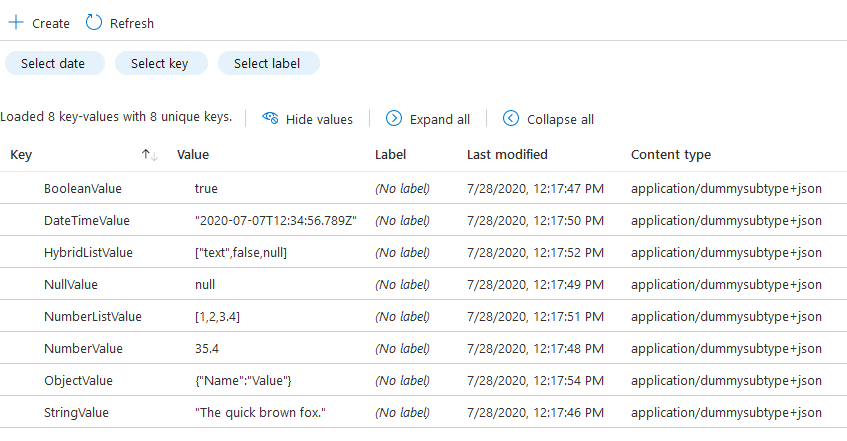
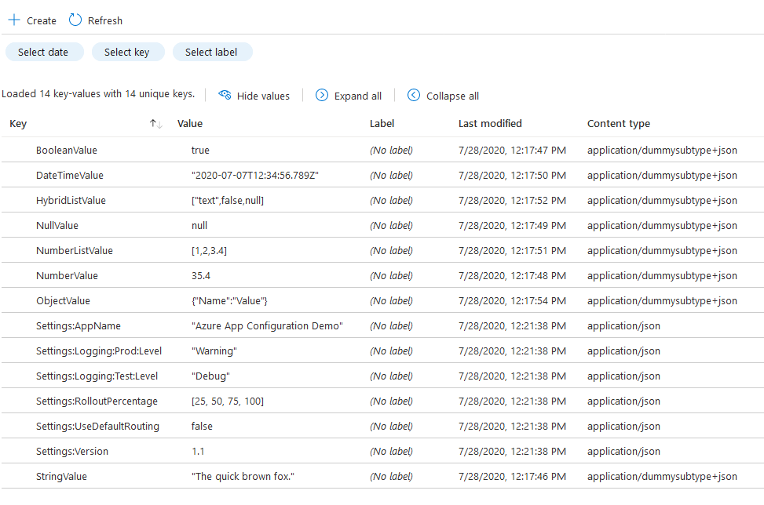

# Leverage content type to store JSON settings in App Configuration

Your configuration data is stored in App Configuration as key-value pairs, where the values assigned to keys are unicode strings. However, configuration settings are not confined to having a string value. If you need to preserve the data type of your value, you can do so by leveraging the content type associated with each setting.

App Configuration supports storing key-values in JSON format by assigning a JSON content type and JSON value to your configuration setting.
In this tutorial, you will learn how to add JSON settings to your App Configuration store by:
- Creating settings manually.
- Importing settings from a JSON file.

## Valid JSON content type

Media types, as defined [here](https://www.iana.org/assignments/media-types/media-types.xhtml), can be assigned to the content type associated with each setting.
A media type consists of a type and a subtype, which is further structured into a tree. A media type can optionally define a suffix and parameters:

`type "/" [tree "."] subtype ["+" suffix] *[";" parameter]`

If the type is `"application"` and the subtype (or suffix) is `"json"`, the media type will be considered a valid JSON content type.
Some examples of valid JSON content types are:

- application/json
- application/activity+json
- application/vnd.foobar+json;charset=utf-8

## Valid JSON values

If the value of a configuration setting can be validated using any JSON validator (like [JSONLint](https://jsonlint.com/)), it is a valid JSON value.
Some examples of valid JSON values are:

- "John Doe"
- 723
- false
- null
- "2020-01-01T12:34:56.789Z"
- [1, 2, 3, 4]
- {"ObjectSetting":{"Targeting":{"Default":true,"Level":"Information"}}}

## Prerequisites

- Azure subscription - [create one for free](https://azure.microsoft.com/free/). You can optionally use the Azure Cloud Shell.
- Latest version of Azure CLI (3.0.0 or later). To find the version, run `az --version`. If you need to install or upgrade, see [Install Azure CLI](/cli/azure/install-azure-cli). If you are using Azure CLI, you must first sign in using `az login`. You can optionally use the Azure Cloud Shell.

[!INCLUDE [cloud-shell-try-it.md](../../includes/cloud-shell-try-it.md)]

## Create a resource group

The resource group is a logical collection into which Azure resources are deployed and managed.

Create a resource group with the [az group create](/cli/azure/group) command.

Replace `<resource_group_name>` with a unique name for your resource group.

```azurecli-interactive
resourceGroupName="<resource_group_name>"
az group create --name $resourceGroupName --location westus
```

## Create an App Configuration store

Replace `<appconfig_name>` with a unique name for your configuration store. The store name must be unique because it's used as a DNS name.

```azurecli-interactive
appConfigName=<appconfig_name>
az appconfig create \
  --name $appConfigName \
  --location westus \
  --resource-group $resourceGroupName\
  --sku Standard
```

## Preset default App Configuration store

To connect to your store, you can specify the Azure App Configuration instance by providing either the store name (`--name <appconfig_name>`) or by using a connection string (`--connection-string <your-connection-string>`). In this tutorial, you will preset a default connection string because it's faster to connect to App Configuration using a connection string.

```azurecli-interactive
connectionString=$(az appconfig credential list -n $appConfigName --query [0].connectionString --output tsv)
az configure --defaults appconfig_connection_string=$connectionString
```

## Create JSON settings in App Configuration

The following commands will create some JSON settings in your App Configuration store.

```azurecli-interactive
az appconfig kv set --content-type application/dummysubtype+json --key StringValue --value "\"The quick brown fox.\"" -y
az appconfig kv set --content-type application/dummysubtype+json --key BooleanValue  --value true -y
az appconfig kv set --content-type application/dummysubtype+json --key NumberValue  --value 35.4 -y
az appconfig kv set --content-type application/dummysubtype+json --key NullValue  --value null -y
az appconfig kv set --content-type application/dummysubtype+json --key DateTimeValue  --value \"2020-07-07T12:34:56.789Z\" -y
az appconfig kv set --content-type application/dummysubtype+json --key NumberListValue  --value [1,2,3.4] -y
az appconfig kv set --content-type application/dummysubtype+json --key HybridListValue  --value [\"text\",false,null] -y
az appconfig kv set --content-type application/dummysubtype+json --key ObjectValue  --value {\"Name\":\"Value\"} -y
```

> [!IMPORTANT]
> If you are using Azure CLI or Azure Cloud Shell to manually create JSON settings, the value provided must be an escaped JSON string.

Your settings will look like this in App Configuration:




## Import JSON settings from a file

Create a JSON file called `Import.json` with the following settings and import the settings into App Configuration.

```json
{
  "Settings": {
    "AppName": "Azure App Configuration Demo",
    "UseDefaultRouting": false,
    "RolloutPercentage": [
      25,
      50,
      75,
      100
    ],
    "Logging": {
      "Test": {
        "Level": "Debug"
      },
      "Prod": {
        "Level": "Warning"
      }
    },
    "Version": 1.1
  }
}
```

```azurecli-interactive
az appconfig kv import -s file --format json --path "~/Import.json" --content-type "application/json" --separator : -y
```

Your settings will look like this in App Configuration:




## Export JSON settings to a file

Now your App Configuration store contains JSON settings that you manually created and settings that you imported from file. To verify that all values have preserved their original data type, export the settings to a JSON file.

```azurecli-interactive
az appconfig kv export -d file --format json --path "~/Export.json" --separator : -y
```

Your JSON file should look like this:

```json
{
  "BooleanValue": true,
  "DateTimeValue": "2020-07-07T12:34:56.789Z",
  "HybridListValue": [
    "text",
    false,
    null
  ],
  "NullValue": null,
  "NumberListValue": [
    1,
    2,
    3.4
  ],
  "NumberValue": 35.4,
  "ObjectValue": {
    "Name": "Value"
  },
  "Settings": {
    "AppName": "Azure App Configuration Demo",
    "Logging": {
      "Prod": {
        "Level": "Warning"
      },
      "Test": {
        "Level": "Debug"
      }
    },
    "RolloutPercentage": [
      25,
      50,
      75,
      100
    ],
    "UseDefaultRouting": false,
    "Version": 1.1
  },
  "StringValue": "The quick brown fox."
}
```

> [!NOTE]
> If your App Configuration store has JSON and non-JSON settings, the non-JSON settings will also be exported as strings. If you want to export only the JSON settings, assign a unique label or prefix to your JSON settings and use label or prefix filtering during export.


## Clean up resources

If you don't want to continue working with this App Configuration, use the following command to delete the resource group created in this article.

```azurecli-interactive
az group delete --name $resourceGroupName
```

## Next steps

Now that you know how to add JSON settings in your App Configuration store, create an application for consuming these settings:

- [Create an ASP.NET Core app with App Configuration](./quickstart-aspnet-core-app.md)
