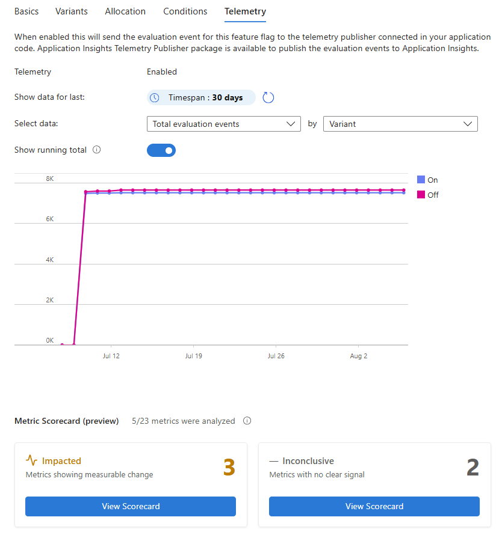
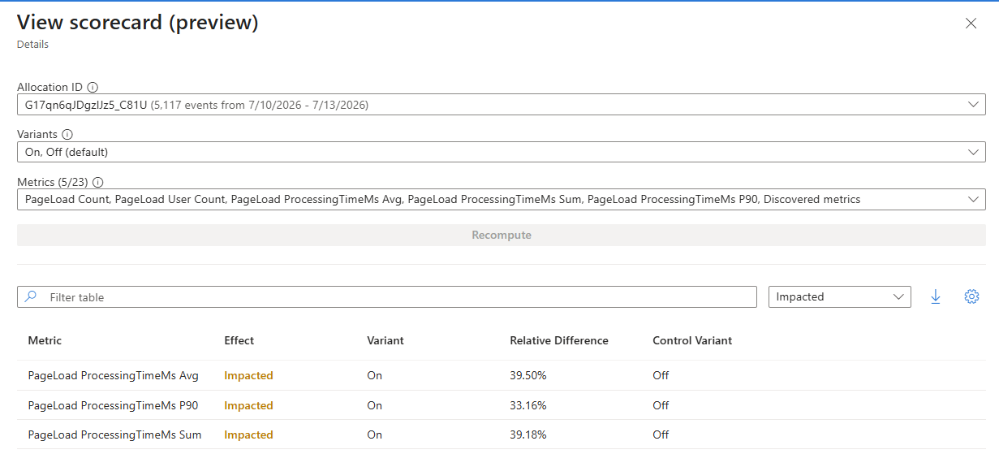

# Analyze the impact of feature flags

## Prerequisites

- The feature flag with telemetry enabled from [Enable telemetry for feature flags](./howto-telemetry.md).
- Familiarity with viewing telemetry results. For more information, see [View feature flag events](./howto-telemetry-review-results.md).

## Identify impacted metrics with scorecards (preview)

On the **Telemetry** tab, scroll below the metric chart to **Metric Scorecard (preview)**.

> [!div class="mx-imgBorder"]
> 

Scorecards use the standard and custom telemetry that your application sends to Application Insights. No additional instrumentation is required beyond enabling telemetry for the feature flag and configuring the Application Insights telemetry publisher.

The scorecard groups the analyzed metrics into two categories:

- **Impacted**: Metrics that show a statistically significant difference between variants.
- **Inconclusive**: Metrics for which the scorecard didn't detect a statistically significant difference between variants.

To review the analysis:

1. Select **View Scorecard** under **Impacted** or **Inconclusive**.
1. In **View scorecard (preview)**, select the allocation whose events you want to analyze.
1. Select the variants to compare. The portal identifies the control variant as **default**.
1. Select the metrics to include, and then select **Recompute**.
1. Use the table filter to switch between impacted and inconclusive metrics. Review the **Relative Difference** and **Control Variant** columns to understand how each variant compares with the control.

> [!div class="mx-imgBorder"]
> 

In this example, the scorecard compares the `On` variant with the `Off` control variant. The selected allocation contains 5,117 events collected from July 10 through July 13, 2026, and the analysis includes 5 of the 23 available metrics. With the table filtered to **Impacted**, the average, 90th percentile (P90), and sum of `PageLoad ProcessingTimeMs` show relative differences of 39.50%, 33.16%, and 39.18%, respectively, for the `On` variant.

Because all three processing-time metrics are higher for the `On` variant, the results suggest a potential performance regression. In this scenario, you should investigate the change and validate it with other relevant telemetry before expanding the rollout.

## Next steps

> [!div class="nextstepaction"]
> [Monitor Azure App Configuration](./monitor-app-configuration.md)
