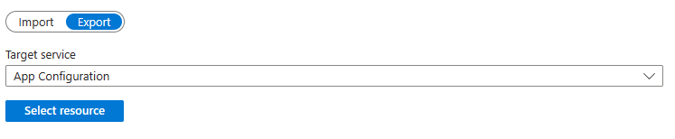

# Move an App Configuration store to another region 

App Configuration stores are region-specific and can't be moved across regions automatically. You must create a new App Configuration store in the target region, then move your content from the source store to the new target store. You might move your configuration to another region for a number of reasons. For example, to take advantage of a new Azure region with Availability Zone support, to deploy features or services available in specific regions only, or to meet internal policy and governance requirements. 

The following steps walk you through the process of creating a new target store and exporting your current store to the new region. 

## Design considerations

Before you begin, keep in mind the following concepts:

* Configuration store names are globally unique. 
* You need to reconfigure your access policies and network configuration settings in the new configuration store.

## Create the target configuration store

### [Portal](#tab/portal)     
To create a new App Configuration store in the Portal, follow these steps: 
1.  Sign in to the [Azure portal](https://portal.azure.com). In the upper-left corner of the home page, select **Create a resource**. In the **Search the Marketplace** box, enter *App Configuration* and select <kbd>Enter</kbd>. 

    
1. Select **App Configuration** from the search results, and then select **Create**.

    
1. On the **Create App Configuration** pane, enter the following settings:
    
    | Setting | Suggested value | Description |
    |---|---|---|
    | **Subscription** | Your subscription | Select the Azure subscription of your original store |
    | **Resource group** | Your resource group | Select the Azure resource group of your original store |
    | **Resource name** | Globally unique name | Enter a unique resource name to use for the target App Configuration store. This can not be the same name as the previous configuration store. |
    | **Location** | Your target Location | Select the target region you want to move your configuration store to. |
    | **Pricing tier** | *Standard* | Select the desired pricing tier. For more information, see the [App Configuration pricing page](https://azure.microsoft.com/pricing/details/app-configuration). |
1. Select **Review + create** to validate your settings.
1. Select **Create**. The deployment might take a few minutes.
1. Once the resource has been deployed, recreate the access policies and network configuration settings of our source store. These will not be transferred with the configuration. This can include using manage identities, virtual networks, and public network access. 
    
#### [Azure CLI](#tab/azcli)
To create a new App Configuration store in the CLI, follow these steps: 
1. Log in to the Azure CLI with your credentials.
    ```azurecli
    az login
    ```
1. Create a new configuration store with the `create` command,
    ```azurecli
    az appconfig create -g MyResourceGroup -n MyResourceName -l targetlocation --sku Standard 
    ```
    and enter the following settings:

    | Setting | Suggested value | Description |
    |---|---|---|
    | **Resource group** | Your resource group | Select the Azure resource group of your original store |
    | **Resource name** | Globally unique name | Enter a unique resource name to use for the target App Configuration store. This can not be the same name as the previous configuration store. |
    | **Location** | Your target Location | Select the target region you want to move your configuration store to. |
    | **Sku** | *Standard* | Select the desired pricing tier. For more information, see the [App Configuration pricing page](https://azure.microsoft.com/pricing/details/app-configuration). |
1. The deployment might take a few minutes. Once it is complete, recreate the access policies and network configuration settings of our source store. These will not be transferred with the configuration values. This can include using manage identities, virtual networks, and public network access. For more information, reference the [CLI documentation](./cli-samples.md).
---

## Transfer your configuration key-values  

### [Portal](#tab/portal)
Follow these steps to export your configuration to the target store using the Portal:
1. Navigate to your source configuration store in the [Azure portal](https://portal.azure.com) and select **Import/Export** under **Operations** .
1. Select **Export** and choose **App Configuration** in the **Target Service** dropdown. 
    
1. Click on **Select Resource** and enter your **Subscription** and **Resource group**. The **Resource** is the name of the target configuration store you created previously. 
1. Select **Apply** to verify your target configuration store. 
1. Leave the from label, time, and Label fields as their default values and select **Apply**. 
1. To verify that your configurations have been successfully transferred from your source to your target store, navigate to your target configuration store in the portal. Select **Configuration Explorer** under **Operations** and verify that this contains the same key value pairs as those in your original store. 
    > [!NOTE]
    > This process only allows for configuration key-values to be exported by one label at a time. To export multiple, repeat steps 2-5 for each label. 

### [Azure CLI](#tab/azcli)
Follow these steps to export your configuration to the target store using the Azure:
1. In the Azure CLI, enter the following command that will export all of the values from your source configuration store to your target configuration store. 
    ```azurecli
    az appconfig kv export -n SourceConfigurationStore -d appconfig --dest-name TargetConfigurationStore --key * --label * --preserve-labels
    ```
1. To verify that your configurations have been successfully transferred from your source to your target store, list all of the key values in your target store. 
    ```azurecli
    az appconfig kv list -n TargetAppConfiguration --all
    ```
---
## Delete your source configuration store 

If the configuration has been transferred to the target store, you can choose to delete your source configuration store. 

### [Portal](#tab/portal)
Follow these steps to delete your source configuration store in the Portal:
1. Sign in to the [Azure portal](https://portal.azure.com), and select **Resource groups**.
1. In the **Filter by name** box, enter the name of your resource group. 
1. In the result list, select the resource group name to see an overview.
1. Select your source configuration store, and on the **Overview** blade, select **Delete**. 
1. You're asked to confirm the deletion of the configuration store, select **Yes**.

After a few moments, the source configuration store will have been deleted.

### [Azure CLI](#tab/azcli)
Follow these steps to delete your source configuration store in the Azure CLI:
1. In the Azure CLI, run the following command: 
    ```azurecli
    az appconfig delete -g ResourceGroupName -n SourceConfiguration
    ```
    Note that the **Resource Group** is the one associated with your source Configuration store. 
1. Deleting the source configuration store might take a few moments. You can verify that the operation was successful by listing all of the current configuration stores in your resource group. 
    ```azurecli
    az appconfig list -g MyResourceGroup
    ```
    After a few moments, the source configuration store will have been deleted.

---
## Next steps

> [!div class="nextstepaction"]
> [Automatically back up key-values from Azure App Configuration stores](./howto-move-resource-between-regions.md)
>[Azure App Configuration resiliency and disaster recovery](./concept-disaster-recovery.md)
