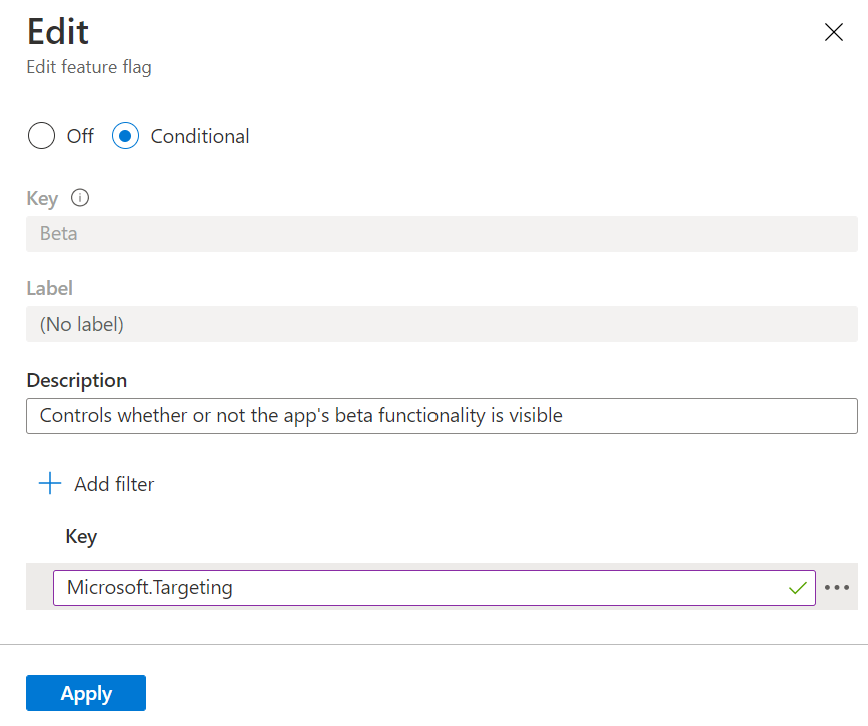
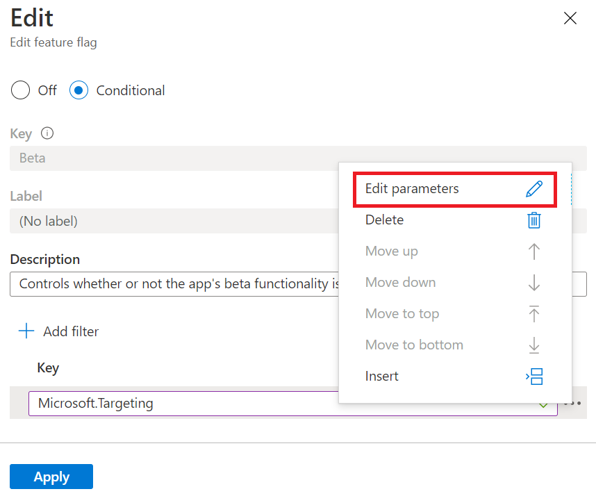
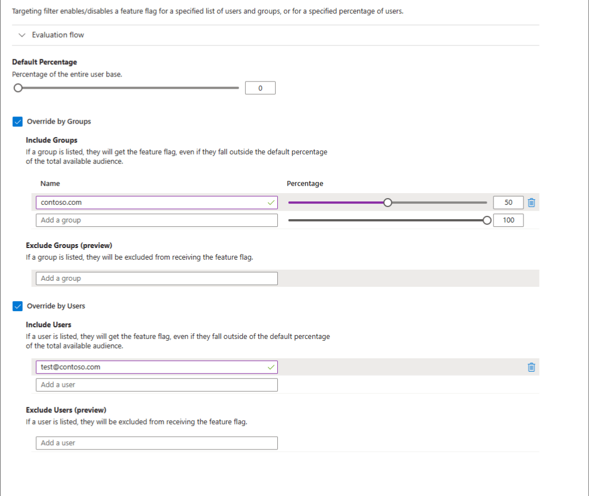
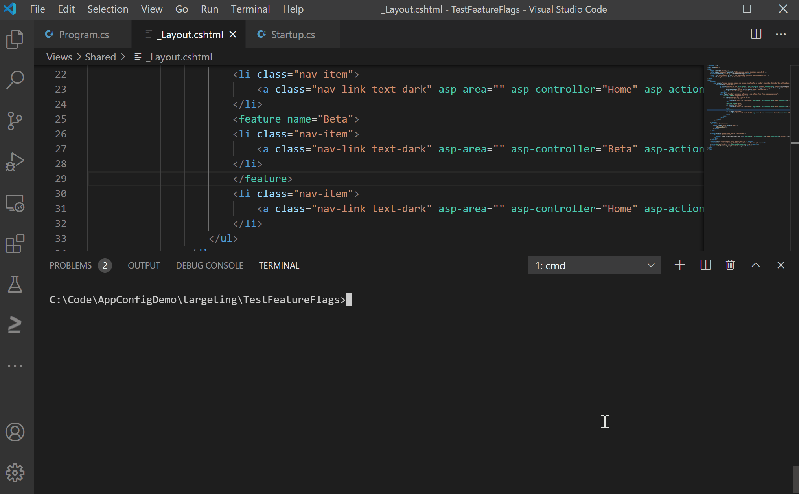

# Enable staged rollout of features for targeted audiences

Feature flags allow you to dynamically activate or deactivate functionality in your application. Feature filters determine the state of a feature flag each time it's evaluated. The `Microsoft.FeatureManagement` library includes `TargetingFilter`, which enables a feature flag for a specified list of users and groups, or for a specified percentage of users. `TargetingFilter` is "sticky," meaning that once an individual user receives a feature, they will continue to see that feature on subsequent requests. You can use `TargetingFilter` to enable a feature for a specific account during a demo, to progressively roll out new features to users in different groups or "rings," and much more.

In this article, you'll learn how to roll out a new feature in an ASP.NET Core web application to specified users and groups, using `TargetingFilter` with Azure App Configuration.

## Create a web application with feature flags and authentication

To roll out features based on users and groups, you'll need a web application that allows users to sign in.

1. Create a web application that authenticates against a local database using the following command:

   ```dotnetcli
   dotnet new mvc --auth Individual -o TestFeatureFlags
   ```

1. Build and run, then select the **Register** link in the upper right corner to create a new user account. Use an email address of **test@contoso.com**

1. Follow the instructions in [Quickstart: Add feature flags to an ASP.NET Core app](./quickstart-feature-flag-aspnet-core.md) to add a feature flag to your new web application.

1. Validate that you can control the visibility of the **Beta** item on the navigation bar by toggling the feature flag in App Configuration.

## Update the web application code to use TargetingFilter

At this point, you can use the feature flag to enable or disable the `Beta` feature for all users. To enable the feature flag for some users while disabling it for others, update your code to use `TargetingFilter`. In this example, you'll use the signed-in user's email address as the user ID, and the domain name portion of the email address as the group. You'll add the user and group to the `TargetingContext`. The `TargetingFilter` uses this context to determine the state of the feature flag for each request.

1. Update to the latest version of the `Microsoft.FeatureManagement.AspNetCore` package.

   ```dotnetcli
   dotnet add package Microsoft.FeatureManagement.AspNetCore --version 2.2.0-preview
   ```

1. Add a *TestTargetingContextAccessor.cs* file:

    ```csharp
    using Microsoft.AspNetCore.Http;
    using Microsoft.FeatureManagement.FeatureFilters;
    using System;
    using System.Collections.Generic;
    using System.Threading.Tasks;

    namespace TestFeatureFlags
    {
        public class TestTargetingContextAccessor : ITargetingContextAccessor
        {
            private const string TargetingContextLookup = "TestTargetingContextAccessor.TargetingContext";
            private readonly IHttpContextAccessor _httpContextAccessor;

            public TestTargetingContextAccessor(IHttpContextAccessor httpContextAccessor)
            {
                _httpContextAccessor = httpContextAccessor ?? throw new ArgumentNullException(nameof(httpContextAccessor));
            }

            public ValueTask<TargetingContext> GetContextAsync()
            {
                HttpContext httpContext = _httpContextAccessor.HttpContext;
                if (httpContext.Items.TryGetValue(TargetingContextLookup, out object value))
                {
                    return new ValueTask<TargetingContext>((TargetingContext)value);
                }
                List<string> groups = new List<string>();
                if (httpContext.User.Identity.Name != null)
                {
                    groups.Add(httpContext.User.Identity.Name.Split("@", StringSplitOptions.None)[1]);
                }
                TargetingContext targetingContext = new TargetingContext
                {
                    UserId = httpContext.User.Identity.Name,
                    Groups = groups
                };
                httpContext.Items[TargetingContextLookup] = targetingContext;
                return new ValueTask<TargetingContext>(targetingContext);
            }
        }
    }
    ```

1. In *Startup.cs*, add a reference to the *Microsoft.FeatureManagement.FeatureFilters* namespace:

    ```csharp
    using Microsoft.FeatureManagement.FeatureFilters;
    ```

1. Update the *ConfigureServices* method to register `TargetingFilter`, following the call to `AddFeatureManagement()`:

    ```csharp
    services.AddFeatureManagement()
            .AddFeatureFilter<TargetingFilter>();
    ```

1. Update the *ConfigureServices* method to add the `TestTargetingContextAccessor` created in the earlier step to the service collection. The *TargetingFilter* uses it to determine the targeting context every time that the feature flag is evaluated.

    ```csharp
      services.AddSingleton<ITargetingContextAccessor, TestTargetingContextAccessor>();
    ```

The entire *ConfigureServices* method will look like this:

```csharp
    public void ConfigureServices(IServiceCollection services)
    {
    services.AddDbContext<ApplicationDbContext>(options =>
        options.UseSqlite(
            Configuration.GetConnectionString("DefaultConnection")));
    services.AddDefaultIdentity<IdentityUser>(options => options.SignIn.RequireConfirmedAccount = true)
            .AddEntityFrameworkStores<ApplicationDbContext>();
    services.AddControllersWithViews();
    services.AddRazorPages();

    // Add feature management, targeting filter, and ITargetingContextAccessor to service collection
    services.AddFeatureManagement().AddFeatureFilter<TargetingFilter>();
    services.AddSingleton<ITargetingContextAccessor, TestTargetingContextAccessor>();
    }
```

## Update the feature flag to use TargetingFilter

1. In the Azure portal, go to your App Configuration store and select **Feature manager**.

1. Select the context menu for the *Beta* feature flag that you created in the quickstart. Select **Edit**.

    > [!div class="mx-imgBorder"]
    > 

1. In the **Edit** screen, select the **On** radio button if it isn't already selected. Then select the **Add Filter** button. (The **On** radio button's label will change to read **Conditional**.)

1. In the **Key** field, enter *Microsoft.Targeting*.

    > [!div class="mx-imgBorder"]
    > 

1. Select the context menu next to the feature filter key. Select **Edit Parameters**.

    > [!div class="mx-imgBorder"]
    > 

1. Hover under the **Name** header so that text boxes appear in the grid. Enter a **Name** of *Audience*

1. In the **Value** field, enter the following JSON:

    ```json
    {
      "Users": [
        "test@contoso.com"
      ],
      "Groups": [
        {
          "Name": "contoso.com",
          "RolloutPercentage": 50
        }
      ],
      "DefaultRolloutPercentage": 0
    }
    ```

    This *Audience* value results in the following behavior:

    - The feature flag is always enabled for user `test@contoso.com`, because `test@contoso.com` is listed in the `Users` section.
    - The feature flag is enabled for 50% of other users in the `contoso.com` group, because `contoso.com` is listed in the `Groups` section with a `RolloutPercentage` of 50.
    - The feature is always disabled for all other users, because `DefaultRolloutPercentage` is set to 0.

1. Select **Apply** to return to the **Edit feature flag** screen. Then select **Apply** again to save the feature flag settings.

1. The **State** of the feature flag now appears as *Conditional*. This state indicates that the feature flag will be enabled or disabled on a per-request basis, based on the criteria enforced by the feature filter.

    > [!div class="mx-imgBorder"]
    > 

## TargetingFilter in action

To see the effects of this feature flag, build and run the application. Initially, the *Beta* item doesn't appear on the toolbar, because the `DefaultRolloutPercentage` option is set to 0.

Now sign in as `test@contoso.com`, using the password you set when registering. The *Beta* item now appears on the toolbar, because `test@contoso.com` is specified as a targeted user.

The following video shows this behavior in action.

> [!div class="mx-imgBorder"]
> 
