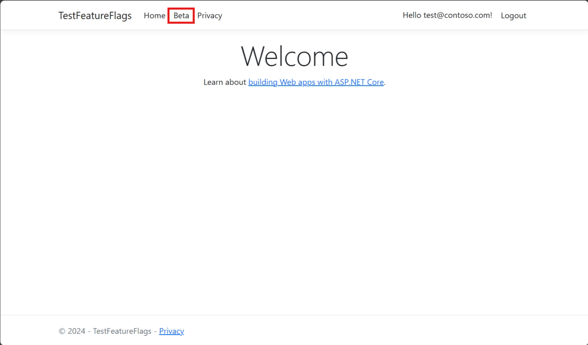

# Tutorial: Roll out features to targeted audiences in an ASP.NET Core application

In this tutorial, you'll use the targeting filter to roll out a feature to targeted audience for your ASP.NET Core application. For more information about the targeting filter, see [Roll out features to targeted audiences](./howto-targetingfilter.md).

## Prerequisites

- An Azure account with an active subscription. [Create one for free](https://azure.microsoft.com/free/).
- An App Configuration store. [Create a store](./quickstart-azure-app-configuration-create.md#create-an-app-configuration-store).
- A feature flag with targeting filter. [Create the feature flag](./howto-targetingfilter.md).
- [.NET SDK 6.0 or later](https://dotnet.microsoft.com/download).

## Create a web application with a feature flag

In this section, you will create a web application that allows users to sign in and use the *Beta* feature flag you created before.

1. Create a web application that authenticates against a local database using the following command.

   ```dotnetcli
   dotnet new webapp --auth Individual -o TestFeatureFlags
   ```

1. Add references to the following NuGet packages.

    ```dotnetcli
    dotnet add package Microsoft.Azure.AppConfiguration.AspNetCore
    dotnet add package Microsoft.FeatureManagement.AspNetCore
    ```

1. Store the connection string for your App Configuration store.

    ```dotnetcli
    dotnet user-secrets init
    dotnet user-secrets set ConnectionStrings:AppConfig "<your_connection_string>"
    ```

1. Add Azure App Configuration and feature management to your application.

    Update the *Program.cs* file with the following code. 

    ``` C#
    // Existing code in Program.cs
    // ... ...

    var builder = WebApplication.CreateBuilder(args);

    // Retrieve the App Config connection string
    string AppConfigConnectionString = builder.Configuration.GetConnectionString("AppConfig") ?? throw new InvalidOperationException("Connection string 'AppConfig' not found."); ;

    // Load feature flag configuration from Azure App Configuration
    builder.Configuration.AddAzureAppConfiguration(options =>
    {
        options.Connect(AppConfigConnectionString);
        options.UseFeatureFlags();
    });

    // Add Azure App Configuration middleware to the container of services
    builder.Services.AddAzureAppConfiguration();

    // Add feature management to the container of services
    builder.Services.AddFeatureManagement();

    // The rest of existing code in Program.cs
    // ... ...
    ```

1. Enable configuration and feature flag refresh from Azure App Configuration with the App Configuration middleware.

    Update Program.cs withe the following code.

    ``` C#
    // Existing code in Program.cs
    // ... ...
    
    var app = builder.Build();

    // Use Azure App Configuration middleware for dynamic configuration refresh
    app.UseAzureAppConfiguration();

    // The rest of existing code in Program.cs
    // ... ...
    ```

1. Add a new empty Razor page named **Beta** under the Pages directory. It includes two files *Beta.cshtml* and *Beta.cshtml.cs*.

    ``` cshtml
    @page
    @model TestFeatureFlags.Pages.BetaModel
    @{
        ViewData["Title"] = "Beta Page";
    }

    <h1>This is the beta website.</h1>
    ```

1. Open *Beta.cshtml.cs*, and add `FeatureGate` attribute to the `BetaModel` class.

    ``` C#
    using Microsoft.AspNetCore.Mvc.RazorPages;
    using Microsoft.FeatureManagement.Mvc;

    namespace TestFeatureFlags.Pages
    {
        [FeatureGate("Beta")]
        public class BetaModel : PageModel
        {
            public void OnGet()
            {
            }
        }
    }
    ```

1. Open *Pages/_ViewImports.cshtml*, and register the feature manager Tag Helper using an `@addTagHelper` directive.

    ``` cshtml
    @addTagHelper *, Microsoft.FeatureManagement.AspNetCore
    ```

1. Open *_Layout.cshtml* in the *Pages/Shared* directory. Insert a new `<feature>` tag in between the *Home* and *Privacy* navbar items, as shown in the highlighted lines below.

    :::code language="html" source="../../includes/azure-app-configuration-navbar.md" range="15-38" highlight="13-17":::

## Enable targeting for the web application

The targeting filter evaluates a user's feature state based on the user's targeting context, which comprises the user ID and the groups the user belongs to. In this example, you use the signed-in user's email address as the user ID and the domain name of the email address as the group.

1. Add an *ExampleTargetingContextAccessor.cs* file with the following code. You implement the `ITargetingContextAccessor` interface to provide the targeting context for the signed-in user of the current request.

    ```csharp
    using Microsoft.FeatureManagement.FeatureFilters;

    namespace TestFeatureFlags
    {
        public class ExampleTargetingContextAccessor : ITargetingContextAccessor
        {
            private const string TargetingContextLookup = "ExampleTargetingContextAccessor.TargetingContext";
            private readonly IHttpContextAccessor _httpContextAccessor;

            public ExampleTargetingContextAccessor(IHttpContextAccessor httpContextAccessor)
            {
                _httpContextAccessor = httpContextAccessor ?? throw new ArgumentNullException(nameof(httpContextAccessor));
            }

            public ValueTask<TargetingContext> GetContextAsync()
            {
                HttpContext httpContext = _httpContextAccessor.HttpContext;
                if (httpContext.Items.TryGetValue(TargetingContextLookup, out object value))
                {
                    return new ValueTask<TargetingContext>((TargetingContext)value);
                }
                List<string> groups = new List<string>();
                if (httpContext.User.Identity.Name != null)
                {
                    groups.Add(httpContext.User.Identity.Name.Split("@", StringSplitOptions.None)[1]);
                }
                TargetingContext targetingContext = new TargetingContext
                {
                    UserId = httpContext.User.Identity.Name,
                    Groups = groups
                };
                httpContext.Items[TargetingContextLookup] = targetingContext;
                return new ValueTask<TargetingContext>(targetingContext);
            }
        }
    }
    ```

1. Open the *Program.cs* file and enable the targeting filter by calling the `WithTargeting` method. You pass in the type `ExampleTargetingContextAccessor` that the targeting filter will use to get the targeting context during feature flag evaluation. Add `HttpContextAccessor` to the service collection to allow `ExampleTargetingContextAccessor` to access the signed-in user information from the `HttpContext`.

    ```csharp
    // Existing code in Program.cs
    // ... ...

    // Add feature management to the container of services
    builder.Services.AddFeatureManagement()
                    .WithTargeting<ExampleTargetingContextAccessor>();

    // Add HttpContextAccessor to the container of services.
    builder.Services.AddHttpContextAccessor();

    // The rest of existing code in Program.cs
    // ... ...
    ```
    
    > [!NOTE]
    > For Blazor applications, see [instructions](./faq.yml#how-to-enable-feature-management-in-blazor-applications-or-as-scoped-services-in--net-applications) for enabling feature management as scoped services.

## Targeting filter in action

1. Build and run the application. Initially, the **Beta** item doesn't appear on the toolbar, because the _Default percentage_ option is set to 0.

    > [!div class="mx-imgBorder"]
    > 

1. Select the **Register** link in the upper right corner to create a new user account. Use an email address of `test@contoso.com`. On the **Register Confirmation** screen, select **Click here to confirm your account**.

1. Sign in as `test@contoso.com`, using the password you set when registering the account. 

    The **Beta** item now appears on the toolbar, because `test@contoso.com` is specified as a targeted user.

    > [!div class="mx-imgBorder"]
    > 

    Now sign in as `testuser@contoso.com`, using the password you set when registering the account. The **Beta** item doesn't appear on the toolbar, because `testuser@contoso.com` is specified as an excluded user.

    You can create more users with `@contoso.com` and `@contoso-xyz.com` email addresses to see the behavior of the group settings.

    Users with `contoso-xyz.com` email addresses won't see the **Beta** item. While 50% of users with `@contoso.com` email addresses will see the **Beta** item, the other 50% won't see the **Beta** item.

## Next steps

To learn more about the feature filters, continue to the following tutorials.

> [!div class="nextstepaction"]
> [Enable conditional features with feature filters](./howto-feature-filters.md)

> [!div class="nextstepaction"]
> [Enable features on a schedule](./howto-timewindow-filter-aspnet-core.md)
