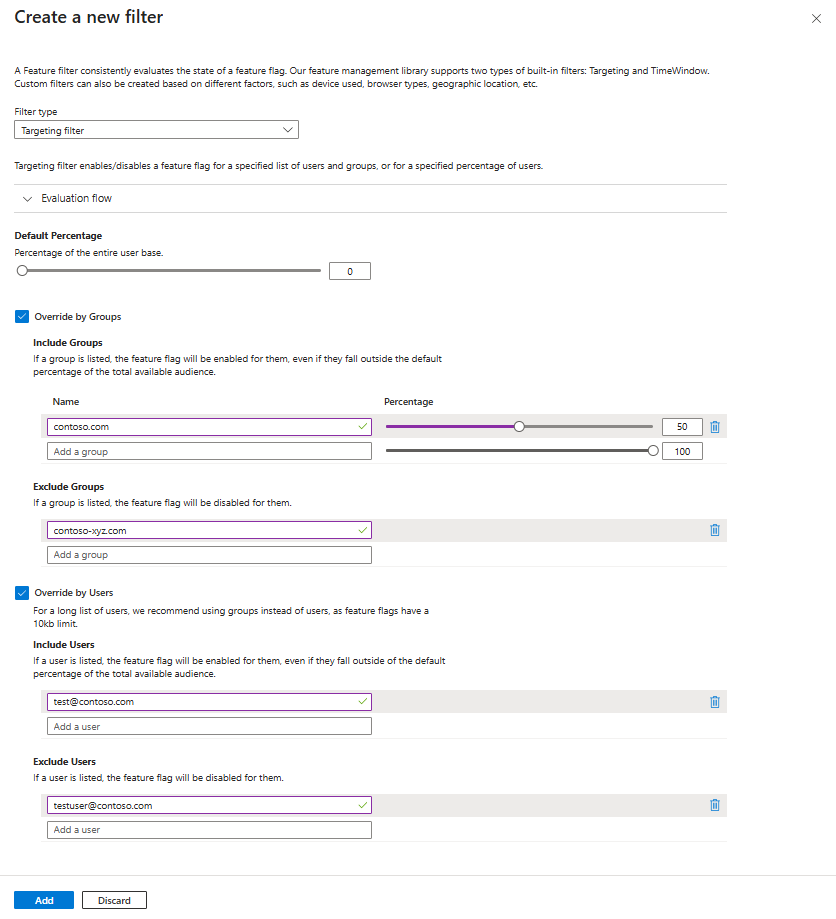
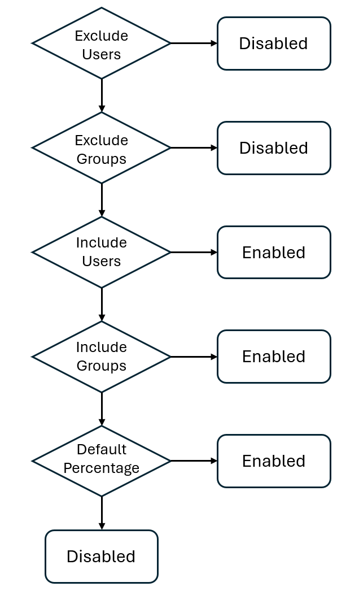
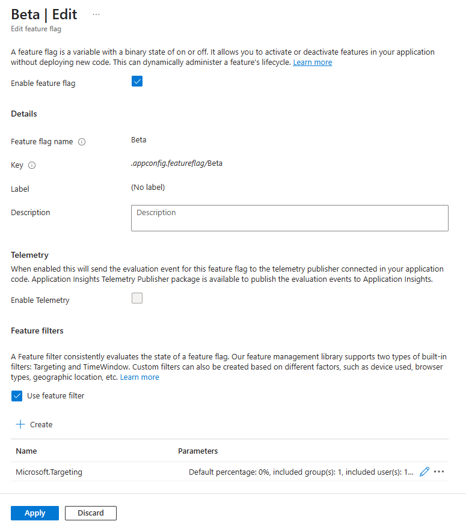

# Tutorial: Roll out features to targeted audiences

Targeting is a feature management strategy that enables developers to progressively roll out new features to their user base. The strategy is built on the concept of targeting a set of users known as the targeted audience. An audience is made up of specific users, groups, and a designated percentage of the entire user base.

- The users can be actual user accounts, but they can also be machines, devices, or any uniquely identifiable entities to which you want to roll out a feature.

- The groups are up to your application to define. For example, when targeting user accounts, you can use Microsoft Entra groups or groups denoting user locations. When targeting machines, you can group them based on rollout stages. Groups can be any common attributes based on which you want to categorize your audience.

[Feature filters](./howto-feature-filters.md#what-is-a-feature-filter) allow a feature flag to be enabled or disabled conditionally. The targeting filter is one of the feature management library's built-in feature filters. It allows you to turn on or off a feature for targeted audiences.

In this article, you will learn how to add and configure a targeting filter for your feature flags.

## Add a targeting filter

1. Create a feature flag named *Beta* in your App Configuration store and open to edit it. For more information about how to add and edit a feature flag, see [Manage feature flags](./manage-feature-flags.md).

1. In the **Edit feature flag** pane that opens, check the **Enable feature flag** checkbox if it isn't already enabled. Then check the **Use feature filter** checkbox and select **Create**.

    > [!div class="mx-imgBorder"]
    > 

1. The pane **Create a new filter** opens. Under **Filter type**, select the **Targeting filter** in the dropdown.

1. Select the **Override by Groups** and **Override by Users** checkbox.

1. Select the following options.

    - **Default percentage**: 0
    - **Include Groups**: Enter a **Name** of _contoso.com_ and a **Percentage** of _50_
    - **Exclude Groups**: `contoso-xyz.com`
    - **Include Users**: `test@contoso.com`
    - **Exclude Users**: `testuser@contoso.com`

    The feature filter screen will look like this.

    > [!div class="mx-imgBorder"]
    > 

    These settings result in the following behavior.

    - The feature flag is always disabled for user `testuser@contoso.com`, because `testuser@contoso.com` is listed in the _Exclude Users_ section.
    - The feature flag is always disabled for users in the `contoso-xyz.com`, because `contoso-xyz.com` is listed in the _Exclude Groups_ section.
    - The feature flag is always enabled for user `test@contoso.com`, because `test@contoso.com` is listed in the _Include Users_ section.
    - The feature flag is enabled for 50% of users in the _contoso.com_ group, because _contoso.com_ is listed in the _Include Groups_ section with a _Percentage_ of _50_.
    - The feature is always disabled for all other users, because the _Default percentage_ is set to _0_.

    The targeting filter is evaluated for a given user as in the following diagram.
    
    > [!div class="mx-imgBorder"]
    > 

1. Select **Add** to save the configuration of the targeting filter and return to the **Edit feature flag** screen.

1. The targeting feature filter is now listed in the feature flag details. Select **Apply** to save the feature flag.

    > [!div class="mx-imgBorder"]
    > 

Now, you successfully added a targeting filter for your feature flag. This targeting filter will use the targeting rule you configured to enable or disable the feature flag for specific users and groups. Follow the instructions in the [Next Steps](#next-steps) section to learn how it works in your application for the language or platform you are using.

## Next steps

In this tutorial, you learned the concept of the targeting filter and added it to a feature flag.

To learn how to use the feature flag with a targeting filter in your application, continue to the following tutorial.

> [!div class="nextstepaction"]
> [ASP.NET Core](./howto-targetingfilter-aspnet-core.md)

To learn more about the feature filters, continue to the following tutorials:

> [!div class="nextstepaction"]
> [Enable conditional features with feature filters](./howto-feature-filters.md)

> [!div class="nextstepaction"]
> [Enable features on a schedule](./howto-timewindow-filter.md)