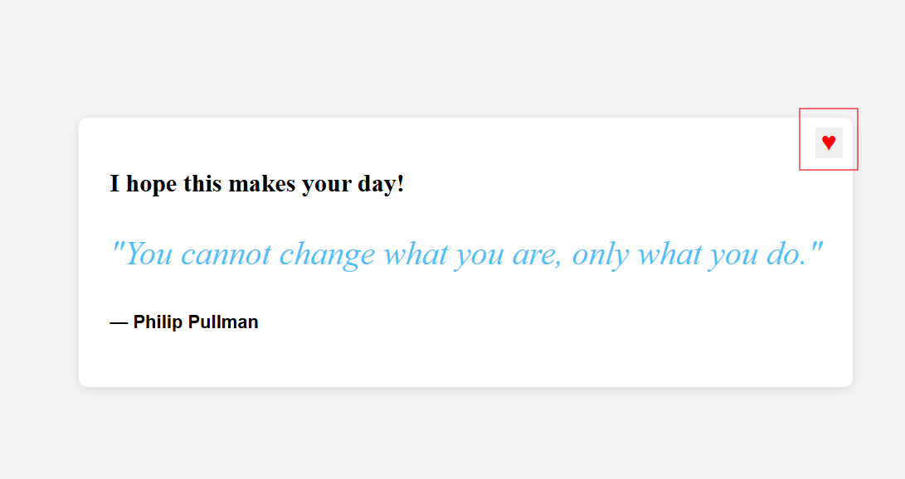
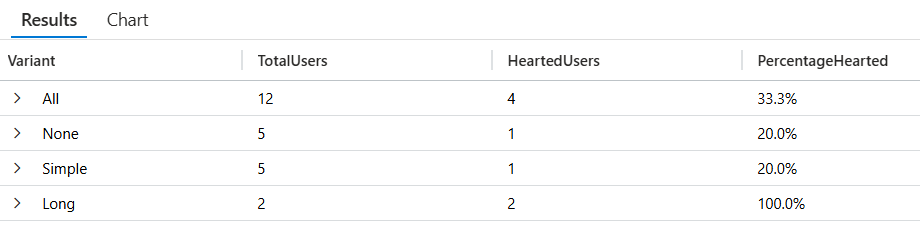

# Enable telemetry for feature flags in a Node.js application

In this tutorial, you use telemetry in your Node.js application to track feature flag evaluations and custom events. Telemetry allows you to make informed decisions about your feature management strategy. You utilize the feature flag with telemetry enabled created in [Enable telemetry for feature flags](./howto-telemetry.md). Before proceeding, ensure that you create a feature flag named *Greeting* in your Configuration store with telemetry enabled. This tutorial builds on top of [Tutorial: Use variant feature flags in a Node.js application](./howto-variant-feature-flags-javascript.md).

## Prerequisites

- [Enable telemetry for feature flags](./howto-telemetry.md).
- [Tutorial: Use variant feature flags in a Node.js application](./howto-variant-feature-flags-javascript.md).

## Add telemetry to your Node.js application

1. Install the following packages.

    ```bash
    npm install @microsoft/feature-management-applicationinsights-node
    ```

1. Open `server.js` and add the following code in the beginning to connect to Application Insights to publish telemetry.

    ```js
    const appInsightsConnectionString = process.env.APPLICATIONINSIGHTS_CONNECTION_STRING;
    const applicationInsights = require("applicationinsights");
    applicationInsights.setup(appInsightsConnectionString).start();

    const express = require("express");
    const server = express();
    // existing code ...
    ```

1. Add the following import.

    ```js
    const { createTelemetryPublisher, trackEvent } = require("@microsoft/feature-management-applicationinsights-node");
    ```

1. Create and register the telemetry publisher when initializing the `FeatureManager`.

    ```js
    // existing code ...
    const featureFlagProvider = new ConfigurationMapFeatureFlagProvider(appConfig);
    const publishTelemetry = createTelemetryPublisher(applicationInsights.defaultClient);
    featureManager = new FeatureManager(featureFlagProvider, {
        onFeatureEvaluated: publishTelemetry
    });
    // existing code ...
    ```

    The `publishTelemetry` callback will send telemetry data each time a feature flag is evaluated.

1. Track custom events for user interactions. Modify the `/api/like` endpoint to send telemetry data to Application Insights whenever a user likes content. This helps you analyze which feature variants perform better.

    ```js
    server.post("/api/like", (req, res) => {
        const { UserId } = req.body;
        if (UserId === undefined) {
            return res.status(400).send({ error: "UserId is required" });
        }
        trackEvent(applicationInsights.defaultClient, UserId, { name: "Liked" });
        res.status(200).send();
    });
    ```

## Run the application

1. Application insights requires a connection string to connect to your Application Insights resource. Set the `APPLICATIONINSIGHTS_CONNECTION_STRING` environment variable to the connection string for your Application Insights resource.

    ```cmd
    setx APPLICATIONINSIGHTS_CONNECTION_STRING "applicationinsights-connection-string"
    ```

    If you use PowerShell, run the following command:

    ```powershell
    $Env:APPLICATIONINSIGHTS_CONNECTION_STRING = "applicationinsights-connection-string"
    ```

    If you use macOS or Linux, run the following command:

    ```bash
    export APPLICATIONINSIGHTS_CONNECTION_STRING='applicationinsights-connection-string'
    ```

1. Run the application, [see step 4 of Use variant feature flags](./howto-variant-feature-flags-javascript.md#run-the-application).

1. Use 10 different users to visit the application. As you use a different user, you get a different message variant for some of them. ~50% of the time you get no message. 25% of the time you get the message "Hello!" and 25% of the time you get "I hope this makes your day!".

1. With some of the users click the **Like**(heart) button to trigger the telemetry event.

    > [!div class="mx-imgBorder"]
    > 

1. Open your Application Insights resource in the Azure portal and select **Logs** under **Monitoring**. In the query window, run the following query to see the telemetry events:

    ```kusto
    // Step 1: Get distinct users and their Variant from FeatureEvaluation
    let evaluated_users =
        customEvents
        | where name == "FeatureEvaluation"
        | extend TargetingId = tostring(customDimensions.TargetingId),
                Variant = tostring(customDimensions.Variant)
        | summarize Variant = any(Variant) by TargetingId;

    // Step 2: Get distinct users who emitted a "Like"
    let liked_users =
        customEvents
        | where name == "Liked"
        | extend TargetingId = tostring(customDimensions.TargetingId)
        | summarize by TargetingId;

    // Step 3: Join them to get only the evaluated users who also liked
    let hearted_users =
        evaluated_users
        | join kind=inner (liked_users) on TargetingId
        | summarize HeartedUsers = dcount(TargetingId) by Variant;

    // Step 4: Total evaluated users per variant
    let total_users =
        evaluated_users
        | summarize TotalUsers = dcount(TargetingId) by Variant;

    // Step 5: Combine results
    let combined_data =
        total_users
        | join kind=leftouter (hearted_users) on Variant
        | extend HeartedUsers = coalesce(HeartedUsers, 0)
        | extend PercentageHearted = strcat(round(HeartedUsers * 100.0 / TotalUsers, 1), "%")
        | project Variant, TotalUsers, HeartedUsers, PercentageHearted;

    // Step 6: Add total row
    let total_sum =
        combined_data
        | summarize
            TotalUsers = sum(TotalUsers),
            HeartedUsers = sum(HeartedUsers)
        | extend
            Variant = "All",
            PercentageHearted = strcat(round(HeartedUsers * 100.0 / TotalUsers, 1), "%")
        | project Variant, TotalUsers, HeartedUsers, PercentageHearted;

    // Step 7: Output
    combined_data
    | union (total_sum)
    ```

    > [!div class="mx-imgBorder"]
    > 

    You see one "FeatureEvaluation" for each time the quote page was loaded and one "Liked" event for each time the like button was clicked. The "FeatureEvaluation" event have a custom property called `FeatureName` with the name of the feature flag that was evaluated. Both events have a custom property called `TargetingId` with the name of the user that liked the quote.

## Additional resources

- [Quote of the Day sample](https://github.com/Azure-Samples/quote-of-the-day-javascript)

## Next steps

For the full feature rundown of the JavaScript feature management library, refer to the following document.

> [!div class="nextstepaction"]
> [JavaScript Feature Management](./feature-management-javascript-reference.md)
