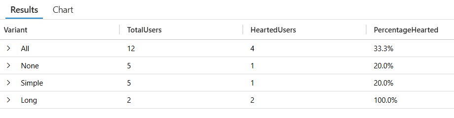

# Enable telemetry for feature flags in a Python application

In this tutorial, you use telemetry in your Python application to track feature flag evaluations and custom events. Telemetry allows you to make informed decisions about your feature management strategy. You utilize the feature flag with telemetry enabled created in [Enable telemetry for feature flags](./howto-telemetry.md). Before proceeding, ensure that you create a feature flag named *Greeting* in your Configuration store with telemetry enabled. This tutorial builds on top of [use variant feature flags](./howto-variant-feature-flags-python.md).

## Prerequisites

- The variant feature flag with telemetry enabled from [Enable telemetry for feature flags](./howto-telemetry.md).
- The application from [Use variant feature flags](./howto-variant-feature-flags-python.md).

## Add telemetry to your python application

1. Install the required packages using pip:

    ```bash
    pip install azure-appconfiguration-provider
    pip install featuremanagement["AzureMonitor"]
    pip install azure-monitor-opentelemetry
    ```

1. Open `app.py` and configure your code to connect to Application Insights to publish telemetry.

    ```python
    import os
    from azure.monitor.opentelemetry import configure_azure_monitor

    # Configure Azure Monitor
    configure_azure_monitor(connection_string=os.getenv("APPLICATIONINSIGHTS_CONNECTION_STRING"))
    ```
    
1. Also in `app.py` load your feature flags from App Configuration and load them into feature management. `FeatureManager` uses the `publish_telemetry` callback function to publish telemetry to Azure Monitor.

    ```python
    from featuremanagement.azuremonitor import publish_telemetry

    feature_manager = FeatureManager(config, on_feature_evaluated=publish_telemetry)
    ```

1. Open `routes.py` and update your code to track your own events in your application. When `track_event` is called, a custom event is published to Azure Monitor with the provided user.

    ```python
    from featuremanagement import track_event
    
    @bp.route("/heart", methods=["POST"])
    def heart():
        if current_user.is_authenticated:
            user = current_user.username
            
            # Track the appropriate event based on the action
            track_event("Liked", user)
        return jsonify({"status": "success"})
    ```

1. Open `index.html` and update the code to implement the like button. The like button sends a POST request to the `/heart` endpoint when clicked.

    ```html
    <script>
        function heartClicked(button) {
            var icon = button.querySelector('i');
            
            // Toggle the heart icon appearance
            icon.classList.toggle('far');
            icon.classList.toggle('fas');
            
            // Only send a request to the dedicated heart endpoint when it's a like action
            if (icon.classList.contains('fas')) {
                fetch('/heart', {
                    method: 'POST',
                    headers: {
                        'Content-Type': 'application/json',
                    }
                });
            }
        }
    </script>
    ```

## Build and run the app

1. Application insights requires a connection string to connect to your Application Insights resource. Set the `APPLICATIONINSIGHTS_CONNECTION_STRING` environment variable to the connection string for your Application Insights resource.

    ```cmd
    setx APPLICATIONINSIGHTS_CONNECTION_STRING "applicationinsights-connection-string"
    ```

    If you use PowerShell, run the following command:

    ```powershell
    $Env:APPLICATIONINSIGHTS_CONNECTION_STRING = "applicationinsights-connection-string"
    ```

    If you use macOS or Linux, run the following command:

    ```bash
    export APPLICATIONINSIGHTS_CONNECTION_STRING='applicationinsights-connection-string'
    ```

1. Run the application, [see step 2 of Use variant feature flags](./howto-variant-feature-flags-python.md#build-and-run-the-app) .
1. Create 10 different users and log into the application. As you log in with each user, you get a different message variant for some of them. ~50% of the time you get no message. 25% of the time you get the message "Hello!" and 25% of the time you get "I hope this makes your day!".
1. With some of the users select the **Like** button to trigger the telemetry event.
1. Open your Application Insights resource in the Azure portal and select **Logs** under **Monitoring**. In the query window, run the following query to see the telemetry events:

    ```kusto
    // Total users
    let total_users =
        customEvents
        | where name == "FeatureEvaluation"
        | summarize TotalUsers = count() by Variant = tostring(customDimensions.Variant);
    
    // Hearted users
    let hearted_users =
        customEvents
        | where name == "FeatureEvaluation"
        | extend TargetingId = tostring(customDimensions.TargetingId)
        | join kind=inner (
            customEvents
            | where name == "Liked"
            | extend TargetingId = tostring(customDimensions.TargetingId)
        ) on TargetingId
        | summarize HeartedUsers = count() by Variant = tostring(customDimensions.Variant);
    
    // Calculate the percentage of hearted users over total users
    let combined_data =
        total_users
        | join kind=leftouter (hearted_users) on Variant
        | extend HeartedUsers = coalesce(HeartedUsers, 0)
        | extend PercentageHearted = strcat(round(HeartedUsers * 100.0 / TotalUsers, 1), "%")
        | project Variant, TotalUsers, HeartedUsers, PercentageHearted;
    
    // Calculate the sum of total users and hearted users of all variants
    let total_sum =
        combined_data
        | summarize Variant="All", TotalUsers = sum(TotalUsers), HeartedUsers = sum(HeartedUsers);
    
    // Display the combined data along with the sum of total users and hearted users
    combined_data
    | union (total_sum)
    ```

    > [!div class="mx-imgBorder"]
    > 

    You see one "FeatureEvaluation" for each time the quote page was loaded and one "Liked" event for each time the like button was clicked. The "FeatureEvaluation" event have a custom property called `FeatureName` with the name of the feature flag that was evaluated. Both events have a custom property called `TargetingId` with the name of the user that liked the quote.

## Additional resources
- [Flask Quote of the Day sample](https://github.com/Azure-Samples/quote-of-the-day-python)
