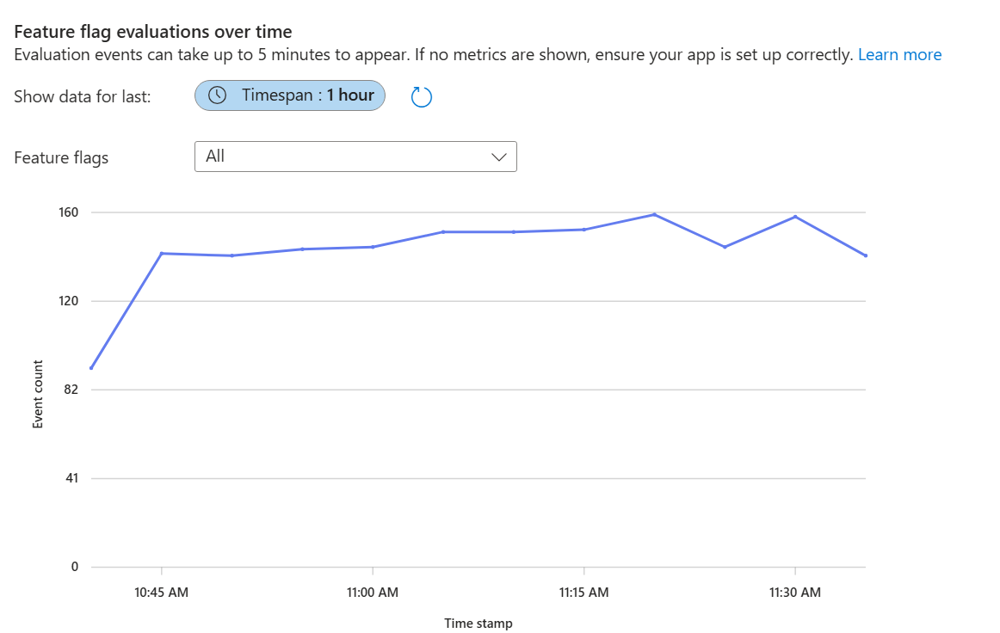
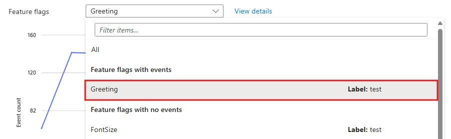
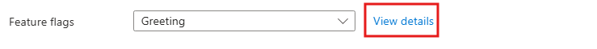
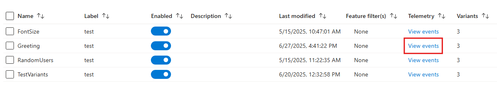
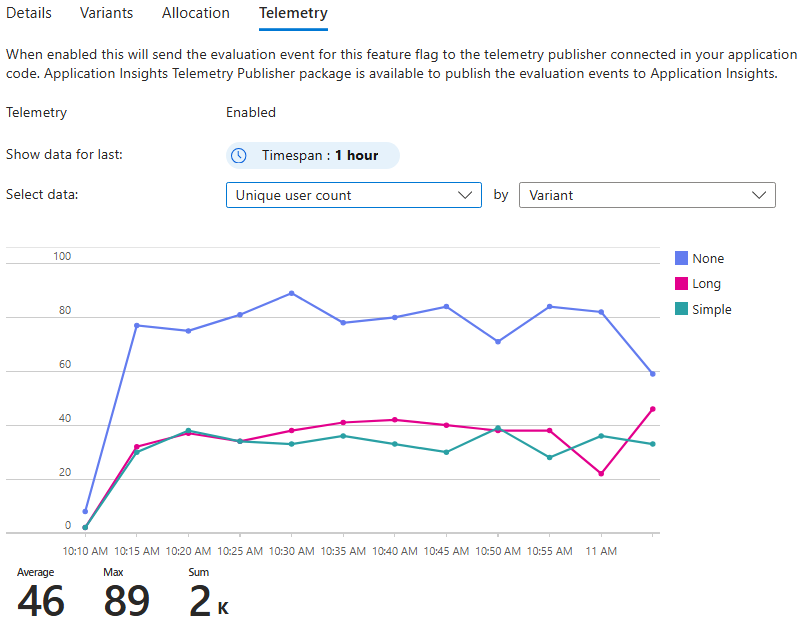
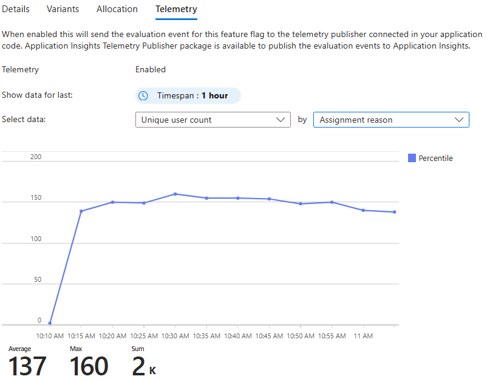
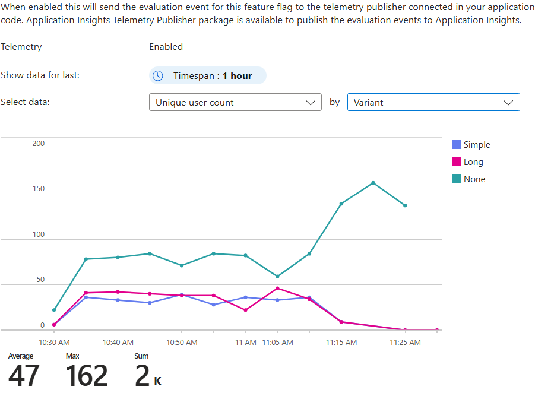
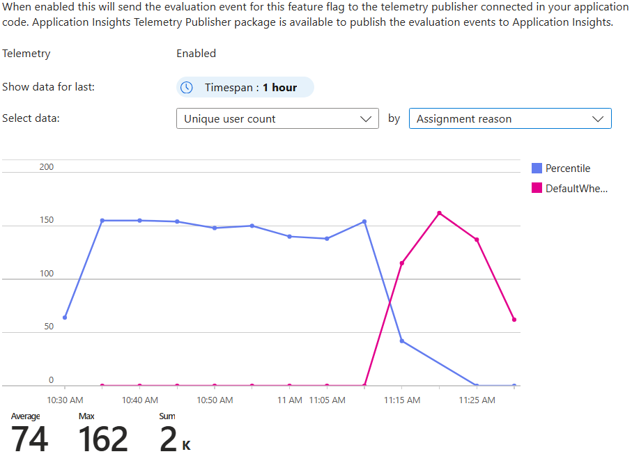
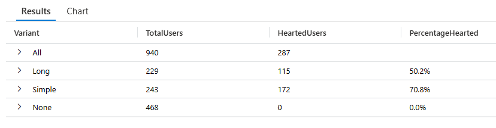

# View feature flag events

This article shows you how to view the telemetry emitted by your feature flags in Azure App Configuration. You learn how to view feature flag evaluation events in Application Insights, verify variant assignments and their allocation percentages, confirm that overrides and flag state changes produce the expected behavior, and run a Kusto query in Application Insights to compare how different variants perform against custom application events.

## Prerequisites

- The feature flag with telemetry enabled from [Enable telemetry for feature flags](./howto-telemetry.md).

## View feature flag events in Azure App Configuration

1. Go to the **Application Insights** in the App Configuration portal. You see a graph that shows all events from your application. This graph gives you an overview of activity patterns.
    > [!div class="mx-imgBorder"]
    > 

1. Use the time range selector to focus on specific periods so you can identify trends or investigate particular timeframes.

1. Filter by feature flag
    1. Select the dropdown menu above the event graph.
    1. Under **Feature flags with events**, select your feature flag.
    1. The graph now shows only events related to the feature flag's evaluations.
    > [!div class="mx-imgBorder"]
    > 

1. To access more detailed telemetry, select **View details** to open the telemetry tab.
    > [!div class="mx-imgBorder"]
    > 

> [!NOTE]
> You can also access this tab by going to the **Feature manager** and selecting **View events** in the telemetry column for the feature flag.
>    


### Verify variant assignments

In the telemetry tab, you can view:

- **Total events**: Total number of evaluation events your application emits.
- **Unique users**: Number of distinct users who are targeted and for whom the application emits events.

To show the distribution of users and the number of evaluations across the **Simple**, **Long**, and **None** variants, group the metrics by variant. This grouping helps you see whether the configured allocations work as expected and whether the application serves all expected variants to users.


> [!div class="mx-imgBorder"]
> 

In this example, the number of users assigned the **None** variant is almost twice that of the **Simple** and **Long** variants, given the configured 50-25-25 percentile split between **None**, **Simple**, and **Long** variants.


### Confirm overrides and behavior based on flag state

Users might receive a variant for different reasons. Ensure that your variant assignments are not only in the right proportion but also for the right reason. You can group metrics by assignment reason. In this example, the only assignment reason is Percentile allocations.

> [!div class="mx-imgBorder"]
> 

1. Disable the feature flag by going to the feature manager and toggling the feature flag **Enable** switch. 
1. In the  telemetry column, click **View events** to go to telemetry tab in read-only mode. 
1. View **Unique user count by Variant**. You should see that all assignments for **Long** and **Simple** go to zero. Only the **None** variant, which is the default in this case, is assigned to users.
    > [!div class="mx-imgBorder"]
    > 
    
1. Switch to **Unique user count by assignment reason**.
Confirm from the graph that the **Percentile** allocations fall to zero and **DefaultWhenDisabled** is the only reason for which users are being assigned variants.

    Other possible reasons include **DefaultWhenEnabled**, **Group**, or **User** if configured.
    > [!div class="mx-imgBorder"]
    > 


## View telemetry in Application Insights

After you confirm the feature flag allocations are working as expected, dive deeper into the telemetry events to see how different variants perform based on the likes that users send.


Open your Application Insights resource in the Azure portal and select **Logs** under **Monitoring**. In the query window, run the following query to see the telemetry events:

```kusto
// Step 1: Get distinct users and their Variant from FeatureEvaluation (Replace <AppConfigurationEndpoint> with your store's endpoint)
let evaluated_users =
    customEvents
    | where name == "FeatureEvaluation"
    | where tostring(customDimensions.FeatureFlagReference) == "https://<AppConfigurationEndpoint>/kv/.appconfig.featureflag/Greeting"
    | extend TargetingId = tostring(customDimensions.TargetingId),
            Variant = tostring(customDimensions.Variant)
    | summarize Variant = any(Variant) by TargetingId;

// Step 2: Get distinct users who emitted a "Like"
let liked_users =
    customEvents
    | where name == "Liked"
    | extend TargetingId = tostring(customDimensions.TargetingId)
    | summarize by TargetingId;

// Step 3: Join them to get only the evaluated users who also liked
let hearted_users =
    evaluated_users
    | join kind=inner (liked_users) on TargetingId
    | summarize HeartedUsers = dcount(TargetingId) by Variant;

// Step 4: Total evaluated users per variant
let total_users =
    evaluated_users
    | summarize TotalUsers = dcount(TargetingId) by Variant;

// Step 5: Combine results
let combined_data =
    total_users
    | join kind=leftouter (hearted_users) on Variant
    | extend HeartedUsers = coalesce(HeartedUsers, 0)
    | extend PercentageHearted = strcat(round(HeartedUsers * 100.0 / TotalUsers, 1), "%")
    | project Variant, TotalUsers, HeartedUsers, PercentageHearted;

// Step 6: Add total row
let total_sum =
    combined_data
    | summarize Variant="All", TotalUsers = sum(TotalUsers), HeartedUsers = sum(HeartedUsers);

// Step 7: Output
combined_data
| union (total_sum)
```

> [!div class="mx-imgBorder"]
> 

You see one `FeatureEvaluation` event for each time the quote page loads and one `Liked` event for each time the like button is clicked. The `FeatureEvaluation` events have a custom property called `FeatureName` with the name of the feature flag that was evaluated. Both events have a custom property called `TargetingId` with the name of the user that liked the quote.

In this example, even though the number of users getting the Long variant versus Simple was roughly the same, the Simple variant performs better by a margin of 22%.

## Next steps

> [!div class="nextstepaction"]
> [Analyze the impact of feature flags](./howto-metric-scorecards.md)
