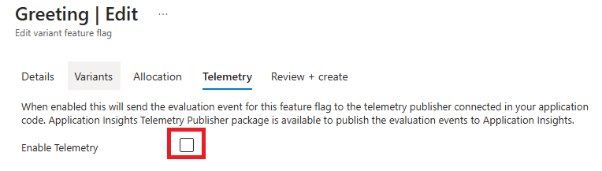
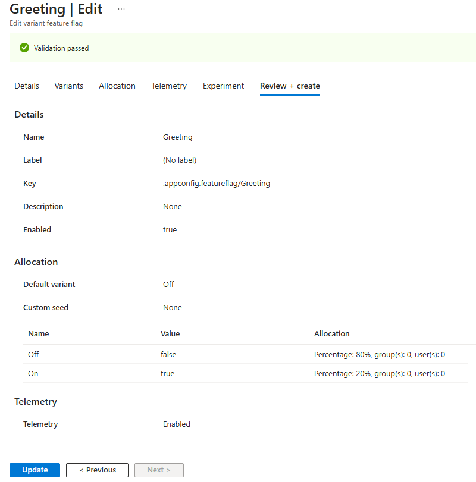

# Tutorial: Enable telemetry for feature flags (preview)

Having telemetry data on your feature flags can be a powerful tool for understanding how your feature flags are used. Telemetry (preview) allows you to make informed decisions about your feature management strategy.

In this tutorial, you:

> [!div class="checklist"]
> - Add telemetry to a feature flag (preview)

## Prerequisites

- An Azure subscription. If you don't have an Azure subscription, create a [free account](https://azure.microsoft.com/free/) before you begin.
- An App Configuration store. If you don't have an App Configuration store, see [Create an App Configuration store](./quickstart-azure-app-configuration-create.md).
- A variant feature flag. If you don't have a feature flag, see [Create a feature flag](./manage-feature-flags.md).
- An Application Insights resource. If you don't have an Application Insights resource, see [Create an Application Insights resource](/azure/azure-monitor/app/create-workspace-resource).

## Connect your App Configuration store to Application Insights

1. Open your App Configuration store in the Azure portal.
1. In the **Telemetry** section, select the **Application Insights (preview)** button.
1. Select the subscription, resource group, and the Application Insights resource you want to connect to your App Configuration store.
1. Select the **Connect** button.

    > [!div class="mx-imgBorder"]
    > 

## Add telemetry to a feature flag (preview)

1. Open your App Configuration store in the Azure portal.
1. In the **Operations** section, select the **Feature manager** page.
1. When viewing the list of feature flags, you should see a column labeled **Telemetry** (preview), it should show as **Disabled**. Right click on the feature flag you want to enable telemetry for and select **Edit**.

    > [!div class="mx-imgBorder"]
    > 

1. In the new view, select the **Telemetry** tab.
1. Select the **Enable Telemetry** checkbox and then the **Review + update** button at the bottom of the page.

    > [!div class="mx-imgBorder"]
    > 

1. On the **Review + update** page, select the **Update** button.

    > [!div class="mx-imgBorder"]
    > 

## Next steps

In this tutorial, you learned how to enable telemetry for feature flags in Azure App Configuration. To learn about how to use the telemetry data in your applications, continue to the following tutorial for your language or platform.

> [!div class="nextstepaction"]
> [Python](./howto-telemetry-python.md)
>