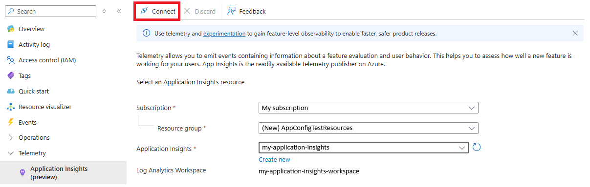
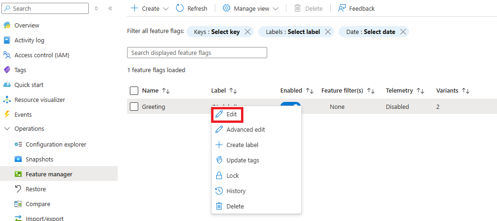
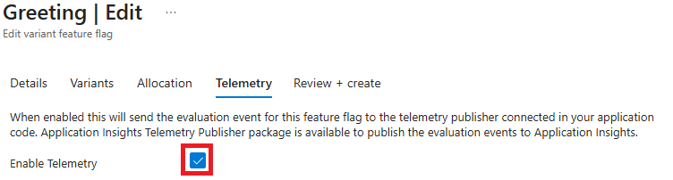

# Enable telemetry for feature flags

Telemetry is the process of collecting, transmitting, and analyzing data about the usage and performance of your application. It helps you monitor feature flag behavior and make data-driven decisions. When a feature flag change is deployed, it's often important to analyze its effect on an application. For example, here are a few questions that may arise:

- Are my flags enabled/disabled as expected?
- Are targeted users getting access to a certain feature as expected?
- How does a variant affect customer engagement?

These types of questions can be answered through the emission and analysis of feature flag evaluation events.

## Prerequisites

- The feature flag created in [Use variant feature flags](./howto-variant-feature-flags.md).

## Connect to Application Insights (preview)

1. Open your App Configuration store in the Azure portal.
1. In the **Telemetry** section, select the **Application Insights (preview)** blade.
1. Select the subscription, resource group. Then either select your existing Application Insights resource you want to connect to your App Configuration store to, or select **Create new** to create a new Application Insights resource.
1. Select the **Connect** button.

    > [!div class="mx-imgBorder"]
    > 

## Enable telemetry for a feature flag

1. Open your App Configuration store in the Azure portal and select the **Feature manager** blade under the **Operations** section.
1. Select the feature flag named Greeting. If you don't have it, follow the [instructions to create it](./manage-feature-flags.md). Then, right-click on the feature flag and select **Edit**.

    > [!div class="mx-imgBorder"]
    > 

1. In the new view, select the **Telemetry** tab.
1. Check the **Enable Telemetry** box and then select the **Review + update** button at the bottom of the page.

    > [!div class="mx-imgBorder"]
    > 

1. Continue to the following instructions to use telemetry in your application for the language or platform you're using.

    * [Python](./howto-telemetry-python.md)
    * [JavaScript](./howto-telemetry-javascript.md)
