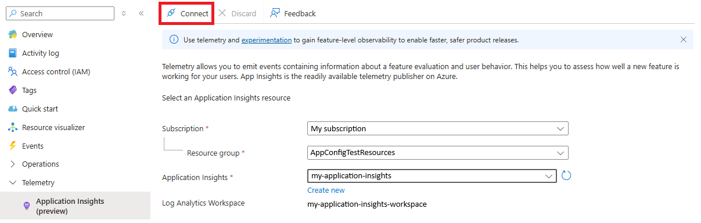
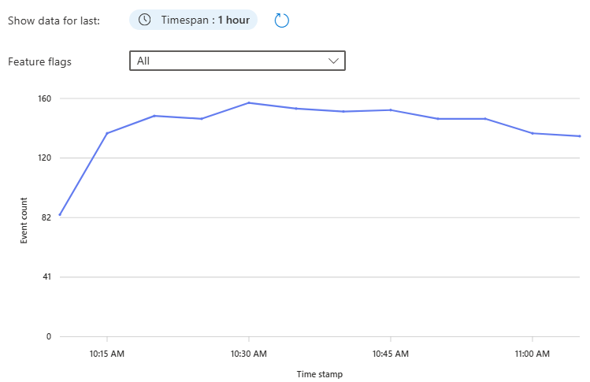
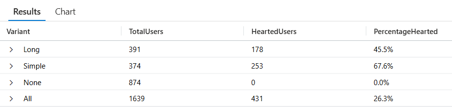

# Enable telemetry for feature flags

Telemetry is the automated process of collecting, transmitting, and analyzing data about how your application and its features are used. Enabling telemetry for feature flags offers valuable insights into the behavior and impact of feature rollouts, helping teams iterate faster, enhance user experience, detect issues early, and validate the effectiveness of new features. With telemetry, teams can answer critical questions such as:

- Is a feature enabled or disabled as expected?  
- Are specific users or groups accessing the new feature?  
- Is a feature causing performance regressions or errors?  
- What is the impact of a feature on key metrics like engagement or conversion?

By leveraging telemetry data, organizations can make informed, data-driven decisions, quickly identify and resolve issues, and optimize feature delivery for better business and user outcomes.

Telemetry is the process of collecting, transmitting, and analyzing data about the usage and performance of your application. It helps you monitor feature flag behavior and make data-driven decisions. When a feature flag change is deployed, it's often important to analyze its effect on an application. For example, here are a few questions that may arise:

- Are my flags enabled/disabled as expected?
- Are targeted users getting access to a certain feature as expected?
- How does a variant affect customer engagement?

These types of questions can be answered through the emission and analysis of feature flag evaluation events.

## Prerequisites

- The feature flag created in [Use variant feature flags](./howto-variant-feature-flags.md).

## Connect to Application Insights

1. Open your App Configuration store in the Azure portal.
1. In the **Telemetry** section, select the **Application Insights (preview)** blade.
1. Select the subscription, resource group. Then either select your existing Application Insights resource you want to connect to your App Configuration store to, or select **Create new** to create a new Application Insights resource.
1. Select the **Connect** button.

    > [!div class="mx-imgBorder"]
    > 

## Enable telemetry for a feature flag

1. Open your App Configuration store in the Azure portal and select the **Feature manager** blade under the **Operations** section.
1. Select the feature flag named Greeting. If you don't have it, follow the [instructions to create it](./manage-feature-flags.md). Then, right-click on the feature flag and select **Edit**.

    > [!div class="mx-imgBorder"]
    > 

1. In the new view, select the **Telemetry** tab.
1. Check the **Enable Telemetry** box and then select the **Review + update** button at the bottom of the page.

    > [!div class="mx-imgBorder"]
    > 

1. Continue to the following instructions to use telemetry in your application for the language or platform you're using.

    * [Python](./howto-telemetry-python.md)
    * [JavaScript](./howto-telemetry-javascript.md)

## Review telemetry results in Azure App Configuration

1. Navigate to the **Application Insights** blade in the App Configuration portal. You should see a graph displaying all events from your application. This graph provides an initial overview of activity patterns.
    > [!div class="mx-imgBorder"]
    > 

1. Use the time range selector to focus on specific periods to identify trends or investigate particular timeframes of interest.

1. Filter by feature Flag
    1. Click on the dropdown menu above the event graph
    1. Under **Feature flags with events** select your feature flag
    1. The graph will now display only events related to the feature flag's evaluations
    > [!div class="mx-imgBorder"]
    > 

1. To access more detailed telemetry, click **View details** to open the telemetry tab.
    > [!div class="mx-imgBorder"]
    > 

> [!NOTE]
> You can also access this tab by going to the **Feature manager** and clicking **View events** in the telemetry column for the feature flag of interest.
>    


### Verify variant assignments

In the telemetry tab, you can view:

- **Total events**: Total number of evaluation events emitted by your application
- **Unique users**: Number of distinct users who were targeted and for whom events were emitted.

In order to show the distribution of users and number of evaluations across Simple, Long, and None variants, group the metrics by Variant. This grouping enables you to see whether the configured allocations are working as expected, and that all expected variants are being served to users. 

> [!div class="mx-imgBorder"]
> 

In this example, we see that the number of users assigned the "None" variant is almost twice that of the "Simple" and "Long" variants given the configured 50-25-25 percentile split between "None", "Simple" and "Long" respectively. 


### Confirm overrides and behavior based on flag state

Users may receive a variant for different reasons. You want to ensure that your variant assignments aren't only in the right proportion, but also for the right reason. You can group metrics by assignment reason. In this example, we see that the only assignment reason is solely due to Percentile allocations.

> [!div class="mx-imgBorder"]
> 

1. Disable the feature flag by going to the feature manager and toggling the feature flag "Enable" switch. 
1. In the  telemetry column, click **View events** to go to telemetry tab in read-only mode. 
1. View Unique user count by Variant. You should see that all assignments for Long and Simple go to zero. Only the None variant, which is the default in our case, is assigned to users.
    > [!div class="mx-imgBorder"]
    > 
    
1. Switch to view unique user count by assignment reason.
Confirm from the graph that the Percentile allocations fall to zero and DefaultWhenDisabled is the only reason for which users are being assigned variants.

    Other possible reasons include "DefaultWhenEnabled", "Group" or "User" if configured.
    > [!div class="mx-imgBorder"]
    > 


## Analyze telemetry in Application Insights

Now that you have confirmed the feature flag allocations are working as expected, you can dive deeper into the telemetry events to see how different variants are performing based on the likes emitted for users.

Open your Application Insights resource in the Azure portal and select **Logs** under **Monitoring**. In the query window, run the following query to see the telemetry events:

```kusto
// Step 1: Get distinct users and their Variant from FeatureEvaluation (Replace <store-endpoint> with your store's endpoint)
let evaluated_users =
    customEvents
    | where name == "FeatureEvaluation"
    | where tostring(customDimensions.FeatureFlagReference) == "https://<store-endpoint>/kv/.appconfig.featureflag/Greeting"
    | extend TargetingId = tostring(customDimensions.TargetingId),
            Variant = tostring(customDimensions.Variant)
    | summarize Variant = any(Variant) by TargetingId;

// Step 2: Get distinct users who emitted a "Like"
let liked_users =
    customEvents
    | where name == "Liked"
    | extend TargetingId = tostring(customDimensions.TargetingId)
    | summarize by TargetingId;

// Step 3: Join them to get only the evaluated users who also liked
let hearted_users =
    evaluated_users
    | join kind=inner (liked_users) on TargetingId
    | summarize HeartedUsers = dcount(TargetingId) by Variant;

// Step 4: Total evaluated users per variant
let total_users =
    evaluated_users
    | summarize TotalUsers = dcount(TargetingId) by Variant;

// Step 5: Combine results
let combined_data =
    total_users
    | join kind=leftouter (hearted_users) on Variant
    | extend HeartedUsers = coalesce(HeartedUsers, 0)
    | extend PercentageHearted = strcat(round(HeartedUsers * 100.0 / TotalUsers, 1), "%")
    | project Variant, TotalUsers, HeartedUsers, PercentageHearted;

// Step 6: Add total row
let total_sum =
    combined_data
    | summarize Variant="All", TotalUsers = sum(TotalUsers), HeartedUsers = sum(HeartedUsers);

// Step 7: Output
combined_data
| union (total_sum)
```

> [!div class="mx-imgBorder"]
> 

You see one "FeatureEvaluation" event for each time the quote page was loaded and one "Liked" event for each time the like button was clicked. The "FeatureEvaluation" events have a custom property called `FeatureName` with the name of the feature flag that was evaluated. Both events have a custom property called `TargetingId` with the name of the user that liked the quote.

In this example, we can see that, even though the number of users getting the Long variant vs Simple was roughly the same, the Simple variant appears to be performing better by a margin of 22%. 