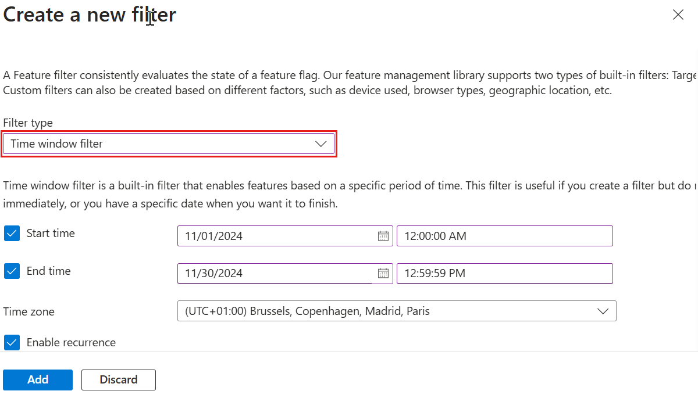
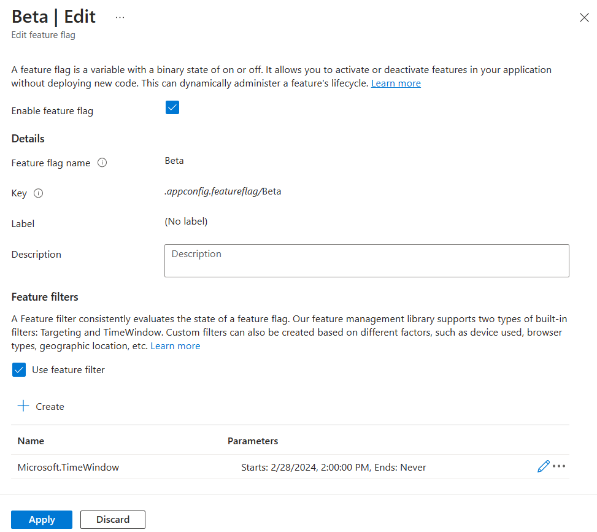

# Tutorial: Enable features on a schedule

[Feature filters](./howto-feature-filters.md#what-is-a-feature-filter) allow a feature flag to be enabled or disabled conditionally. The time window filter is one of the feature management library's built-in feature filters. It allows you to turn on or off a feature on a schedule. For example, when you have a new product announcement, you can use it to unveil a feature automatically at a planned time. You can also use it to discontinue a promotional discount as scheduled after the marketing campaign ends.

In this article, you will learn how to add and configure a time window filter for your feature flags.

## Add a time window filter

1. Create a feature flag named *Beta* in your App Configuration store and open to edit it. For more information about how to add and edit a feature flag, see [Manage feature flags](./manage-feature-flags.md).

1. In the **Edit feature flag** pane that opens, check the **Enable feature flag** checkbox if it isn't already enabled. Then check the **Use feature filter** checkbox and select **Create**.

    > [!div class="mx-imgBorder"]
    > 

1. The pane **Create a new filter** opens. Under **Filter type**, select the **Time window filter** in the dropdown.

    > [!div class="mx-imgBorder"]
    > 

1. A time window filter includes two parameters: start and expiry date. Set the **Start date** to **Custom** and select a time a few minutes ahead of your current time. Set the **Expiry date** to **Never**. In this example, you schedule the *Beta* feature to be enabled automatically at a future time, and it will never be disabled once enabled.

1. Select **Add** to save the configuration of the time window filter and return to the **Edit feature flag** screen.

1. The time window filter is now listed in the feature flag details. Select **Apply** to save the feature flag.

    > [!div class="mx-imgBorder"]
    > 

Now, you successfully added a time window filter to a feature flag. Follow the instructions in the [Next Steps](#next-steps) section to learn how it works in your application for the language or platform you are using.

## Next steps

In this tutorial, you learned the concept of the time window filter and added it to a feature flag.

To learn how to use the feature flag with a time window filter in your application, continue to the following tutorial.

> [!div class="nextstepaction"]
> [ASP.NET Core](./howto-timewindow-filter-aspnet-core.md)

To learn more about the feature filters, continue to the following tutorials:

> [!div class="nextstepaction"]
> [Enable conditional features with feature filters](./howto-feature-filters.md)

> [!div class="nextstepaction"]
> [Roll out features to targeted audience](./howto-targetingfilter.md)