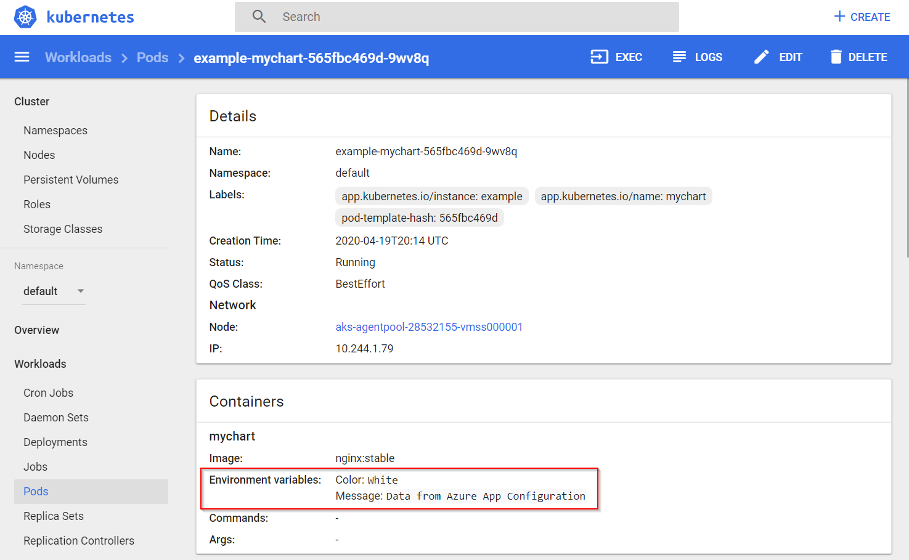
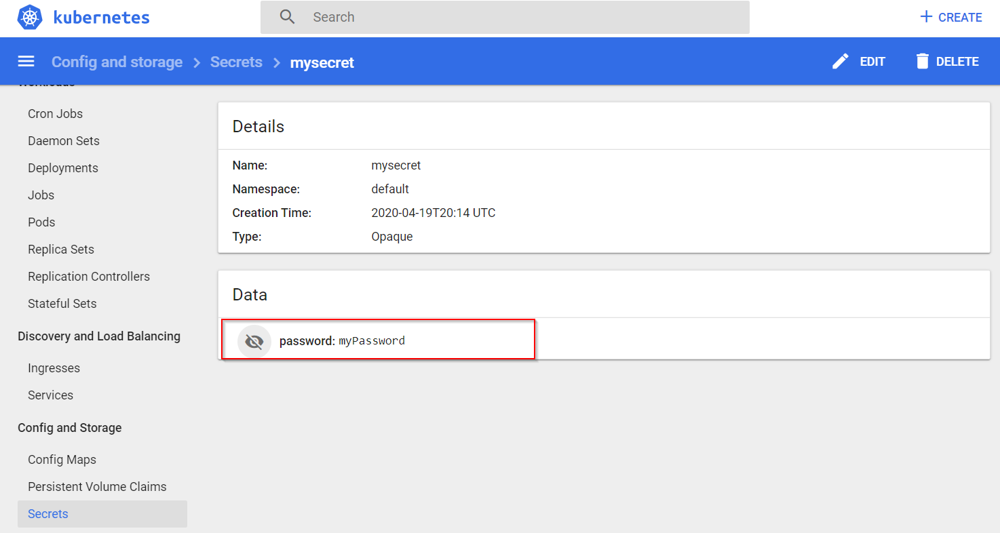

# Integrate with Kubernetes Deployment using Helm

Applications hosted in Kubernetes can access data in App Configuration [using the App Configuration provider library](./enable-dynamic-configuration-aspnet-core.md). The App Configuration provider has built-in caching and refreshing capabilities so applications can have dynamic configuration without redeployment. If you prefer not to update your application, this tutorial shows how to bring data from App Configuration to your Kubernetes using Helm via deployment. This way, your application can continue accessing configuration from Kubernetes variables and secrets. You run Helm upgrade when you want your application to pick up new configuration changes.

Helm provides a way to define, install, and upgrade applications running in Kubernetes. A Helm chart contains the information necessary to create an instance of a Kubernetes application. Configuration is stored outside of the chart itself, in a file called *values.yaml*.

During the release process, Helm merges the chart with the proper configuration to run the application. For example, variables defined in *values.yaml* can be referenced as environment variables inside the running containers. Helm also supports creation of Kubernetes Secrets, which can be mounted as data volumes or exposed as environment variables.

You can override the values stored in *values.yaml* by providing additional YAML-based configuration files on the command line when running Helm. Azure App Configuration supports exporting configuration values to YAML files. Integrating this export capability into your deployment allows your Kubernetes applications to leverage configuration values stored in App Configuration.

In this tutorial, you learn how to:
> [!div class="checklist"]
> - Use values from App Configuration when deploying an application to Kubernetes using Helm.
> - Create a Kubernetes Secret based on a Key Vault reference in App Configuration.

This tutorial assumes basic understanding of managing Kubernetes with Helm. Learn more about installing applications with Helm in [Azure Kubernetes Service](../aks/kubernetes-helm.md).

## Prerequisites

- An Azure account with an active subscription. [Create one for free](https://azure.microsoft.com/free/).
- Install [Azure CLI](/cli/azure/install-azure-cli) (version 2.4.0 or later)
- Install [Helm](https://helm.sh/docs/intro/install/) (version 2.14.0 or later)
- An App Configuration store. [Create a store](./quickstart-azure-app-configuration-create.md#create-an-app-configuration-store).
- A Kubernetes cluster.

## Add key-values

Add the following key-values to the App Configuration store and leave **Label** and **Content Type** with their default values. For more information about how to add key-values to a store using the Azure portal or the CLI, go to [Create a key-value](./quickstart-azure-app-configuration-create.md#create-a-key-value).

| Key | Value |
|---|---|
| *settings.color* | *White* |
| *settings.message* | *Data from Azure App Configuration* |

## Add a Key Vault reference to App Configuration

1. Sign in to the [Azure portal](https://portal.azure.com) and add a secret to [Key Vault](../key-vault/secrets/quick-create-portal.md#add-a-secret-to-key-vault) with name **Password** and value **myPassword**.

2. Select the App Configuration store instance that you created in previous section.

3. Select **Configuration Explorer**.

4. Select **+ Create** > **Key vault reference**, and then specify the following values:

    - **Key**: Select **secrets.password**.
    - **Label**: Leave this value blank.
    - **Subscription**, **Resource group**, and **Key vault**: Enter the values corresponding to those in the key vault you created in previous step.
    - **Secret**: Select the secret named **Password** that you created in the previous section.

## Create Helm chart

First, create a sample Helm chart with the following command:

`helm create mychart`

Helm creates a new directory called mychart with the structure shown below.

> [!TIP]
> Follow this [charts guide](https://helm.sh/docs/chart_template_guide/getting_started/) to learn more.

```
mychart
|-- Chart.yaml
|-- charts
|-- templates
|   |-- NOTES.txt
|   |-- _helpers.tpl
|   |-- deployment.yaml
|   |-- ingress.yaml
|   `-- service.yaml
`-- values.yaml
```

Next, update the **spec:template:spec:containers** section of the *deployment.yaml* file. The following snippet adds two environment variables to the container. You'll set their values dynamically at deployment time.

```yaml
env:
- name: Color
    value: {{ .Values.settings.color }}
- name: Message
    value: {{ .Values.settings.message }}
```

The complete *deployment.yaml* file after the update should look like below.

```yaml
apiVersion: apps/v1beta2
kind: Deployment
metadata:
  name: {{ include "mychart.fullname" . }}
  labels:
    app.kubernetes.io/name: {{ include "mychart.name" . }}
    helm.sh/chart: {{ include "mychart.chart" . }}
    app.kubernetes.io/instance: {{ .Release.Name }}
    app.kubernetes.io/managed-by: {{ .Release.Service }}
spec:
  replicas: {{ .Values.replicaCount }}
  selector:
    matchLabels:
      app.kubernetes.io/name: {{ include "mychart.name" . }}
      app.kubernetes.io/instance: {{ .Release.Name }}
  template:
    metadata:
      labels:
        app.kubernetes.io/name: {{ include "mychart.name" . }}
        app.kubernetes.io/instance: {{ .Release.Name }}
    spec:
      containers:
        - name: {{ .Chart.Name }}
          image: "{{ .Values.image.repository }}:{{ .Values.image.tag }}"
          imagePullPolicy: {{ .Values.image.pullPolicy }}
          env:
            - name: Color
              value: {{ .Values.settings.color }}
            - name: Message
              value: {{ .Values.settings.message }}
          ports:
            - name: http
              containerPort: 80
              protocol: TCP
          livenessProbe:
            httpGet:
              path: /
              port: http
          readinessProbe:
            httpGet:
              path: /
              port: http
          resources:
{{ toYaml .Values.resources | indent 12 }}
    {{- with .Values.nodeSelector }}
      nodeSelector:
{{ toYaml . | indent 8 }}
    {{- end }}
    {{- with .Values.affinity }}
      affinity:
{{ toYaml . | indent 8 }}
    {{- end }}
    {{- with .Values.tolerations }}
      tolerations:
{{ toYaml . | indent 8 }}
    {{- end }}
```

To store sensitive data as Kubernetes Secrets, add a *secrets.yaml* file under the templates folder.

> [!TIP]
> Learn more about how to use [Kubernetes Secrets](https://kubernetes.io/docs/concepts/configuration/secret/#using-secrets).

```yaml
apiVersion: v1
kind: Secret
metadata:
  name: mysecret
type: Opaque
data:
  password: {{ .Values.secrets.password | b64enc }}
```

Finally, update the *values.yaml* file with the following content to optionally provide default values of the configuration settings and secrets that referenced in the *deployment.yaml* and *secrets.yaml* files. Their actual values will be overwritten by configuration pulled from App Configuration.

```yaml
# settings will be overwritten by App Configuration
settings:
  color: red
  message: myMessage
```

## Pass configuration from App Configuration in Helm install

First, download the configuration from App Configuration to a *myConfig.yaml* file. Use a key filter to only download those keys that start with **settings.**. If in your case the key filter is not sufficient to exclude keys of Key Vault references, you may use the argument **--skip-keyvault** to exclude them.

> [!TIP]
> Learn more about the [export command](/cli/azure/appconfig/kv#az-appconfig-kv-export).

```azurecli-interactive
az appconfig kv export -n myAppConfiguration -d file --path myConfig.yaml --key "settings.*"  --separator "." --format yaml
```

Next, download secrets to a file called *mySecrets.yaml*. The command-line argument **--resolve-keyvault** resolves the Key Vault references by retrieving the actual values in Key Vault. You'll need to run this command with credentials that have access permissions to the corresponding Key Vault.

> [!WARNING]
> As this file contains sensitive information, keep the file with care and clean up when it's not needed anymore.

```azurecli-interactive
az appconfig kv export -n myAppConfiguration -d file --path mySecrets.yaml --key "secrets.*" --separator "." --resolve-keyvault --format yaml
```

Use helm upgrade's **-f** argument to pass in the two configuration files you've created. They'll override the configuration values defined in *values.yaml* with the values exported from App Configuration.

```console
helm upgrade --install -f myConfig.yaml -f mySecrets.yaml "example" ./mychart
```

You can also use the **--set** argument for helm upgrade to pass literal key values. Using the **--set** argument is a good way to avoid persisting sensitive data to disk.

```powershell
$secrets = az appconfig kv list -n myAppConfiguration --key "secrets.*" --resolve-keyvault --query "[*].{name:key, value:value}" | ConvertFrom-Json

foreach ($secret in $secrets) {
  $keyvalues += $secret.name + "=" + $secret.value + ","
}

if ($keyvalues){
  $keyvalues = $keyvalues.TrimEnd(',')
  helm upgrade --install --set $keyvalues "example" ./mychart
}
else{
  helm upgrade --install "example" ./mychart
}

```

Verify that configurations and secrets were set successfully by accessing the [Kubernetes Dashboard](../aks/kubernetes-dashboard.md). You'll see that the **color** and **message** values from App Configuration were populated into the container's environment variables.



One secret, **password**, stores as Key Vault reference in App Configuration was also added into Kubernetes Secrets.



## Clean up resources

[!INCLUDE [azure-app-configuration-cleanup](../../includes/azure-app-configuration-cleanup.md)]

## Next steps

In this tutorial, you exported Azure App Configuration data to be used in a Kubernetes deployment with Helm. To learn more about how to use App Configuration, continue to the Azure CLI samples.

> [!div class="nextstepaction"]
> [Azure CLI](/cli/azure/appconfig)
