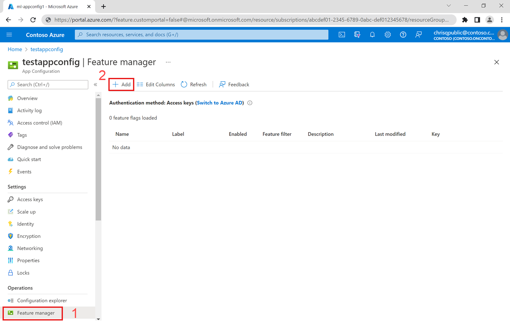
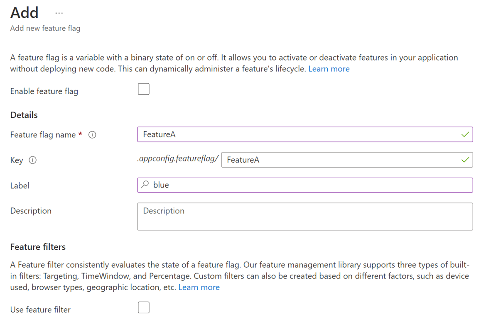
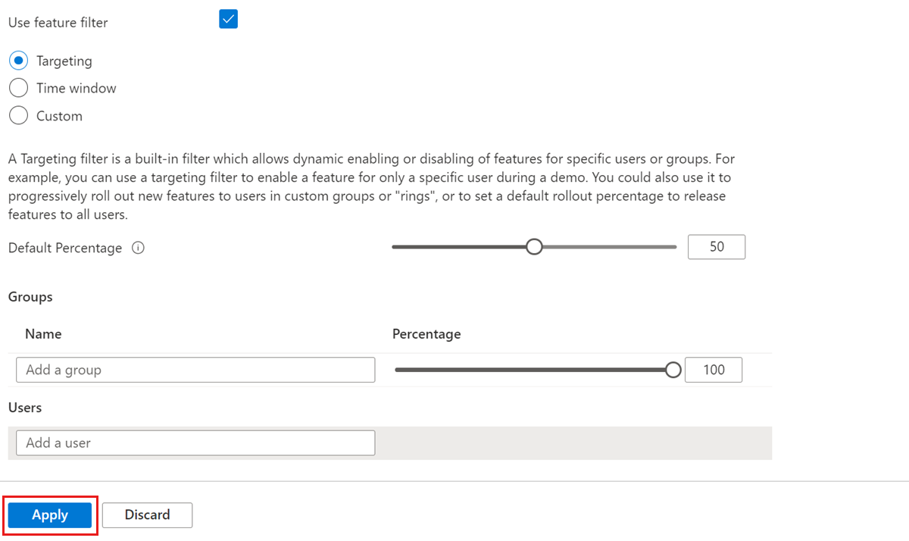

# Tutorial: Manage feature flags in Azure App Configuration

You can store all feature flags in Azure App Configuration and administer them from a single place. App Configuration has a portal UI named **Feature Manager** that's designed specifically for feature flags. App Configuration also natively supports the .NET Core feature-flag data schema.

In this tutorial, you learn how to:

> [!div class="checklist"]
> * Define and manage feature flags in App Configuration.
> * Access feature flags from your application.

## Create feature flags

The Feature Manager in the Azure portal for App Configuration provides a UI for creating and managing the feature flags that you use in your applications.

To add a new feature flag:

1. Select **Feature Manager** > **+Add** to add a feature flag.

    

1. Enter a unique key name for the feature flag. You need this name to reference the flag in your code.

1. If you want, give the feature flag a description.

1. Set the initial state of the feature flag. This state is usually *Off* or *On*. The *On* state changes to *Conditional* if you add a filter to the feature flag.

    

1. When the state is *On*, select **+Add filter** to specify any additional conditions to qualify the state. Enter a built-in or custom filter key, and then select **+Add parameter** to associate one or more parameters with the filter. Built-in filters include:

    | Key | JSON parameters |
    |---|---|
    | Microsoft.Percentage | {"Value": 0-100 percent} |
    | Microsoft.TimeWindow | {"Start": UTC time, "End": UTC time} |

    

## Update feature flag states

To change a feature flag's state value:

1. Select **Feature Manager**.

1. To the right of a feature flag you want to modify, select the ellipsis (**...**), and then select **Edit**.

1. Set a new state for the feature flag.

## Access feature flags

Feature flags created by the Feature Manager are stored and retrieved as regular key values. They're kept under a special namespace prefix `.appconfig.featureflag`. To view the underlying key values, use the Configuration Explorer. Your application can retrieve these values by using the App Configuration configuration providers, SDKs, command-line extensions, and REST APIs.

## Next steps

In this tutorial, you learned how to manage feature flags and their states by using App Configuration. For more information about feature-management support in App Configuration and ASP.NET Core, see the following article:

* [Use feature flags in an ASP.NET Core app](./use-feature-flags-dotnet-core.md)
