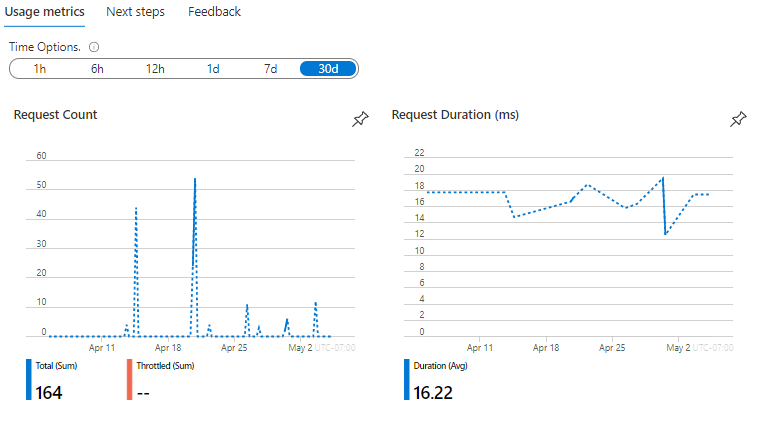
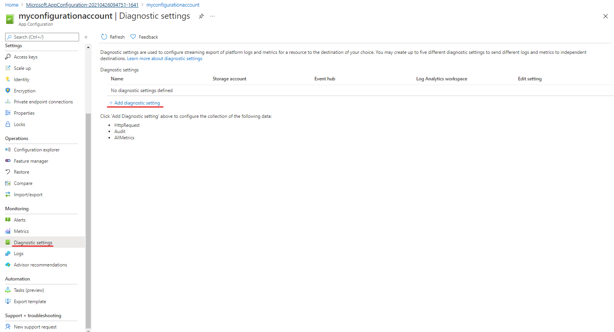
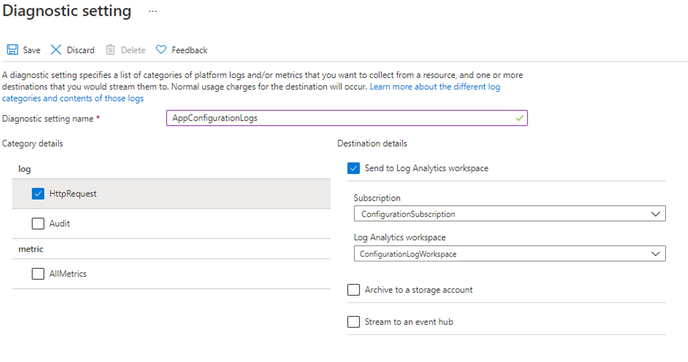
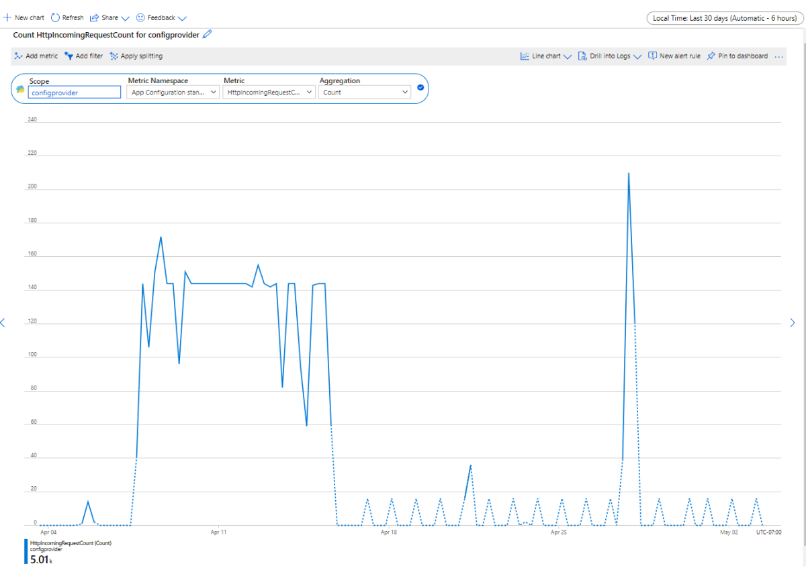
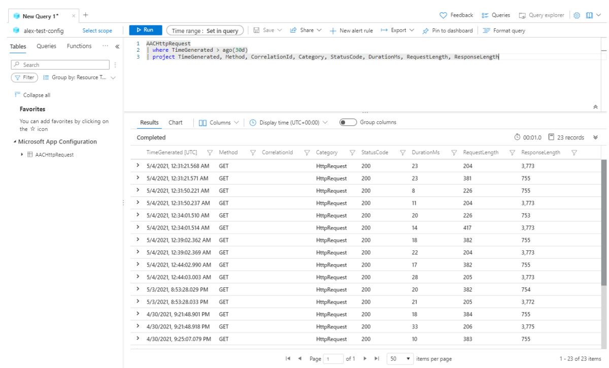

# Monitoring App Configuration
When you have critical applications and business processes relying on Azure resources, you want to monitor those resources for their availability, performance, and operation. 

This article describes the monitoring data generated by App Configuration. App Configuration uses [Azure Monitor](../azure-monitor/overview.md). If you are unfamiliar with the features of Azure Monitor common to all Azure services that use it, read [Monitoring Azure resources with Azure Monitor](../azure-monitor/essentials/monitor-azure-resource.md).

## Monitoring overview page in the Azure portal
The **Overview** page in the Azure portal includes a brief view of the resource usage,  such as the total number of requests, number of  throttled requests, and request duration per configuration store. This information is useful, but only displays a small amount of the monitoring data available. Some of this monitoring data is collected automatically and is available for analysis as soon as you create the resource. You can enable additional types of data collection with some configuration.

> [!div class="mx-imgBorder"]
> 

## Monitoring data 
App Configuration collects the same kinds of monitoring data as other Azure resources that are described in [Monitoring data from Azure resources](../azure-monitor/essentials/monitor-azure-resource.md#monitoring-data). See [Monitoring App Configuration data reference](./monitor-app-configuration-reference.md) for detailed information on the metrics and logs metrics created by App Configuration.

## Collection and routing
Platform metrics and the activity log are collected and stored automatically, but can be routed to other locations by using a diagnostic setting.

Resource Logs are not collected and stored until you create a diagnostic setting and route them to one or more locations. For example, to view logs and metrics for a configuration store in near real-time in Azure Monitor, collect the resource logs in a Log Analytics workspace. If you do not already have one, create a [Log Analytics Workspace](../azure-monitor/logs/quick-create-workspace.md) and follow these steps to create and enable a diagnostic setting. 

 #### [Portal](#tab/portal)

1. Sign in to the Azure portal.

1. Navigate to your App Configuration store.

1. In the **Monitoring** section, select **Diagnostic settings**, then select **+Add diagnostic setting**. 
    > [!div class="mx-imgBorder"]
    > 

1. In the **Diagnostic setting** page, enter a name for your setting, then select **HttpRequest** and choose the destination to send your logs to. To send them to a Log Analytics workspace, choose **Send to Log Analytics workspace**.
 
    > [!div class="mx-imgBorder"]
    > 

1. Enter the name of your **Subscription** and **Log Analytics Workspace**. 
1. Select **Save** and verify that the Diagnostic Settings page now lists your new diagnostic setting. 
    

 ### [Azure CLI](#tab/cli)
    
1. Open the Azure Cloud Shell, or if you've installed the Azure CLI locally, open a command console application such as Windows PowerShell.

1. If your identity is associated with more than one subscription, then set your active subscription to the subscription of the storage account that you want to enable logs for.

    ```Azure CLI
    az account set --subscription <your-subscription-id>
    ```

1. Enable logs by using the az monitor [diagnostic-settings create command](/cli/azure/monitor/diagnostic-settings#az-monitor-diagnostic-settings-create).

    ```Azure CLI
    az monitor diagnostic-settings create --name <setting-name> --workspace <log-analytics-workspace-resource-id> --resource <app-configuration-resource-id> --logs '[{"category": <category name>, "enabled": true "retentionPolicy": {"days": <days>, "enabled": <retention-bool}}]'
    ```

 ### [PowerShell](#tab/PowerShell)
    
1. Open a Windows PowerShell command window, and sign in to your Azure subscription by using the Connect-AzAccount command. Then, follow the on-screen directions.

    ```PowerShell
    Connect-AzAccount
    ```

1. Set your active subscription to the subscription of the App Configuration account that you want to enable logging for.

    ```PowerShell
    Set-AzContext -SubscriptionId <subscription-id>
    ```
    
1. To enable logs for a Log Analytics Workspace, use the [Set-AzDiagnosticSetting PowerShell](/previous-versions/azure/mt631625(v=azure.100)?redirectedfrom=MSDN) cmdlet. 

    ```PowerShell
    Set-AzDiagnosticSetting -ResourceId <app-configuration-resource-id> -WorkspaceId <log-analytics-workspace-resource-id> -Enabled $true
    ```
1. Verify that your diagnostic setting is correctly set and log categories are enabled. 

    ```PowerShell
    Get-AzureRmDiagnosticSetting -ResourceId <app-configuration-resource-id> 
    ```
---
For more information on creating a diagnostic setting using the Azure portal, CLI, or PowerShell, see [create a diagnostic setting to collect platform logs and metrics in Azure](../azure-monitor/essentials/diagnostic-settings.md). 

When you create a diagnostic setting, you specify which categories of logs to collect. For further information on the categories of logs for App Configuration, reference [App Configuration monitoring data reference](./monitor-app-configuration-reference.md#resourcelogs).

## Analyzing metrics

You can analyze metrics for App Configuration with metrics from other Azure services using metrics explorer by opening **Metrics** from the **Azure Monitor** menu. See [Analyze metrics with Azure Monitor metrics explorer](../azure-monitor/essentials/analyze-metrics.md) for details on using this tool. For App Configuration, the following metrics are collected: 

* Http Incoming Request Count 
* Http Incoming Request Duration 
* Throttled Http Request Count (Http status code 429 Responses)
* Daily Storage Usage
* Request Quota Usage
* Replication Latency

In the portal, navigate to the **Metrics** section and select the **Metric Namespaces** and **Metrics** you want to analyze. This screenshot shows you the metrics view when selecting **Http Incoming Request Count** for your configuration store.

> [!div class="mx-imgBorder"]
> 

For a list of the platform metrics collected for App Configuration, see [Monitoring App Configuration data reference metrics](./monitor-app-configuration-reference.md#metrics). For reference, you can also see a list of [all resource metrics supported in Azure Monitor](../azure-monitor/essentials/metrics-supported.md).

## Analyzing logs
Data in Azure Monitor Logs is stored in tables where each table has its own set of unique properties. The common schema is outlined in [Azure Monitor resource log schema](../azure-monitor/essentials/resource-logs-schema.md#top-level-common-schema). 

The [Activity log](../azure-monitor/essentials/activity-log.md) is a platform log in Azure that provides insight into subscription-level events. You can view it independently or route it to Azure Monitor Logs, where you can do much more complex queries using Log Analytics.  
For a list of the types of resource logs collected for App Configuration, see [Monitoring App Configuration data reference](./monitor-app-configuration-reference.md#resourcelogs). For a list of the tables used by Azure Monitor Logs and queryable by Log Analytics, see [Monitoring App Configuration data reference](./monitor-app-configuration-reference.md#azuremonitorlogstables)  

>[!IMPORTANT]
> When you select **Logs** from the App Configuration menu, Log Analytics is opened with the query scope set to the current app configuration resource. This means that log queries will only include data from that resource. 


If you want to run a query that includes data from other configuration or data from other Azure services, select **Logs** from the **Azure Monitor** menu. See [Log query scope and time range in Azure Monitor Log Analytics](/azure/azure-monitor/log-query/scope/) for details.

In the portal, navigate to the **Logs** section, and then to the query editor. On the left under the **Tables** tab, select **AACHttpRequest** to see the logs of your configuration store. Enter a Kusto query into the editor and results will be displayed below.  

> [!div class="mx-imgBorder"]
> 

Following are sample queries that you can use to help you monitor your App Configuration resource. 


* List all Http Requests in the last three days 
    ```Kusto
       AACHttpRequest
        | where TimeGenerated > ago(3d)
    ```

* List all throttled requests (returned Http status code 429 for too many requests) in the last three days 
    ```Kusto
       AACHttpRequest
        | where TimeGenerated > ago(3d)
        | where StatusCode == "429"
    ```

* List the number of requests sent in the last three days by IP Address 
    ```Kusto
       AACHttpRequest
        | where TimeGenerated > ago(3d)
        | summarize requestCount=sum(HitCount) by ClientIPAddress
        | order by requestCount desc 
    ```

* Create a pie chart of the types of status codes received in the last three days
    ```Kusto
       AACHttpRequest
        | where TimeGenerated > ago(3d)
        | summarize requestCount=sum(HitCount) by StatusCode
        | order by requestCount desc 
        | render piechart 
    ```

* List the number of requests sent by day for the last 14 days
    ```Kusto
    AACHttpRequest
        | where TimeGenerated > ago(14d)
        | extend Day = startofday(TimeGenerated)
        | summarize requestcount=sum(HitCount) by Day
        | order by Day desc  
    ```

## Alerts

Azure Monitor alerts proactively notify you when important conditions are found in your monitoring data. They allow you to identify and address issues in your system before your customers notice them. You can set alerts on [metrics](../azure-monitor/alerts/alerts-metric-overview.md), [logs](../azure-monitor/alerts/alerts-unified-log.md), and the [activity log](../azure-monitor/alerts/activity-log-alerts.md). Different types of alerts have benefits and drawbacks.
The following table lists common and recommended alert rules for App Configuration.

| Alert type | Condition | Description  |
|:---|:---|:---|
|Request quota usage exceeded | RequestQuotaUsage >= 100 | The configuration store has exceeded the [request quota usage](./faq.yml#are-there-any-limits-on-the-number-of-requests-made-to-app-configuration). Upgrade to a standard tier store or follow the [best practices](./howto-best-practices.md#reduce-requests-made-to-app-configuration) to optimize your usage. |


## Next steps

* See [Monitoring App Configuration data reference](./monitor-app-configuration-reference.md) for a reference of the metrics, logs, and other important values created by App Configuration.

* See [Monitoring Azure resources with Azure Monitor](../azure-monitor/essentials/monitor-azure-resource.md) for details on monitoring Azure resources.
