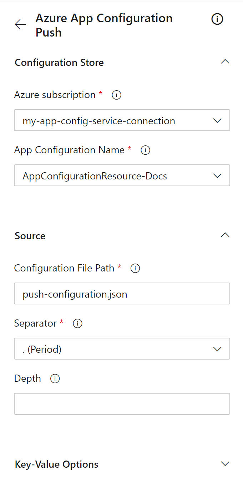

# Push settings to App Configuration with Azure Pipelines

The [Azure App Configuration Push](https://marketplace.visualstudio.com/items?itemName=AzureAppConfiguration.azure-app-configuration-task-push) task pushes key-values from a configuration file into your App Configuration store. This task enables full circle functionality within the pipeline as you're now able to pull settings from the App Configuration store as well as push settings to the App Configuration store.

## Prerequisites

- Azure subscription - [create one for free](https://azure.microsoft.com/free/)
- App Configuration store - [create one for free](./quickstart-azure-app-configuration-create.md#create-an-app-configuration-store)
- Azure DevOps project - [create one for free](https://go.microsoft.com/fwlink/?LinkId=2014881)
- Azure App Configuration Push task - download for free from the [Visual Studio Marketplace](https://marketplace.visualstudio.com/items?itemName=AzureAppConfiguration.azure-app-configuration-task-push).
- [Azure Pipelines agent version 2.206.1](https://github.com/microsoft/azure-pipelines-agent/releases/tag/v2.206.1) or later and [Node version 16](https://nodejs.org/en/blog/release/v16.16.0/) or later for running the task on self-hosted agents.

## Create a service connection

[!INCLUDE [azure-app-configuration-service-connection](../../includes/azure-app-configuration-service-connection.md)]

## Add role assignment

Assign the proper App Configuration role assignments to the credentials being used within the task so that the task can access the App Configuration store.

1. Go to your target App Configuration store. 
1. In the left menu, select **Access control (IAM)**.
1. In the right pane, select **Add role assignments**.

    :::image type="content"  border="true" source="./media/azure-app-configuration-role-assignment/add-role-assignment-button.png" alt-text="Screenshot shows the Add role assignments button.":::
1. For **Role**, select **App Configuration Data Owner**. This role allows the task to read from and write to the App Configuration store.
1. Select the service principal associated with the service connection that you created in the previous section.

    :::image type="content"  border="true" source="./media/azure-app-configuration-role-assignment/add-role-assignment-data-owner.png" alt-text="Screenshot shows the Add role assignment dialog.":::
1. Select **Review + assign**.

## Use in builds

This section will cover how to use the Azure App Configuration Push task in an Azure DevOps build pipeline.

1. Navigate to the build pipeline page by clicking **Pipelines** > **Pipelines**. Documentation for build pipelines can be found [here](/azure/devops/pipelines/create-first-pipeline?tabs=tfs-2018-2).
      - If you're creating a new build pipeline, on the last step of the process, on the **Review** tab, select **Show assistant** on the right side of the pipeline.
        > [!div class="mx-imgBorder"]
        > 
      - If you're using an existing build pipeline, click the **Edit** button at the top-right.
        > [!div class="mx-imgBorder"]
        > 
1. Search for the **Azure App Configuration Push** Task.
    > [!div class="mx-imgBorder"]
    > 
1. Configure the necessary parameters for the task to push the key-values from the configuration file to the App Configuration store. Explanations of the parameters are available in the **Parameters** section below, and in tooltips next to each parameter.
    > [!div class="mx-imgBorder"]
    > 
1. Save and queue a build. The build log will display any failures that occurred during the execution of the task.

## Use in releases

This section will cover how to use the Azure App Configuration Push task in an Azure DevOps release pipeline.

1. Navigate to release pipeline page by selecting **Pipelines** > **Releases**. Documentation for release pipelines can be found [here](/azure/devops/pipelines/release).
1. Choose an existing release pipeline. If you don’t have one, select **+ New** to create a new one.
1. Select the **Edit** button in the top-right corner to edit the release pipeline.
1. From the **Tasks** dropdown, choose the **Stage** to which you want to add the task. More information about stages can be found [here](/azure/devops/pipelines/release/environments).
    > [!div class="mx-imgBorder"]
    > 
1. Click **+** next to the Job to which you want to add a new task.
    > [!div class="mx-imgBorder"]
    > 
1. In the **Add tasks** dialog, type **Azure App Configuration Push** into the search box and select it.
1. Configure the necessary parameters within the task to push your key-values from your configuration file to your App Configuration store. Explanations of the parameters are available in the **Parameters** section below, and in tooltips next to each parameter.
1. Save and queue a release. The release log will display any failures encountered during the execution of the task.

## Parameters

The following parameters are used by the App Configuration Push task:

- **Azure subscription**: A drop-down containing your available Azure service connections. To update and refresh your list of available Azure service connections, press the **Refresh Azure subscription** button to the right of the textbox.
- **App Configuration Endpoint**: A drop-down that loads your available configuration stores endpoint under the selected subscription. To update and refresh your list of available configuration stores endpoint, press the **Refresh App Configuration Endpoint** button to the right of the textbox. 
- **Configuration File Path**: The path to your configuration file. The **Configuration File Path** parameter begins at the root of the file repository. You can browse through your build artifact to select a configuration file. (`...` button to the right of the textbox). The supported file formats depend on the file content profile. For the default profile the supported file formats are yaml, json and properties. For KvSet profile the supported file format is json.
- **File Content Profile**: The Configuration File's [content profile](./concept-config-file.md). Default value is **Default**.
     - **Default**: Refers to the conventional configuration file formats that are directly consumable by applications.
     - **Kvset**: Refers to a [file schema](https://aka.ms/latest-kvset-schema) that contains all properties of an App Configuration key-value, including key, value, label, content type, and tags. The task parameters 'Separator', 'Label', 'Content type', 'Prefix', 'Tags', and 'Depth' are not applicable when using the Kvset profile.
- **Import Mode**: The default value is **All**. Determines the behavior when importing key-values.
    - **All**: Imports all key-values in the configuration file to App Configuration. 
    - **Ignore-Match**: Imports only settings that have no matching key-value in App Configuration. Matching key-values are considered to be key-values with the same key, label, value, content type and tags.
- **Dry Run**: Default value is **Unchecked**.
   - **Checked**: No updates will be performed to App Configuration. Instead any updates that would have been performed in a normal run will be printed to the console for review.
   - **Unchecked**: Performs any updates to App Configuration and does not print to the console.
- **Separator**: The separator that's used to flatten .json and .yml files.
- **Depth**: The depth that the .json and .yml files will be flattened to.
- **Prefix**: A string that's appended to the beginning of each key pushed to the App Configuration store.
- **Label**: A string that's added to each key-value as the label within the App Configuration store.
- **Content Type**: A string that's added to each key-value as the content type within the App Configuration store.
- **Tags**: A JSON object in the format of `{"tag1":"val1", "tag2":"val2"}`, which defines tags that are added to each key-value pushed to your App Configuration store.
- **Delete key-values that are not included in the configuration file**: Default value is **Unchecked**. The behavior of this option depends on the configuration file content profile.
   - **Checked**:
       - **Default content profile**: Removes all key-values in the App Configuration store that match both the specified prefix and label before pushing new key-values from the configuration file.
       - **Kvset content profile**: Removes all key-values in the App Configuration store that are not included in the configuration file before pushing new key-values from the configuration file.
   - **Unchecked**: Pushes all key-values from the configuration file into the App Configuration store and leaves everything else in the App Configuration store intact.

## Troubleshooting

If an unexpected error occurs, debug logs can be enabled by setting the pipeline variable `system.debug` to `true`.

## FAQ

**How can I upload multiple configuration files?**

Create multiple instances of the Azure App Configuration Push task within the same pipeline to push multiple configuration files to the App Configuration store.

**How can I create Key Vault references or feature flags using this task?**

Depending on the file content profile you selected, please refer to examples in the [Azure App Configuration support for configuration file](./concept-config-file.md).

**Why am I receiving a 409 error when attempting to push key-values to my configuration store?**

A 409 Conflict error message will occur if the task tries to remove or overwrite a key-value that is locked in the App Configuration store.
