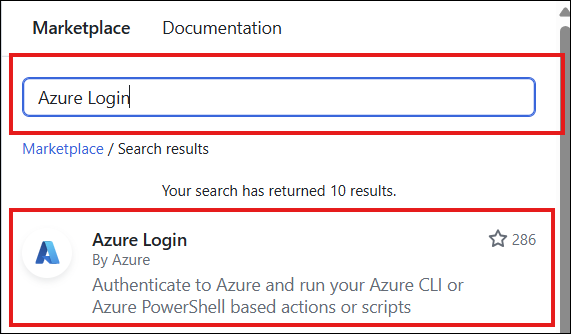

# Import configuration files from your GitHub repository to App Configuration store

If you have adopted [Configuration as Code](./howto-best-practices.md#configuration-as-code) and manage your configurations in GitHub, you can use GitHub Actions to automatically import configuration files from your GitHub repository into your App Configuration store. This allows you to make changes to your configuration files as you normally would, while getting App Configuration store benefits like:
* Centralized configuration outside of your code.
* Updating configuration without redeploying your entire app. 
* Integration with services like Azure App Service and Functions.

A [GitHub Action workflow](https://docs.github.com/en/actions/learn-github-actions/introduction-to-github-actions#the-components-of-github-actions) defines an automated process in a GitHub repository. To import a configuration file from your GitHub repository into Azure App Configuration store, use the [Azure CLI](https://github.com/Azure/cli) GitHub action, which provides full capabilities for file importing to your App Configuration store.

## Authentication
To import configurations to your Azure App Configuration store you can authenticate using one of the following methods:

### Use Microsoft Entra ID
The recommended way to authenticate is by using Microsoft Entra ID, which allows you to securely connect to your Azure resources. You can automate the authentication process using the [Azure Login](/azure/developer/github/connect-from-azure) GitHub action.

Azure Login allows you to authenticate using service principals with secrets or OpenID Connect with a Federated Identity Credential. In this example, you’ll use OpenID Connect to log in to your App Configuration store.

#### Use Azure login with OpenID Connect
To use Azure Login with OpenID Connect, you will need to:
1. Set up a [Microsoft Entra application with a service principal.](/entra/identity-platform/howto-create-service-principal-portal)
2. Assign your Microsoft Entra application the **App Configuration Data Owner** role to allow your GitHub action to read and write to your App Configuration store.
3. Provide your Microsoft Entra application's Client ID, Tenant ID, and Subscription ID to the login action. These values can be provided directly in the workflow or stored as GitHub secrets for better security. In the example below, these values are set as secrets. For more information about using secrets in GitHub, see [Using secrets in GitHub Actions](https://docs.github.com/en/actions/reference/encrypted-secrets).

To start using this GitHub Action, go to your repository and select the **Actions** tab. Select **New workflow**, then **Set up a workflow yourself**. Finally, search the marketplace for “Azure Login”. Once you find it, click on the action and copy the provided snippet into your workflow file.
> [!div class="mx-imgBorder"]
> 
> [!div class="mx-imgBorder"]
> 

#### Example using Microsoft Entra ID

```yaml
# Set permissions for the workflow. Specify 'id-token: write' to allow OIDC token generation at the workflow level.
permissions: 
  id-token: write
  contents: read
 
jobs: 
  syncconfig: 
    runs-on: ubuntu-latest 
    steps: 
      - name: Azure login
        uses: azure/login@v2
        with:
          client-id: ${{ secrets.AZURE_CLIENT_ID }}
          tenant-id: ${{ secrets.AZURE_TENANT_ID }}
          subscription-id: ${{ secrets.AZURE_SUBSCRIPTION_ID }}
```

### Use a connection string
Alternatively, you can authenticate by passing the connection string directly to the Azure CLI command. This method involves retrieving the connection string from the Azure portal and using it in your commands or scripts.

To get started, you can find the connection string under **Access Settings** of your App Configuration store in the Azure portal.

Next, set this connection string as a secret variable in your GitHub repository. For more information about using secrets in GitHub, see [Using secrets in GitHub Actions.](https://docs.github.com/en/actions/reference/encrypted-secrets). 

#### Example using a connection string

```yaml
on: 
  push: 
    branches: 
      - 'main' 
    paths: 
      - 'appsettings.json'
 
jobs: 
  syncconfig: 
    runs-on: ubuntu-latest
    
    # pass the secret variable as an environment variable to access it in your CLI action.
    env:
      CONNECTION_STRING: ${{ secrets.<ConnectionString> }}
```
## Configuration file import

You use the [Azure CLI](https://github.com/Azure/cli) GitHub Action to import a configuration file to your App Configuration store. To start using this GitHub Action, go to your repository and select the **Actions** tab. Select **New workflow**, then **Set up a workflow yourself**. Finally, search the marketplace for “Azure CLI Action.” Once you find it, click on the action and copy the provided snippet into your workflow file.
> [!div class="mx-imgBorder"]
> 

In the following example, you use the Azure CLI action to import configuration files into an Azure App Configuration store when a change is pushed to `appsettings.json`. When a developer pushes a change to `appsettings.json`, the script passed to the Azure CLI action updates the App Configuration store with the new values.

The *on* section of this workflow specifies that the action triggers *on* a *push* containing `appsettings.json` to the *main* branch. The *jobs* section lists the jobs run once the action is triggered. The action checks out the relevant files and updates the App Configuration store.

```yaml
on: 
  push: 
    branches: 
      - 'main' 
    paths: 
      - 'appsettings.json'

# Set permissions for the workflow. Specify 'id-token: write' to allow OIDC token generation at the workflow level.
permissions: 
  id-token: write
  contents: read

jobs: 
  syncconfig: 
    runs-on: ubuntu-latest 
    steps: 
      - name: Azure login
        uses: azure/login@v2
        with:
          client-id: ${{ secrets.AZURE_CLIENT_ID }}
          tenant-id: ${{ secrets.AZURE_TENANT_ID }}
          subscription-id: ${{ secrets.AZURE_SUBSCRIPTION_ID }}

      # checkout done so that files in the repo can be read by the sync 
      - uses: actions/checkout@v1 
      - uses: azure/cli@v2
        with: 
          azcliversion: latest
          inlineScript: |
            az appconfig kv import --endpoint <your-app-configuration-store-endpoint> --auth-mode login -s file --path appsettings.json --format json --yes
```

For more information about Azure App Configuration CLI import commands, see the [Azure AppConfifguration CLI documentation.](/cli/azure/appconfig/kv#az-appconfig-kv-import)

### Use a dynamic label on import

Using a dynamic label on each import is a good way to maintain clear and precise version control of your configurations. It allows each import to your App Configuration store to be uniquely identified, making it easier to map code changes to configuration updates. 

#### Example using a dynamic label on import

In the following example, all key-values imported will have a unique label based on the commit hash.

```yaml
 jobs: 
  syncconfig: 
    runs-on: ubuntu-latest 
    steps:      
      # Creates a label based on the branch name and the first 8 characters          
      # of the commit hash 
      - id: determine_label 
        run: echo ::set-output name=LABEL::"${GITHUB_REF#refs/*/}/${GITHUB_SHA:0:8}" 
      # checkout done so that files in the repo can be read by the sync 
      - uses: actions/checkout@v1 
      - uses: azure/cli@v2
        with: 
          azcliversion: latest
          inlineScript: |
            az appconfig kv import --endpoint <your-app-configuration-store-endpoint> --auth-mode login -s file --path appsettings.json --format json --label ${{ steps.determine_label.outputs.LABEL }} --yes
```
## Next steps

To learn how to use CLI import commands, check out our comprehensive guide [Azure CLI import commands](/cli/azure/appconfig/kv#az-appconfig-kv-import).

To learn more about different file content profiles, see [Azure App Configuration support for configuration files](./concept-config-file.md).
