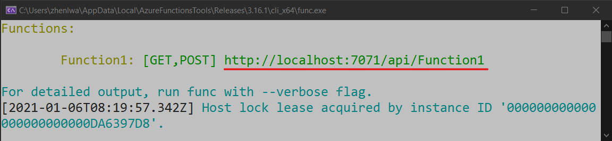
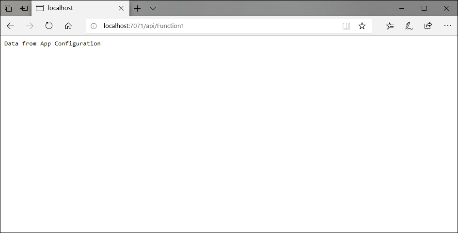

# Quickstart: Create an Azure Functions app with Azure App Configuration

In this quickstart, you incorporate the Azure App Configuration service into an Azure Functions app to centralize storage and management of all your application settings separate from your code.

## Prerequisites

- Azure subscription - [create one for free](https://azure.microsoft.com/free/)
- [Visual Studio 2019](https://visualstudio.microsoft.com/vs) with the **Azure development** workload.
- [Azure Functions tools](../azure-functions/functions-develop-vs.md#check-your-tools-version)

## Create an App Configuration store

[!INCLUDE [azure-app-configuration-create](../../includes/azure-app-configuration-create.md)]

6. Select **Configuration Explorer** > **+ Create** to add the following key-value pairs:

    | Key | Value |
    |---|---|
    | TestApp:Settings:Message | Data from Azure App Configuration |

    Leave **Label** and **Content Type** empty for now.

## Create a Functions app

[!INCLUDE [Create a project using the Azure Functions template](../../includes/functions-vstools-create.md)]

## Connect to an App Configuration store

1. Right-click your project, and select **Manage NuGet Packages**. On the **Browse** tab, search for and add the following NuGet packages to your project. If you can't find them, select the **Include prerelease** check box.

    ```
    Microsoft.Extensions.Configuration.AzureAppConfiguration 3.0.0-preview-010550001-251 or later
    ```

2. Open *Function1.cs*, and add the namespaces of the .NET Core configuration and the App Configuration configuration provider.

    ```csharp
    using Microsoft.Extensions.Configuration;
    using Microsoft.Extensions.Configuration.AzureAppConfiguration;
    ```
3. Add a `static` property named `Configuration` to create a singleton instance of `IConfiguration`. Then add a `static` constructor to connect to App Configuration by calling `AddAzureAppConfiguration()`. This will load configuration once at the application startup. The same configuration instance will be used for all Functions calls later.

    ```csharp
    private static IConfiguration Configuration { set; get; }

    static Function1()
    {
        var builder = new ConfigurationBuilder();
        builder.AddAzureAppConfiguration(Environment.GetEnvironmentVariable("ConnectionString"));
        Configuration = builder.Build();
    }
    ```
4. Update the `Run` method to read values from the configuration.

    ```csharp
    public static async Task<IActionResult> Run(
        [HttpTrigger(AuthorizationLevel.Anonymous, "get", "post", Route = null)] HttpRequest req, ILogger log)
    {
        log.LogInformation("C# HTTP trigger function processed a request.");

        string keyName = "TestApp:Settings:Message";
        string message = Configuration[keyName];
            
        return message != null
            ? (ActionResult)new OkObjectResult(message)
            : new BadRequestObjectResult($"Please create a key-value with the key '{keyName}' in App Configuration.");
    }
    ```

## Test the function locally

1. Set an environment variable named **ConnectionString**, and set it to the access key to your App Configuration store. If you use the Windows command prompt, run the following command and restart the command prompt to allow the change to take effect:

    ```CLI
        setx ConnectionString "connection-string-of-your-app-configuration-store"
    ```
    If you use Windows PowerShell, run the following command:

    ```azurepowershell
        $Env:ConnectionString = "connection-string-of-your-app-configuration-store"
    ```
    If you use macOS or Linux, run the following command:

        export ConnectionString='connection-string-of-your-app-configuration-store'

2. Press F5 to test your function. If prompted, accept the request from Visual Studio to download and install **Azure Functions Core (CLI)** tools. You might also need to enable a firewall exception so that the tools can handle HTTP requests.

3. Copy the URL of your function from the Azure Functions runtime output.

    

4. Paste the URL for the HTTP request into your browser's address bar. The following image shows the response in the browser to the local GET request returned by the function.

    

## Clean up resources

[!INCLUDE [azure-app-configuration-cleanup](../../includes/azure-app-configuration-cleanup.md)]

## Next steps

In this quickstart, you created a new App Configuration store and used it with an Azure Functions app via the [App Configuration provider](https://go.microsoft.com/fwlink/?linkid=2074664). To learn how to configure your Azure Functions app to dynamically refresh configuration settings, continue to the next tutorial.

> [!div class="nextstepaction"]
> [Enable dynamic configuration](./enable-dynamic-configuration-azure-functions-csharp.md)
